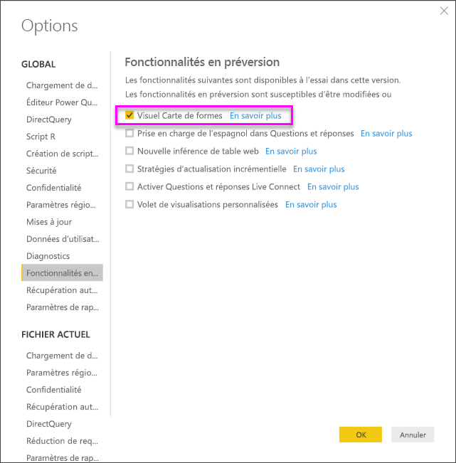
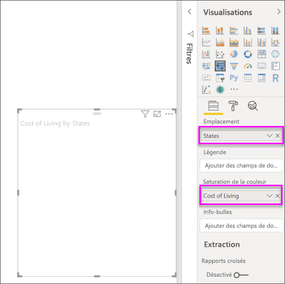
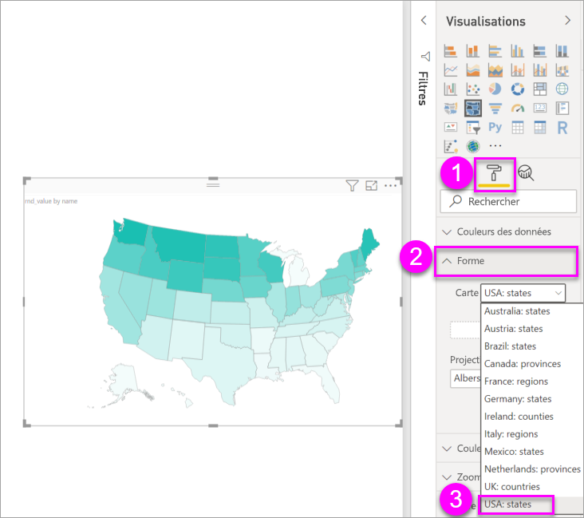
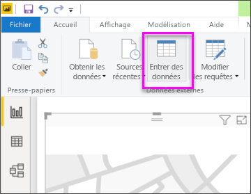
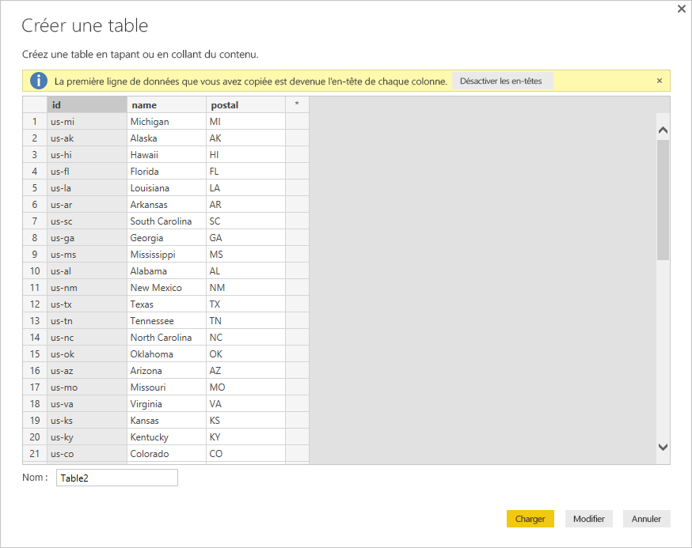

# Créer des visualisations de carte de forme dans Power BI Desktop (préversion)

[!INCLUDE[consumer-appliesto-nyyn](../includes/consumer-appliesto-nyyn.md)]

[!INCLUDE [power-bi-visuals-desktop-banner](../includes/power-bi-visuals-desktop-banner.md)]

Créez un visuel **Carte de formes** pour comparer des régions sur une carte à l’aide de la couleur. À la différence du visuel **Carte**, le visuel **Carte de formes** ne permet pas d’afficher l’emplacement géographique précis de points de données sur une carte. Il a pour principal objectif de montrer des comparaisons relatives de régions sur une carte en leur appliquant une couleur différente.

Les visuels **Carte de formes** reposent sur les cartes TopoJSON, qui présentent l’avantage de pouvoir utiliser des cartes personnalisées que vous pouvez créer, comme des cartes géographiques, des plans de salle, des plans d’étage, etc. Vous ne pouvez pas utiliser de cartes personnalisées dans cette préversion de **Carte de formes**.

> [!NOTE]
> Pour que vous puissiez partager votre rapport avec un collègue Power BI, il faut que vous disposiez tous deux de licences individuelles Power BI Pro ou que le rapport soit enregistré dans une capacité Premium.

## Créer des cartes de formes
Vous pouvez tester le contrôle **Carte de formes** avec les cartes fournies avec cette version préliminaire. Vous pouvez également utiliser votre propre carte personnalisée tant qu’elle répond aux exigences décrites dans la section suivante intitulée **Utiliser des cartes personnalisées**.

L’élément visuel **Carte de formes** est en version préliminaire et doit être activé dans Power BI Desktop. Pour activer l’élément visuel **Carte de formes**, sélectionnez **Fichier > Options et paramètres > Options > Fonctionnalités en version préliminaire**, puis cochez la case **Visuel Carte de formes**. Vous devez redémarrer Power BI Desktop après avoir effectué la sélection.

Une fois le visuel **Carte de formes** activé, sélectionnez l’icône **Carte de formes** dans le volet **Visualisations**.

Power BI Desktop crée une zone de dessin d’élément visuel **Carte de formes** vide.

Procédez comme suit pour créer un élément visuel **Carte de formes** :

1. Dans le volet **Champs**, faites glisser un champ de données contenant les noms (ou abréviations) de région sur le compartiment **Emplacement** et un champ de mesure de données sur le compartiment **Saturation des couleurs** (vous ne voyez pas encore de carte).

   > [!NOTE]
   > Voir la section intitulée **Obtenir des données de carte** ci-dessous pour plus d’informations sur la façon d’obtenir rapidement des données de carte afin de tester l’élément visuel **Carte de formes**.
   > 
   > 

   
2. Dans le volet de paramètres **Format**, développez **Forme**, puis sélectionnez la liste déroulante **Cartes standard** pour afficher vos données. À ce stade, le rendu s’affiche comme illustré dans l’image suivante.

   

   > [!NOTE]
   > La section **Codes de région** à la fin de cet article présente une collection de tables qui répertorient des codes de région de carte que vous pouvez utiliser pour tester l’élément visuel **Carte de formes**.
   > 
   > 
3. Vous pouvez ensuite modifier la carte en utilisant les options de mise en forme comme **Couleur par défaut**, **Zoom**, etc. Vous pouvez aussi ajouter une colonne de données de catégorie pour le compartiment **Légende** et classer les régions de la carte en fonction de catégories.

## Utiliser des cartes personnalisées
Vous pouvez utiliser des cartes personnalisées avec **Carte de formes** tant qu’elles sont au format **TopoJSON**. Si votre carte est dans un autre format, vous pouvez utiliser les outils en ligne tels que le [**Modélisateur de carte**](https://mapshaper.org/) pour convertir vos cartes *shapefiles* ou *GeoJSON* au format **TopoJSON**.

Pour utiliser votre fichier de carte **TopoJSON**, ajoutez un élément visuel ShapeMap à votre rapport et ajoutez des données aux compartiments *Emplacement* et *Saturation des couleurs*. Ensuite, dans le volet **Visualisations** avec la section **Format** sélectionnée (indiquée par (1) dans l’image suivante), développez la section **Forme** et sélectionnez **+ Ajouter une carte**.

## Exemple de carte personnalisée
Les *bureaux des avocats des États-Unis* publient un rapport fiscal annuel sur leurs données concernant les contentieux et le nombre de dossiers.  Tous leurs rapports sont accessibles via le lien ci-dessous,

https://www.justice.gov/usao/resources/annual-statistical-reports

Comme les États peuvent être divisés en plusieurs districts, nous devons utiliser une carte de formes personnalisée.  En important la carte **TopoJSON** des districts judiciaires des États-Unis dans **Power BI Desktop**, nous pouvons visualiser les données des avocats des districts de l’année fiscale.  L’image ci-dessous montre un exemple de cette carte.

Vous pouvez faire des choses intéressantes avec les cartes des états individuels et afficher plus de détails en fonction des districts qu’ils contiennent. 

Si vous voulez faire des essais avec ce jeu de données et cette visualisation, vous pouvez télécharger le fichier PBIX d’origine qui a été utilisé pour générer ce rapport via le lien suivant.

* [Fichier .PBIX de démonstration de carte de formes personnalisée](https://download.microsoft.com/download/1/2/8/128943FB-9231-42BD-8A5D-5E2362C9D589/DistrictAttorneyFiscalReport.pbix)

## Obtenir des données de carte
Pour obtenir rapidement des données dans un modèle afin de tester l’élément visuel **Carte de formes**, copiez une des tables situées à la fin de cet article, puis sélectionnez **Entrer des données** dans le ruban **Accueil**.

Si vos données contiennent plusieurs colonnes, vous devrez utiliser un éditeur comme Excel pour coller les données, puis copiez chaque colonne de données séparément. Vous pouvez ensuite coller les données dans Power BI Desktop. La ligne supérieure est automatiquement identifiée comme en-tête.

Vous pouvez entrer une nouvelle colonne tout simplement en tapant un nouveau nom de colonne (dans la colonne vide à droite), puis ajouter les valeurs dans chaque cellule, tout comme vous le feriez dans Excel. Une fois que vous avez terminé, sélectionnez **Charger** afin d’ajouter la table au modèle de données pour Power BI Desktop.

> [!NOTE]
> Lorsque vous utilisez des pays ou régions, utilisez l’abréviation à trois lettres pour vous assurer que le géocodage fonctionne correctement dans des visualisations de carte. N’utilisez *pas* d’abréviations à deux lettres, car il se peut que certains pays ou régions ne soient pas correctement reconnus.
> 
> Si vous disposez d’abréviations à deux lettres, consultez [ce billet de blog externe](https://blog.ailon.org/how-to-display-2-letter-country-data-on-a-power-bi-map-85fc738497d6#.yudauacxp) pour savoir comment associer vos abréviations de pays/région à deux lettres à vos abréviations de pays/région à trois lettres.
> 
> 

## Comportement et exigences de la préversion
Cette version préliminaire de l’élément visuel **Carte de formes** est associée à un certain nombre de considérations et exigences :

* L’élément visuel **Carte de formes** est en version préliminaire et doit être activé dans Power BI Desktop. Pour activer l’élément visuel **Carte de formes**, sélectionnez **Fichier > Options et paramètres > Options > Fonctionnalités en version préliminaire**, puis cochez la case **Visuel Carte de formes**.
* Actuellement, le compartiment **Saturation des couleurs** doit également être défini pour que la classification **Légende** puisse fonctionner correctement.
* L’interface utilisateur de la version commerciale finale de l’élément visuel **Carte de formes** indiquera les codes cartographiques de la carte actuellement sélectionnée (il n’existe aucune date définie pour la version finale, et **Carte de formes** est encore en préversion). Dans cette préversion, vous pouvez référencer les codes cartographiques de région des tables que vous trouverez dans la section **Codes de région** de cet article.
* Le visuel **Carte de formes** peut tracer au maximum 1 500 points de données.

## Codes de région

Utilisez les **codes de région** suivants dans cette préversion pour tester **Carte de formes**.

### Australie : États

| ID | abbr | iso | name | postal |
| --- | --- | --- | --- | --- |
| au-wa |WA |AU-WA |Western Australia |WA |
| au-vic |Vic |AU-VIC |Victoria |VIC |
| au-tas |Tas |AU-TAS |Tasmania |TAS |
| au-sa |SA |AU-SA |South Australia |SA |
| au-qld |Qld |AU-QLD |Queensland |QLD |
| au-nt |NT |AU-NT |Northern Territory |NT |
| au-nsw |NSW |AU-NSW |New South Wales |NSW |
| au-act |ACT |AU-ACT |Australian Capital Territory |ACT |

### Austriche : États

| ID | iso | name | name-en | postal |
| --- | --- | --- | --- | --- |
| at-wi |AT-9 |Wien |Vienna |WI |
| at-vo |AT-8 |Vorarlberg |Vorarlberg |VO |
| at-tr |AT-7 |Tirol |Tyrol |TR |
| at-st |AT-6 |Steiermark |Styria |ST |
| at-sz |AT-5 |Salzburg |Salzburg |SZ |
| at-oo |AT-4 |Oberösterreich |Upper Austria |OO |
| at-no |AT-3 |Niederösterreich |Lower Austria |NO |
| at-ka |AT-2 |Kärnten |Carinthia |KA |
| at-bu |AT-1 |Burgenland |Burgenland |BU |

### Brésil : États

| ID |
| --- |
| Tocantins |
| Pernambuco |
| Goias |
| Sergipe |
| Sao Paulo |
| Santa Catarina |
| Roraima |
| Rondonia |
| Rio Grande do Sul |
| Rio Grande do Norte |
| Rio de Janeiro |
| Piaui |
| Parana |
| Paraiba |
| Para |
| Minas Gerais |
| Mato Grosso |
| Maranhao |
| Mato Grosso do Sul |
| Distrito Federal |
| Ceara |
| Espirito Santo |
| Bahia |
| Amazonas |
| Amapa |
| Alagoas |
| Acre |
| Litigated Zone 1 |
| Litigated Zone 2 |
| Litigated Zone 3 |
| Litigated Zone 4 |

### Canada : Provinces

| ID | iso | name | postal |
| --- | --- | --- | --- |
| ca-nu |CA-NU |Nunavut |NU |
| ca-nt |CA-NT |Northwest Territories |NT |
| ca-yt |CA-YT |Yukon |YT |
| ca-sk |CA-SK |Saskatchewan |SK |
| ca-qc |CA-QC |Quebec |QC |
| ca-pe |CA-PE |Prince Edward Island |PE |
| ca-on |CA-ON |Ontario |ON |
| ca-ns |CA-NS |Nova Scotia |NS |
| ca-nl |CA-NL |Newfoundland and Labrador |NL |
| ca-nb |CA-NB |New Brunswick |NB |
| ca-mb |CA-MB |Manitoba |MB |
| ca-bc |CA-BC |British Columbia |BC |
| ca-ab |CA-AB |Alberta |AB |

### France : Régions

| ID | name | name-en |
| --- | --- | --- |
| Auvergne-Rhone-Alpes |  |  |
| Bourgogne-Franche-Comte |  |  |
| Bretagne |Bretagne |Brittany |
| Centre-Val de Loire |Centre-Val de Loire |Centre-Val de Loire |
| Corse |Corse |Corsica |
| Grand Est |  |  |
| Guadeloupe | |   |
| Hauts-de-France |  |  |
| Ile-de-France |Île-de-France |Ile-de-France |
| La Reunion |  |  |
| Mayotte  |  |  |
| Normandie |Normandie |  |
| Nouvelle-Aquitaine |  |  |
| Occitanie  |  |  |
| Pays de la Loire |Pays de la Loire |Pays de la Loire |
| Provence-Alpes-Cote d'Azur |Provence-Alpes-Côte d'Azur |Provence-Alpes-Cote d'Azur |
|  |  |  |

### Allemagne : États

| ID | iso | name | name-en | postal |
| --- | --- | --- | --- | --- |
| de-be |DE-BE |Berlin |Berlin |BE |
| de-th |DE-TH |Thüringen |Thuringia |TH |
| de-st |DE-ST |Sachsen-Anhalt |Saxony-Anhalt |ST |
| de-sn |DE-SN |Sachsen |Saxony |SN |
| de-mv |DE-MV |Mecklenburg-Vorpommern |Mecklenburg-Vorpommern |MV |
| de-bb |DE-BB |Brandenburg |Brandenburg |BB |
| de-sh |DE-SH |Schleswig-Holstein |Schleswig-Holstein |SH |
| de-sl |DE-SL |Saarland |Saarland |SL |
| de-rp |DE-RP |Rheinland-Pfalz |Rhineland-Palatinate |RP |
| de-nw |DE-NW |Nordrhein-Westfalen |North Rhine-Westphalia |NW |
| de-ni |DE-NI |Niedersachsen |Lower Saxony |NI |
| de-he |DE-HE |Hessen |Hesse |HE |
| de-hh |DE-HH |Hamburg |Hamburg |HH |
| de-hb |DE-HB |Bremen |Bremen |HB |
| de-by |DE-BY |Bayern |Bavaria |BY |
| de-bw |DE-BW |Baden-Württemberg |Baden-Wurttemberg |BW |

### Irlande : Pays

| ID |
| --- |
| Wicklow |
| Wexford |
| Westmeath |
| Waterford |
| Sligo |
| Tipperary |
| Roscommon |
| Offaly |
| Monaghan |
| Meath |
| Mayo |
| Louth |
| Longford |
| Limerick |
| Leitrim |
| Laoighis |
| Kilkenny |
| Kildare |
| Kerry |
| Galway |
| Dublin |
| Donegal |
| Cork |
| Clare |
| Cavan |
| Carlow |

### Italie : Régions

| ID | iso | name | name-en | postal |
| --- | --- | --- | --- | --- |
| it-vn |IT-34 |Veneto |Veneto |VN |
| it-vd |IT-23 |Valle d'Aosta |Aosta Valley |VD |
| it-um |IT-55 |Umbria |Umbria |UM |
| it-tt |IT-32 |Trentino-Alto Adige |Trentino-South Tyrol |TT |
| it-tc |IT-52 |Toscana |Tuscany |TC |
| it-sc |IT-82 |Sicilia |Sicily |SC |
| it-sd |IT-88 |Sardegna |Sardinia |SD |
| it-pm |IT-21 |Piemonte |Piedmont |PM |
| it-ml |IT-67 |Molise |Molise |ML |
| it-mh |IT-57 |Marche |Marche |MH |
| it-lm |IT-25 |Lombardia |Lombardy |LM |
| it-lg |IT-42 |Liguria |Liguria |LG |
| it-lz |IT-62 |Lazio |Lazio |LZ |
| it-fv |IT-36 |Friuli-Venezia Giulia |Friuli-Venezia Giulia |FV |
| it-er |IT-45 |Emilia-Romagna |Emilia-Romagna |ER |
| it-cm |IT-72 |Campania |Campania |CM |
| it-lb |IT-78 |Calabria |Calabria |LB |
| it-bc |IT-77 |Basilicata |Basilicata |BC |
| it-pu |IT-75 |Apulia |Puglia |PU |
| it-ab |IT-65 |Abruzzo |Abruzzo |AB |

### Mexique : États

| ID | abreviatura | iso | name | name-en | postal |
| --- | --- | --- | --- | --- | --- |
| mx-zac |Zac. |MX-ZAC |Zacatecas |Zacatecas |ZA |
| mx-yuc |Yuc. |MX-YUC |Yucatán |Yucatan |YU |
| mx-ver |Ver. |MX-VER |Veracruz |Veracruz |VE |
| mx-tla |Tlax. |MX-TLA |Tlaxcala |Tlaxcala |TL |
| mx-tam |Tamps. |MX-TAM |Tamaulipas |Tamaulipas |TM |
| mx-tab |Tab. |MX-TAB |Tabasco |Tabasco |TB |
| mx-son |Son. |MX-SON |Sonora |Sonora |SO |
| mx-sin |Sin. |MX-SIN |Sinaloa |Sinaloa |SI |
| mx-slp |S.L.P. |MX-SLP |San Luis Potosí |San Luis Potosi |SL |
| mx-roo |Q.R. |MX-ROO |Quintana Roo |Quintana Roo |QR |
| mx-que |Qro. |MX-QUE |Querétaro |Queretaro |QE |
| mx-pue |Pue. |MX-PUE |Puebla |Puebla |PU |
| mx-oax |Oax. |MX-OAX |Oaxaca |Oaxaca |OA |
| mx-nle |N.L. |MX-NLE |Nuevo León |Nuevo Leon |NL |
| mx-nay |Nay. |MX-NAY |Nayarit |Nayarit |N/A |
| mx-mor |Mor. |MX-MOR |Morelos |Morelos |MR |
| mx-mic |Mich. |MX-MIC |Michoacán |Michoacan |MC |
| mx-mex |Méx. |MX-MEX |Estado de México |Mexico State |MX |
| mx-jal |Jal. |MX-JAL |Jalisco |Jalisco |JA |
| mx-hid |Hgo. |MX-HID |Hidalgo |Hidalgo |HI |
| mx-gro |Gro. |MX-GRO |Guerrero |Guerrero |GR |
| mx-gua |Gto. |MX-GUA |Guanajuato |Guanajuato |GT |
| mx-dur |Dgo. |MX-DUR |Durango |Durango |DU |
| mx-dif |CDMX. |MX-DIF |Ciudad de México |Mexico City |DF |
| mx-col |Col. |MX-COL |Colima |Colima |CL |
| mx-coa |Coah. |MX-COA |Coahuila |Coahuila |CA |
| mx-chh |Chih. |MX-CHH |Chihuahua |Chihuahua |CH |
| mx-chp |Chis. |MX-CHP |Chiapas |Chiapas |CP |
| mx-cam |Camp. |MX-CAM |Campeche |Campeche |CM |
| mx-bcs |B.C.S. |MX-BCS |Baja California Sur |Baja California Sur |BS |
| mx-bcn |B.C. |MX-BCN |Baja California |Baja California |BN |
| mx-agu |Ags. |MX-AGU |Aguascalientes |Aguascalientes |AG |

### Pays-Bas : Provinces

| ID | iso | name | name-en |
| --- | --- | --- | --- |
| nl-zh |NL-ZH |Zuid-Holland |South Holland |
| nl-ze |NL-ZE |Zeeland |Zeeland |
| nl-ut |NL-UT |Utrecht |Utrecht |
| nl-ov |NL-OV |Overijssel |Overijssel |
| nl-nh |NL-NH |Noord-Holland |North Holland |
| nl-nb |NL-NB |Noord-Brabant |North Brabant |
| nl-li |NL-LI |Limburg |Limburg |
| nl-gr |NL-GR |Groningen |Groningen |
| nl-ge |NL-GE |Gelderland |Gelderland |
| nl-fr |NL-FR |Fryslân |Friesland |
| nl-fl |NL-FL |Flevoland |Flevoland |
| nl-dr |NL-DR |Drenthe |Drenthe |

### Royaume-Uni : pays

| ID | iso | name |
| --- | --- | --- |
| gb-wls |GB-WLS |Wales |
| gb-sct |GB-SCT |Scotland |
| gb-nir |GB-NIR |Northern Ireland |
| gb-eng |GB-ENG |England |

### États-Unis : États

| ID | name | postal |
| --- | --- | --- |
| us-mi |Michigan |MI |
| us-ak |Alaska |AK |
| us-hi |Hawaii |HI |
| us-fl |Florida |FL |
| us-la |Louisiana |LA |
| us-ar |Arkansas |AR |
| us-sc |South Carolina |SC |
| us-ga |Georgia |GA |
| us-ms |Mississippi |MS |
| us-al |Alabama |AL |
| us-nm |New Mexico |NM |
| us-tx |Texas |TX |
| us-tn |Tennessee |TN |
| us-nc |North Carolina |NC |
| us-ok |Oklahoma |OK |
| us-az |Arizona |AZ |
| us-mo |Missouri |MO |
| us-va |Virginia |VA |
| us-ks |Kansas |KS |
| us-ky |Kentucky |KY |
| us-co |Colorado |CO |
| us-md |Maryland |MD |
| us-wv |West Virginia |WV |
| us-de |Delaware |DE |
| us-dc |District of Columbia |DC |
| us-il |Illinois |IL |
| us-oh |Ohio |OH |
| us-ca |California |CA |
| us-ut |Utah |UT |
| us-nv |Nevada |NV |
| us-in |Indiana |IN |
| us-nj |New Jersey |NJ |
| us-ri |Rhode Island |RI |
| us-ct |Connecticut |CT |
| us-pa |Pennsylvania |PA |
| us-ny |New York |NY |
| us-ne |Nebraska |NE |
| us-ma |Massachusetts |MA |
| us-ia |Iowa |IA |
| us-nh |New Hampshire |NH |
| us-or |Oregon |OR |
| us-mn |Minnesota |MN |
| us-vt |Vermont |VT |
| us-id |Idaho |ID |
| us-wi |Wisconsin |WI |
| us-wy |Wyoming |WY |
| us-sd |South Dakota |SD |
| us-nd |North Dakota |ND |
| us-me |Maine |ME |
| us-mt |Montana |MT |
| us-wa |Washington |WA |

## Étapes suivantes

* [Visuel Matrice dans Power BI](desktop-matrix-visual.md)

* [Types de visualisation dans Power BI](power-bi-visualization-types-for-reports-and-q-and-a.md)
