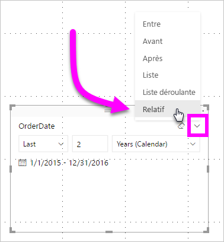

# Utiliser un segment et un filtre de date relative dans Power BI Desktop

Un **segment de date relative** ou un **filtre de date relative** permet d’appliquer des filtres basés sur le temps à n’importe quelle colonne de date dans votre modèle de données. Par exemple, vous pouvez utiliser le **segment de date relative** pour afficher uniquement les données de vente produites durant les 30 derniers jours (ou mois, mois calendaires, etc.). Quand vous actualisez les données, la période relative applique automatiquement la contrainte de date relative appropriée.

## Utiliser le segment de plage de dates relatives

Vous pouvez utiliser le segment de date relative comme tout autre segment. Créez un visuel de **segment** pour votre rapport, puis sélectionnez une valeur de date pour **Champ**. Dans l’image suivante, nous avons sélectionné le champ *OrderDate*.

Sélectionnez le segment sur votre canevas, puis sur le caret dans le coin supérieur droit du visuel de segment. Si le visuel a des données de date, le menu affiche l’option pour **Relatif**.

Pour le segment de date relative, sélectionnez *Relatif*.

Vous pouvez ensuite sélectionner les paramètres.

Pour le premier paramètre du *segment de date relative*, vos choix sont les suivants :

* Dernier

* Suivant

* This

Le deuxième paramètre (milieu) du *segment de date relative* vous permet d’entrer un nombre pour définir la plage de dates relatives.

Le troisième paramètre vous permet de choisir la mesure de la date. Vos choix sont les suivants :

* Jours

* Semaines

* Semaines (calendaires)

* Mois

* Mois (calendaires)

* Années

* Années (civiles)

Si vous sélectionnez **Mois** dans cette liste et entrez *2* dans le paramètre du milieu, voilà ce qui se passe :

* Si nous sommes le 20 juillet,

* les données incluses dans les visuels limités par le segment affichent les données des deux mois précédents,

* à partir du 21 mai jusqu’au 20 juillet (date d’aujourd’hui).

En comparaison, si vous sélectionnez *Mois (calendaires)* , les visuels limités affichent les données du 1er mai jusqu’au 30 juin (les deux derniers mois calendaires complets).

## Utilisation du filtre de plage de dates relatives

Vous pouvez aussi créer un filtre de plage de dates relatives pour la page de votre rapport ou pour l’intégralité de votre rapport. Pour cela, faites glisser un champ de date dans la zone **Filtres au niveau de la page** ou **Filtres au niveau du rapport** dans le volet **Champ**.

Une fois cette opération effectuée, vous pouvez changer la plage de dates relatives. Pour cela, effectuez les mêmes étapes que pour personnaliser le **segment de date relative**. Sélectionnez **Filtrage de date relative** dans la liste déroulante **Type de filtre**.

Une fois **Filtrage de date relative** sélectionné, trois sections à modifier apparaissent, notamment une zone numérique intermédiaire, comme pour le segment.

## Considérations et limitations

Les considérations et limitations suivantes s’appliquent actuellement à l’utilisation du **segment et du filtre de plage de dates relatives**.

* Les modèles de données dans **Power BI** n’incluent pas les informations de fuseau horaire. Ces modèles peuvent stocker des heures, mais sans indication de leur fuseau horaire.

* Le segment et le filtre sont toujours basés sur l’heure UTC (temps universel coordonné). Si vous définissez un filtre dans un rapport et que vous l’envoyez à un collègue dans un autre fuseau horaire, vous voyez tous les deux les mêmes données. Sauf si vous vous trouvez dans le fuseau horaire UTC, vous et votre collègue devez tenir compte du décalage de temps que vous allez rencontrer.

* Vous pouvez convertir à l’heure UTC les données capturées dans un fuseau horaire local en utilisant l’**Éditeur de requête**.

## Étapes suivantes

Découvrez comment [utiliser le regroupement et le compartimentage dans Power BI Desktop](../desktop-grouping-and-binning.md).
