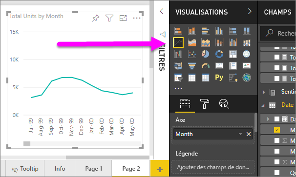
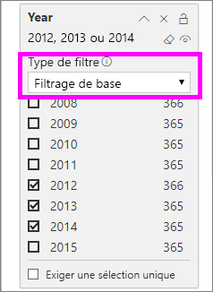

# Graphiques en courbes dans Power BI
Un graphique en courbes est une série de points de données qui sont représentées par des points et connectés par des lignes droites. Un graphique en courbes peut avoir une ou plusieurs lignes. Graphiques en courbes ont un X et un axe des Y. 

## Créer un graphique en courbes
Ces instructions, utilisez les ventes et le Marketing exemple d’application pour créer un graphique en courbes qui affiche les ventes de cette année par catégorie. Pour suivre la procédure, obtenir l’exemple d’application à partir de appsource.com.

1. Démarrez sur une page de rapport vierge. Si vous utilisez le service Power BI, veillez à ouvrir le rapport en [mode Édition](../service-interact-with-a-report-in-editing-view.md).

2. Dans le volet champs, sélectionnez **SalesFact** \> **nombre Total d’unités**, puis sélectionnez **Date** > **mois**.  Power BI crée un graphique à colonnes sur le canevas de rapport.

    

4. Convertir un graphique en courbes en sélectionnant le modèle de graphique de ligne dans le volet visualisations. 

    
   

4. Filtrer votre graphique en courbes pour afficher les données pour les années 2012-2014. Si votre volet filtres est réduite, développez-la maintenant. Dans le volet champs, sélectionnez **Date** \> **année** et faites-le glisser vers le volet filtres. Déposez-le sous le titre **filtres sur ce visuel**. 
     
    

    Modification **filtres avancés** à **filtres de base** et sélectionnez **2012**, **2013** et **2014**.

    

6. Si vous le souhaitez, [ajustez la taille et la couleur du texte du graphique](power-bi-visualization-customize-title-background-and-legend.md). 

    

## Ajoutez des lignes supplémentaires au graphique
Graphiques en courbes peuvent avoir de nombreuses lignes différentes. Et, dans certains cas, les valeurs sur les lignes peuvent être donc divergentes qu’ils n’affichent pas bien ensemble. Penchons-nous sur l’ajout de lignes supplémentaires à notre actuel du graphique et découvrez ensuite comment mettre en forme notre graphique lorsque les valeurs représentées par les lignes sont très différentes. 

### Ajoutez des lignes supplémentaires
Au lieu de regarder le nombre total d’unités pour toutes les régions comme une seule ligne sur le graphique, nous allons fractionner nombre total d’unités par région. Ajoutez des lignes supplémentaires en faisant glisser **géo** > **région** à la zone de légende.

   

### Utilisez les deux axes Y
Que se passe-t-il si vous souhaitez rechercher au total des ventes et le nombre total d’unités sur le même graphique ? Chiffres de ventes sont donc beaucoup plus élevées que les numéros d’unité, ce qui rend le graphique en courbes inutilisable. En fait, la ligne rouge pour le nombre total d’unités semble être égal à zéro.

   

Pour afficher les valeurs divergentes hautement sur un même graphique, utilisez un graphique combiné. Vous pouvez découvrir tous les graphiques combinés en lisant [graphiques combinés dans Power BI](power-bi-visualization-combo-chart.md). Dans notre exemple ci-dessous, nous pouvons afficher les unités de ventes et de totale ensemble sur un graphique en ajoutant un deuxième axe Y. 

   

## Considérations et résolution des problèmes
* Un graphique en courbes ne peut pas avoir deux axes Y.  Vous devez utiliser un graphique combiné à la place.
* Dans les exemples ci-dessus, les graphiques ont été mis en forme pour augmenter la taille de police, modifier la couleur de police, ajouter des titres des axes, le titre du graphique et la légende du centre, démarrer les deux axes à zéro et bien plus encore. Le volet de mise en forme (icône rouleau de peinture) possède un ensemble apparemment interminable d’options pour rendre votre apparence de graphiques comme vous le souhaitez. La meilleure façon d’apprendre consiste à ouvrir le volet Mise en forme et Explorer.

## Étapes suivantes

[Types de visualisation dans Power BI](power-bi-visualization-types-for-reports-and-q-and-a.md)

