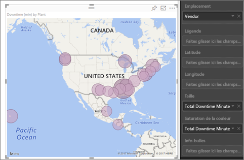
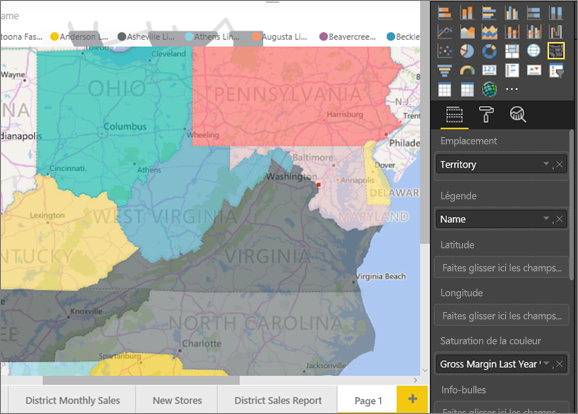
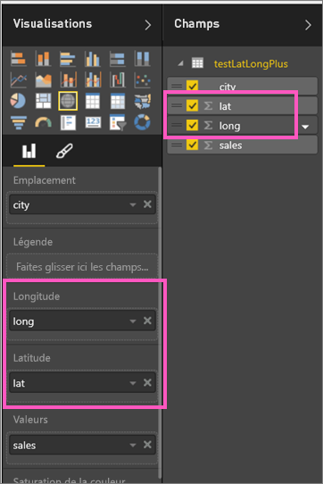
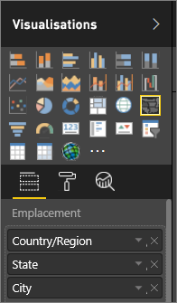

# Trucs et astuces pour les visualisations de carte Power BI
De par son intégration à Bing Cartes, Power BI fournit des coordonnées cartographiques par défaut (processus appelé « géocodage »), ce qui vous permet de créer des cartes. Les deux solutions utilisent des algorithmes pour identifier l’emplacement correct, mais parfois elles présentent seulement une estimation. Si l’instance Power BI échoue à créer la visualisation de carte, elle demande l’aide de Bing Cartes. 

Vous ou votre administrateur devrez peut-être mettre à jour votre pare-feu pour autoriser l’accès aux URL que Bing utilise pour le géocodage.  Il s’agit des URL suivantes :
* https://dev.virtualearth.net/REST/V1/Locations
* https://platform.bing.com/geo/spatial/v1/public/Geodata
* https://www.bing.com/api/maps/mapcontrol

Pour augmenter vos chances d’obtenir un géocodage correct, appliquez les conseils suivants. Vous pouvez utiliser le premier ensemble de conseils si vous avez accès au jeu de données lui-même. Le deuxième ensemble de conseils reprend ce que vous pouvez effectuer dans Power BI si vous n’avez pas accès au jeu de données. 

## Ce qui est envoyé à Bing Cartes
Le service Power BI et Power BI Desktop envoient à Bing les données géographiques nécessaires pour créer la visualisation de carte. Elles peuvent inclure les données des compartiments **Emplacement**, **Latitude** et **Longitude** de la zone des champs du visuel. Ce qui est envoyé exactement varie en fonction du type de carte. Pour en savoir plus, consultez [Bing Cartes](https://go.microsoft.com/fwlink/?LinkID=248686).

* Pour les cartes (à bulles, en nuages de points et à points), si la latitude et la longitude sont fournies, aucune donnée n’est envoyée à Bing. Dans le cas contraire, toutes les données du compartiment **Emplacement** sont envoyées à Bing.     

* Les cartes choroplèthes nécessitent un champ dans le compartiment **Emplacement**, même si la latitude et la longitude sont fournies. Les données figurant dans les compartiments **Emplacement**, **Latitude** et **Longitude** sont envoyées à Bing.
  
    Dans l’exemple ci-dessous, le champ **Vendor** est utilisé pour le géocodage. Les données de la colonne Vendor sont donc envoyées à Bing. Les données des compartiments **Taille** et **Saturation de la couleur** ne sont pas envoyées à Bing.
  
    
  
    Dans le deuxième exemple ci-dessous, le champ **Territory** est utilisé pour le géocodage. Les données de la colonne Territory sont donc envoyées à Bing. Les données des compartiments **Légende** et **Saturation de la couleur** ne sont pas envoyées à Bing.
  
    

## Dans le jeu de données : conseils pour améliorer le jeu de données sous-jacent
Si vous avez accès au jeu de données qui est utilisé pour créer la visualisation de la carte, vous pouvez effectuer quelques opérations pour augmenter la probabilité d’un géocodage correct.

**1. Classer les champs géographiques dans Power BI Desktop**

Dans Power BI Desktop, vous pouvez vous assurer que les champs de données sont correctement géocodés en définissant l’option *Catégorie de données* . Dans la vue de données, sélectionnez la colonne de votre choix. Dans le ruban, sélectionnez l’onglet **Modélisation**, puis définissez la **Catégorie de données** sur **Adresse**, **Ville**, **Continent**, **Pays**, **Région**, **Code Postal**, **État** ou **Province**. Ces catégories de données aident Bing à encoder correctement la date. Pour plus d’informations, consultez [Catégorisation des données dans Power BI Desktop](../desktop-data-categorization.md). Si vous êtes connecté en direct à SQL Server Analysis Services, vous devez définir la catégorisation des données en dehors de Power BI à l’aide de [SQL Server Data Tools (SSDT)](https://docs.microsoft.com/sql/ssdt/download-sql-server-data-tools-ssdt).

**2. Utiliser plusieurs colonnes d’emplacement**    
 Parfois, le fait de définir des catégories de données pour le mappage ne suffit pas à Bing pour deviner votre intention. Certaines désignations sont ambiguës, car l’emplacement existe dans plusieurs pays ou régions. Par exemple, il existe une ville appelée ***Southampton*** en Angleterre, et dans les États de Pennsylvanie et de New York.

Power BI utilise le [service de modèle d’URL non structurée](https://msdn.microsoft.com/library/ff701714.aspx) de Bing pour obtenir les coordonnées de latitude et de longitude en fonction d’un jeu de valeurs d’adresse pour n’importe quel pays. Si vos données ne contiennent pas suffisamment de données d’emplacement, ajoutez ces colonnes et classez-les de façon appropriée.

 Par exemple, si vous n’avez qu’une seule colonne Ville, Bing peut éprouver des difficultés à effectuer le géocodage. Ajoutez des colonnes géographiques supplémentaires pour lever toute ambiguïté concernant l’emplacement.  Il suffit parfois d’ajouter plusieurs colonnes d’emplacement au jeu de données, dans le cas présent, l’état/la province. Et n’oubliez pas de les classer correctement (voir le point 1 ci-dessus).

Vérifiez que chaque champ est associé à une seule catégorie d’emplacement. Par exemple, votre champ de localisation Ville devrait être **Southampton**, non **Southampton, New York**.  Et votre champ de localisation Adresse devrait être **1 Microsoft Way**, non **1 Microsoft Way, Redmond, WA**.

**3. Utiliser des valeurs de latitude et de longitude spécifiques**

Ajoutez des valeurs de latitude et de longitude à votre jeu de données. Cela supprime toute ambiguïté et retourne des résultats plus rapidement. Les champs Latitude et Longitude doivent être au format *Nombre décimal* , que vous pouvez définir dans le modèle de données.

<iframe width="560" height="315" src="https://www.youtube.com/embed/ajTPGNpthcg" frameborder="0" allowfullscreen></iframe>

**4. Utiliser une catégorie Lieu pour les colonnes contenant des informations de localisation complètes**

Bien que nous vous encouragions à utiliser des hiérarchies géographiques dans vos cartes, si vous devez utiliser une seule colonne de localisation avec des informations géographiques complètes, vous pouvez définir la catégorisation des données sur **Lieu**. Par exemple, si les données de la colonne sont des adresses complètes, telles que 1 Microsoft Way, Redmond Washington 98052, cette catégorie de données généralisée fonctionne de façon optimale avec Bing. 

## Dans Power BI : Conseils pour obtenir de meilleurs résultats lors de l’utilisation des visualisations de carte
**1. Utiliser les champs de latitude et de longitude (s’ils existent)**

Dans Power BI, si le jeu de données que vous utilisez a des champs Longitude et Latitude, utilisez-les.  Power BI comporte des compartiments spéciaux permettant de lever toute ambiguïté dans les données cartographiques. Faites simplement glisser le champ qui contient vos données de latitude vers la zone **Visualisations > Latitude**.  Faites la même chose pour vos données de longitude. Quand vous faites cela, vous devez également renseigner le champ *Emplacement* lors de la création de vos visualisations. Sinon, les données seront agrégées par défaut, c’est-à-dire que la latitude et la longitude seront associées au niveau de l’état, et non au niveau de la ville.

 

## Utilisez des hiérarchies géographiques pour effectuer l’exploration hiérarchique des différents « niveaux » de l’emplacement.
Lorsque votre jeu de données comporte déjà différents niveaux de données d’emplacement, vous et vos collègues pouvez utiliser Power BI pour créer des *hiérarchies géographiques*. Pour ce faire, faites glisser plusieurs champs dans le compartiment **Emplacement**. De cette façon, les champs deviennent une hiérarchie géographique. Dans l’exemple ci-dessous, nous avons ajouté des champs géographiques pour : Pays/région, État et Ville. Dans Power BI, vous et vos collègues pouvez monter et descendre dans la hiérarchie à l’aide de cette hiérarchie géographique.

  

   

Lors d’une exploration à l’aide de hiérarchies géographiques, il est important de connaître le fonctionnement de chaque bouton d’exploration et de savoir ce qui est envoyé à Bing Cartes. 

* Le bouton d’exploration tout à fait à droite, appelé mode Exploration  , permet de sélectionner un emplacement sur la carte et d’explorer celui-ci un niveau à la fois. Par exemple, si vous activez Descendre dans la hiérarchie et cliquez sur Amérique du Nord, vous descendez dans la hiérarchie pour accéder au niveau suivant, à savoir celui des États d’Amérique du Nord. Pour le géocodage, Power BI envoie à Bing Cartes des données de pays et d’état uniquement pour l’Amérique du Nord.  
* À gauche, figurent 2 autres options d’exploration. La première option,  , descend au niveau suivant de la hiérarchie pour tous les emplacements à la fois. Par exemple, si vous examinez actuellement les pays, puis utilisez cette option pour passer au niveau suivant, celui des états, Power BI affiche les données d’état pour tous les pays. Pour le géocodage, Power BI envoie des données d’état (non les données de pays) de Bing Cartes pour toutes les localisations. Cette option est utile si chaque niveau de votre hiérarchie est sans relation avec le niveau supérieur. 
* La deuxième option,  , est similaire à l’option Exploration hiérarchique, sauf que vous n’avez pas besoin de cliquer sur la carte.  Elle développe le niveau suivant de la hiérarchie, en mémorisant le contexte du niveau actuel. Par exemple, si vous examinez actuellement les pays, puis sélectionnez cette icône, vous descendez dans la hiérarchie au niveau suivant, celui des états. Pour le géocodage, Power BI envoie des données sur chaque état et le pays correspondant, afin d’aider Bing Cartes à géocoder de façon plus précise. Dans la plupart des cartes, vous utilisez cette option ou l’option Descendre dans la hiérarchie tout à fait à droite, pour pouvoir envoyer à Bing un maximum de données afin obtenir des informations de localisation précises. 

## Étapes suivantes
[Descendre dans la hiérarchie d’une visualisation Power BI](../consumer/end-user-drill.md)

[Visualisations Power BI](power-bi-report-visualizations.md)

D’autres questions ? [Posez vos questions à la communauté Power BI](https://community.powerbi.com/)

