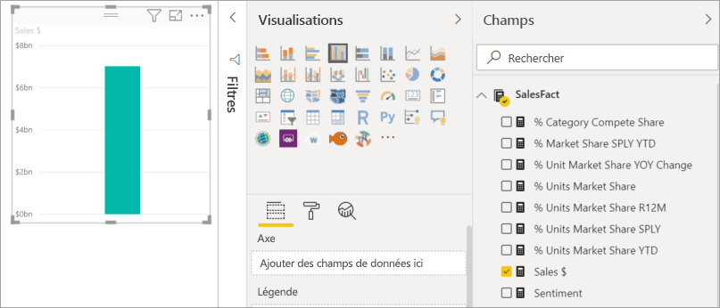
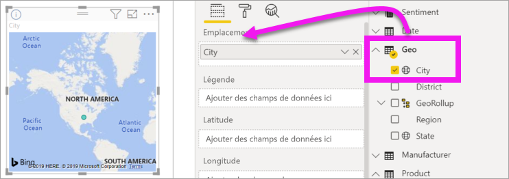

# Ajouter des visuels à un rapport Power BI (partie 1)

[!INCLUDE [power-bi-visuals-desktop-banner](../includes/power-bi-visuals-desktop-banner.md)]

Cet article explique brièvement comment créer une visualisation dans un rapport. Il s’applique à la fois au service Power BI et à Power BI Desktop. Pour un contenu plus avancé, [consultez la partie 2](power-bi-report-add-visualizations-ii.md) de cette série. Regardez Amanda montrer différentes manières de créer, modifier et mettre en forme les visuels sur un canevas de rapport. Essayez ensuite par vous-même d’utiliser l’[exemple Ventes et marketing](../sample-datasets.md) pour créer votre propre rapport.

<iframe width="560" height="315" src="https://www.youtube.com/embed/IkJda4O7oGs" frameborder="0" allowfullscreen></iframe>

## Prérequis

Ce tutoriel s’appuie sur le [fichier PBIX Vente et marketing](https://download.microsoft.com/download/9/7/6/9767913A-29DB-40CF-8944-9AC2BC940C53/Sales%20and%20Marketing%20Sample%20PBIX.pbix).

1. Dans la section supérieure gauche de la barre de menus Power BI Desktop, sélectionnez **Fichier** > **Ouvrir**
   
2. Recherchez votre copie du **fichier PBIX de l’exemple Vente et marketing**

1. Ouvrez le **fichier PBIX de l’exemple Vente et marketing** dans la vue Rapport .

1. Sélectionner  pour ajouter une nouvelle page.

## Ajouter des visualisations au rapport

1. Créez une visualisation en sélectionnant un champ dans le volet **Champs**.

    Commencez par un champ numérique comme **Sales** > **TotalSales** (Ventes > TotalVentes). Power BI crée un histogramme avec une seule colonne.

    

    Ou commencez par un champ de catégorie, tel que **Nom** ou **Produit**. Power BI crée une table et ajoute ce champ à la zone **Valeurs**.

    

    Ou, commencez par un champ géographique, tel que **Geo** > **Ville**. Power BI et Bing Cartes créent une visualisation de carte.

    

## Changer le type de visualisation

 Créez une visualisation, puis modifiez son type. 
 
 1. Sélectionnez **Produit** > **Catégorie**, puis **Produit** > **Quantité de produit** pour ajouter ces éléments à la zone **Valeurs**.

    

1. Changez la visualisation en histogramme en sélectionnant l’icône d’**histogramme empilé**.

   

1. Pour changer le mode de tri du visuel, sélectionnez **Autres actions** (...).  Utilisez les options de tri pour changer le sens du tri (croissant ou décroissant) et la colonne sur laquelle s’effectue le tri (**Trier par**).

   
  
## Étapes suivantes

 Passez à :

* [Partie 2 : Ajouter des visualisations à un rapport Power BI](power-bi-report-add-visualizations-ii.md)

* [interagir avec les visualisations](../consumer/end-user-reading-view.md) dans le rapport ;

