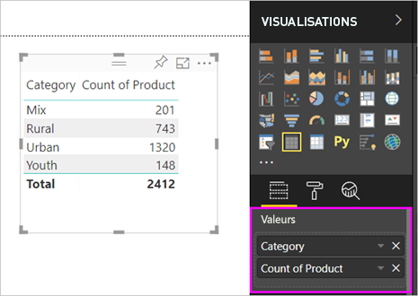

# Partie 1, Ajouter des visualisations à un rapport Power BI
Cet article explique brièvement comment créer une visualisation dans un rapport à l’aide du service Power BI ou de Power BI Desktop.  Pour un contenu plus avancé, [consultez la partie 2](power-bi-report-add-visualizations-ii.md). Regardez Amanda montrer différentes manières de créer, modifier et mettre en forme les visuels sur un canevas de rapport. Essayez ensuite par vous-même d’utiliser l’[exemple Ventes et marketing](../sample-datasets.md) pour créer votre propre rapport.

<iframe width="560" height="315" src="https://www.youtube.com/embed/IkJda4O7oGs" frameborder="0" allowfullscreen></iframe>

## Ouvrir un rapport et ajouter une page vierge
1. Ouvrez un [rapport en Mode Edition](../service-reading-view-and-editing-view.md). Ce didacticiel s’appuie sur l’exemple [Vente et marketing](../sample-datasets.md).
2. Si le volet Champs n’est pas visible, sélectionnez l’icône de flèche pour l’ouvrir. 
   
   
3. [Ajoutez une page vierge au rapport](../power-bi-report-add-page.md).

## Ajouter des visualisations au rapport
1. Créez une visualisation en sélectionnant un champ dans le volet **Champs**.  
   
   **Commencez par un champ numérique** comme SalesFact > Sales $ (Ventes USD). Power BI crée un histogramme avec une seule colonne.
   
   
   
   **Ou, commencez avec un champ de catégorie**, tel que Name (Nom) ou Product (Produit) : Power BI crée une table et ajoute ce champ au puits **Valeurs**.
   
   
   
   **Ou, commencez avec un champ géographique** , tel que Geo > City (Ville). Power BI et Bing Cartes créent une visualisation de carte.
   
   
2. Créez une visualisation, puis modifiez son type. Sélectionnez **Product > Category** (Produit > Catégorie), puis **Product > Count of Product** (Produit > Quantité) pour ajouter ces éléments au puits **Valeurs**.
   
   
3. Changez la visualisation en histogramme en sélectionnant l’icône d’histogramme.
   
   
4. Quand vous créez des visualisations dans votre rapport, vous pouvez les [épingler à votre tableau de bord](../service-dashboard-pin-tile-from-report.md). Pour épingler la visualisation, sélectionnez l’icône d’épingle .
   
   
  

## Étapes suivantes
 passer à la [Partie 2 : Ajouter des visualisations à un rapport Power BI](power-bi-report-add-visualizations-ii.md) ;
   
   [interagir avec les visualisations](../service-reading-view-and-editing-view.md) dans le rapport ;
   
   [exploiter encore davantage les visualisations](power-bi-report-visualizations.md),
   
   [enregistrer votre rapport](../service-report-save.md).
