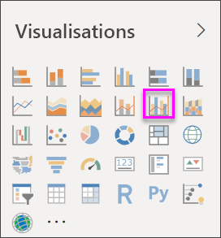
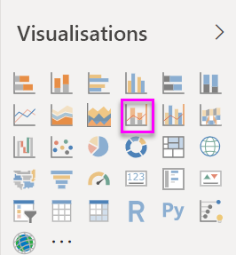
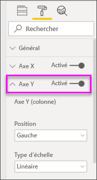
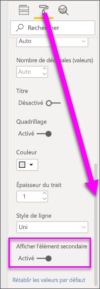

# Créer et utiliser des graphiques combinés dans Power BI

[!INCLUDE[consumer-appliesto-nyyn](../includes/consumer-appliesto-nyyn.md)]

[!INCLUDE [power-bi-visuals-desktop-banner](../includes/power-bi-visuals-desktop-banner.md)]

Dans Power BI, un graphique combiné est une visualisation qui combine un graphique en courbes et un histogramme. Combiner ces deux graphiques en un seul vous permet de comparer plus rapidement les données.

Les graphiques combinés peuvent avoir un ou deux axes Y.

## Quand faut-il utiliser un graphique combiné ?
Les graphiques combinés sont conseillés :

* quand vous avez un graphique en courbes et un histogramme avec le même axe X ;
* pour comparer plusieurs mesures avec des plages de valeurs différentes ;
* pour illustrer la corrélation entre deux mesures dans la même visualisation ;
* pour vérifier si une mesure correspond à la cible qui est définie par une autre mesure ;
* pour utiliser moins d’espace sur le canevas.

> [!NOTE]
> Pour que vous puissiez partager votre rapport avec un collègue Power BI, il faut que vous disposiez tous deux de licences individuelles Power BI Pro ou que le rapport soit enregistré dans une capacité Premium.

### Prérequis
Ce tutoriel utilise le [fichier PBIX de l’exemple Analyse de la vente au détail](https://download.microsoft.com/download/9/6/D/96DDC2FF-2568-491D-AAFA-AFDD6F763AE3/Retail%20Analysis%20Sample%20PBIX.pbix).

1. Dans la section supérieure gauche de la barre de menus, sélectionnez **Fichier** > **Ouvrir**.
   
2. Rechercher votre copie du **fichier PBIX de l’exemple Analyse de la vente au détail**

1. Ouvrez le **fichier PBIX de l’exemple Analyse de la vente au détail** dans la vue Rapport .

1. Sélectionner  pour ajouter une nouvelle page.

## Créer un graphique combiné simple, avec un seul axe
Regardez comment créer un graphique combiné à l’aide de l’exemple Vente et marketing.
   > [!NOTE]
   > Cette vidéo utilise une version antérieure de Power BI Desktop.
   > 
   > 
<iframe width="560" height="315" src="https://www.youtube.com/embed/lnv66cTZ5ho?list=PL1N57mwBHtN0JFoKSR0n-tBkUJHeMP2cP" frameborder="0" allowfullscreen></iframe>  

1. Démarrez sur une page de rapport vide et créez un histogramme qui affiche les ventes de cette année et la marge brute mensuelle.

    a.  Dans le volet Champs, sélectionnez **Sales** \> **This Year Sales** > **Value** (Ventes > Ventes de cette année >Valeur).

    b.  Faites glisser **Sales** \> **Gross Margin This Year** (Ventes > Marge brute cette année) vers **Valeur**.

    c. Sélectionnez **Time** \> **FiscalMonth** (Période > Mois fiscal) pour l’ajouter à **Axe**.

    
5. Sélectionnez **Autres options**  (...) en haut à droite de la visualisation, puis sélectionnez **Trier par > FiscalMonth** (MoisFiscal). Pour modifier l’ordre de tri, sélectionnez les points de suspension à nouveau et choisissez **Tri croissant** ou **Tri décroissant**. Pour cet exemple, nous allons utiliser **Tri croissant**.

6. Convertissez l’histogramme en graphique combiné. Deux graphiques combinés sont disponibles : **Graphique en courbes et histogramme empilé** et **Graphique en courbes et histogramme groupé**. Après avoir sélectionné l’histogramme, ouvrez le volet **Visualisations** et sélectionnez **Graphique en courbes et histogramme groupé**.

    
7. À partir du volet **Champs** , faites glisser **Sales** \> **Last Year Sales** (Ventes > Ventes de l’année dernière) vers **Valeurs de ligne**.

   

   Votre graphique combiné doit ressembler à ceci :

   

## Créer un graphique combiné avec deux axes
Dans cette tâche, nous allons comparer les ventes et la marge brute.

1. Créez un graphique en courbes qui affiche le **Gross Margin last year %** (Pourcentage de marge brute de l’année précédente) par **FiscalMonth** (Mois fiscal). Sélectionnez les points de suspension pour le trier par **mois** et dans l’ordre **croissant**.  
En janvier, la marge brute était de 35 %. Elle a subi un pic à 45 % en avril, a baissé en juillet et a augmenté à nouveau en août. Verrons-nous un modèle similaire dans les ventes de l’année dernière et de cette année ?

   
2. Ajoutez **This Year Sales > Value** (Ventes de l’année > Valeur) et **Last Year Sales** (Ventes de l’année dernière) au graphique en courbes. L’échelle utilisée pour **Gross Margin Last Year %** (Pourcentage de marge brute de l’année précédente) est beaucoup plus petite que l’échelle pour **Sales** (Ventes), ce qui rend difficile la comparaison des données.      

   
3. Pour faciliter la lecture et l’analyse de la visualisation, convertissez le graphique en courbes en un graphique en courbes et histogramme empilé.

   

4. Faites glisser **Gross Margin Last Year %** (Pourcentage de marge brute de l’année précédente) de **Valeurs de colonne** vers **Valeurs de ligne**. Power BI crée deux axes, ce qui permet de définir des échelles différentes pour les jeux de données. L’axe de gauche mesure le montant des ventes et l’axe de droite mesure le pourcentage. Et nous voyons la réponse à notre question : oui, nous notons un modèle similaire.

       

## Ajouter des titres aux axes
1. Sélectionnez l’icône de rouleau de peinture  pour ouvrir le volet Mise en forme.
1. Sélectionnez la flèche déroulante pour développer les options de l’ **axe Y** .
1. Pour l’ **axe Y (colonne)** , définissez les valeurs suivantes : **Position** sur **Gauche** , **Titre** sur **Activé** , **Style** sur **Afficher le titre uniquement** et **Unités d’affichage** sur **Millions**.

   
4. Sous **Axe Y (colonne)** , faites défiler jusqu’à voir **Afficher l’élément secondaire**. Comme de très nombreuses options s’offrent à vous pour les axes Y, il peut être nécessaire d’utiliser les deux barres de défilement. La section Afficher l’élément secondaire contient des options de mise en forme de la partie « graphique en courbes » du graphique combiné.

   
5. Pour l’ **axe Y (ligne)** , laissez **Position** sur **Droite** , définissez **Titre** sur **Activé** et **Style** sur **Afficher le titre uniquement**.

   Le graphique combiné affiche maintenant les deux axes, chacun avec un titre.

   

6. Si vous le souhaitez, modifiez la police, la taille et la couleur de texte et définissez d’autres options de mise en forme pour améliorer l’affichage et la lisibilité du graphique.

À ce stade, vous souhaiterez effectuer les tâches suivantes :

* [Ajoutez le graphique combiné sous forme de vignette de tableau de bord](../create-reports/service-dashboard-tiles.md).
* [Enregistrez le rapport](../create-reports/service-report-save.md).
* [Rendez les rapports plus accessibles aux personnes handicapées](../create-reports/desktop-accessibility-overview.md).

## Mise en surbrillance et filtrage croisés

La mise en surbrillance d’une colonne ou d’une ligne dans un graphique combiné entraîne la mise en surbrillance et le filtrage croisés des autres visualisations sur la page du rapport, et vice versa. Utilisez le contrôle [Interactions entre les visuels](../create-reports/service-reports-visual-interactions.md) pour modifier ce comportement par défaut.

## Étapes suivantes

[Graphiques en anneau dans Power BI](power-bi-visualization-doughnut-charts.md)

[Types de visualisation dans Power BI](power-bi-visualization-types-for-reports-and-q-and-a.md)
