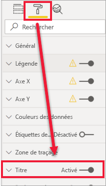
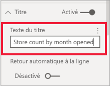
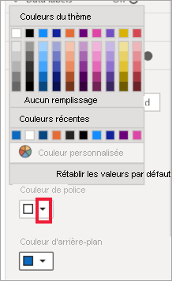
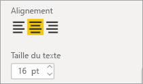
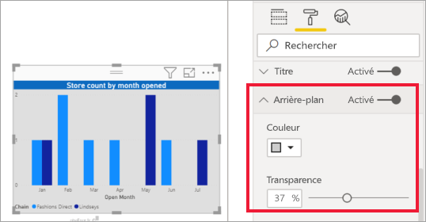
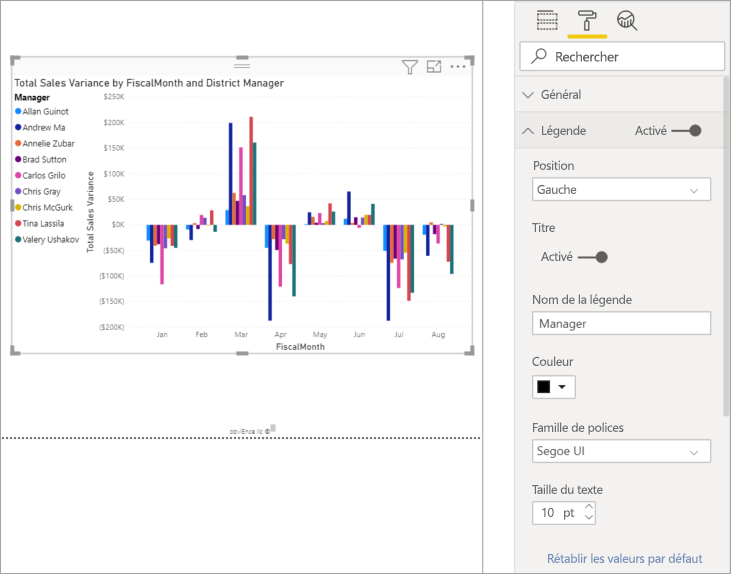
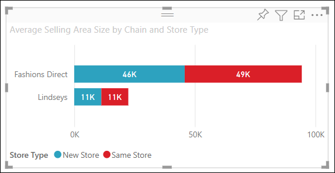
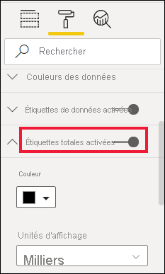

# Personnalisation des titres, des arrière-plans, des étiquettes et des légendes des visualisations

[!INCLUDE[consumer-appliesto-nyyn](../includes/consumer-appliesto-nyyn.md)]    

Ce tutoriel présente quelques façons de personnaliser vos visualisations. Il existe autant d’options permettant de personnaliser vos visualisations. La meilleure façon de les découvrir toutes consiste à Explorer le volet **Mise en forme** (sélectionnez l’icône rouleau de peinture). Pour vous aider à commencer, cet article vous montre comment personnaliser le titre, la légende, l’arrière-plan et l’étiquette d’une visualisation. Il explique également comment ajouter un thème.

Vous ne pouvez pas personnaliser toutes les visualisations. Consultez le [la liste complète](#visualization-types-that-you-can-customize) des visualisations pour plus d’informations.

## Prérequis

- Service Power BI ou Power BI Desktop

- Exemple de rapport Analyse de la vente au détail

> [!NOTE]
> Pour que vous puissiez partager votre rapport avec un collègue Power BI, il faut que vous disposiez tous deux de licences individuelles Power BI Pro ou que le rapport soit enregistré dans une capacité Premium. Consultez [partage des rapports](../collaborate-share/service-share-reports.md).

## Personnaliser les titres des visualisations dans les rapports

Pour poursuivre, connectez-vous à Power BI Desktop, puis ouvrez le rapport [Exemple Analyse de la vente au détail](../create-reports/sample-datasets.md).

> [!NOTE]
> Quand vous épinglez une visualisation à un tableau de bord, elle prend la forme d’une vignette de tableau de bord. Vous pouvez également personnaliser les vignettes proprement dites [en modifiant leur titre et leur sous-titre, en y ajoutant des liens hypertextes et en les redimensionnant](../create-reports/service-dashboard-edit-tile.md).

1. Accédez à la page **New Stores** du rapport **Exemple Analyse de la vente**.

1. Sélectionnez l’histogramme groupé **Open Store Count by Open Month and Chain**.

1. Dans le volet **Visualisations**, sélectionnez l’icône représentant un rouleau pour afficher les options de mise en forme.

1. Sélectionnez **Titre** pour développer cette section.

   

1. Déplacez le curseur **Titre** sur **Activé**.

1. Pour modifier le titre, tapez *Store count by month opened **(Nombre d’ouvertures de magasins pas mois) dans le champ** Texte du titre*.

    

1. Définissez le blanc comme **Couleur de police** et le bleu comme **Couleur d’arrière-plan**.    

    a. Sélectionnez la flèche déroulante et choisissez une couleur dans **Couleurs du thème**, **Couleurs récentes** ou **Couleur personnalisée**.
    
    

    b. Sélectionnez la flèche déroulante pour fermer la fenêtre des couleurs.

1. Augmentez la taille du texte à **16 pt**.

1. Vous allez effectuer une dernière personnalisation : aligner le titre du graphique au centre de la visualisation.

    

    À ce stade du tutoriel, le titre de votre histogramme groupé doit ressembler à ceci :

    

Enregistrez les modifications que vous avez apportées, puis passez à la section suivante.

Si vous devez annuler toutes les modifications, sélectionnez **Rétablir les valeurs par défaut** en bas du volet de personnalisation **Titre**.

## Personnaliser les arrière-plans des visualisations

En reprenant le même histogramme groupé, développez les options **Arrière-plan**.

1. Déplacez le curseur **Arrière-plan** sur **Activé**.

1. Sélectionnez la liste déroulante et choisissez une couleur grise.

1. Changez la **Transparence** à **74 %** .

À ce stade du tutoriel, l’arrière-plan de votre histogramme groupé doit ressembler à ceci :

Enregistrez les modifications que vous avez apportées, puis passez à la section suivante.

Si vous devez annuler toutes les modifications, sélectionnez **Rétablir les valeurs par défaut** en bas du volet de personnalisation **Arrière-plan**.

## Personnaliser les légendes des visualisations

1. Ouvrez la page de rapport **Présentation** et sélectionnez le graphique **Total Sales Variance par FiscalMonth et directeur régional** (Variance du nombre de ventes totales par MoisFiscal et directeur régional).

1. Dans l’onglet **Visualisation**, sélectionnez l’icône en forme de rouleau pour ouvrir le volet Mise en forme.

1. Développez les options de **Légende** :

    

1. Déplacez le curseur **Légende** sur **Activé**.

1. Déplacez la légende à gauche de la visualisation.

1. Ajoutez un titre de légende en basculant le **Titre** sur **Activé**.

1. Entrez *Gestionnaire* dans le champ **Nom de la légende**.

1. Définissez le noir comme **Couleur**.

Enregistrez les modifications que vous avez apportées, puis passez à la section suivante.

Si vous devez annuler toutes les modifications, sélectionnez **Rétablir les valeurs par défaut** en bas du volet de personnalisation **Légende**.

## Personnalisation des étiquettes de total des visuels empilés
Les visuels empilés peuvent présenter des étiquettes de données et des étiquettes de total. Sur un histogramme empilé, les étiquettes de données identifient la valeur de chaque partie d’une colonne. Les étiquettes de total indiquent la valeur totale de la colonne agrégée. 

Regardez comment ajouter des étiquettes de total à un histogramme empilé, puis suivez la procédure ci-dessous pour essayer par vous-même.

> [!VIDEO https://www.youtube.com/embed/OgjX-pFGgfM]

1. Ouvrez la page de rapport **Vue d’ensemble** et sélectionnez l’histogramme **Average selling area size by chain and store type** (Taille moyenne de la zone de vente par chaîne et par type de magasin).

1. Dans l’onglet **Visualisation**, sélectionnez  pour convertir cet histogramme en histogramme empilé. Comme vous pouvez le constater, le visuel conserve ses étiquettes de données. 

    

1. Dans l’onglet **Visualisation**, sélectionnez l’icône en forme de rouleau pour ouvrir le volet Mise en forme.

1. Déplacez le curseur **Étiquettes de total** sur **Activé**. 

    

1. Si vous le souhaitez, mettez en forme les étiquettes de total. Dans cet exemple, nous avons changé la couleur en noir, augmenté la taille de police et choisi d’afficher les valeurs en **Milliers**.

    

## Personnaliser les couleurs à l’aide d’un thème

Avec les thèmes de rapport, vous pouvez appliquer des changements de conception à l’ensemble de votre rapport, par exemple en utilisant les couleurs de votre entreprise, en changeant des jeux d’icônes ou en appliquant une nouvelle mise en forme visuelle par défaut. Quand vous appliquez un thème de rapport, tous les visuels du rapport utilisent les couleurs et la mise en forme du thème sélectionné.

Pour appliquer un thème à votre rapport, sélectionnez **Changer de thème** dans la barre de menus. Choisissez un thème.  Le rapport ci-dessous utilise le thème **Solaire**.

 

## Types de visualisations que vous pouvez personnaliser

Voici une liste des visualisations et des options de personnalisation respectivement disponibles :

| Visualisation | Titre | Arrière-plan | Légende | Étiquettes de total
|:--- |:--- |:--- |:--- |:--- |
| Zone | oui | oui |oui | oui  |
| Barres | oui | oui |Oui | oui |
| Carte | oui | oui |n/a | n/a |
| Carte à plusieurs lignes | oui | oui | n/a | n/a |
| Colonne | oui | oui | Oui |  oui |
| Combiné | oui | Oui | Oui | oui |
| Graphique en anneau | oui | Oui | oui | n/a |
| Carte choroplèthe | oui | oui | oui |n/a |
| Entonnoir | oui | oui | n/a |n/a |
| Jauge | oui | oui | n/a |n/a |
| Influenceur clé | oui | oui | n/a |n/a |
| KPI | oui | oui | n/a |n/a |
| Ligne | oui | oui | oui |n/a |
| Carte | oui | Oui | oui |n/a |
| Matrice | oui | oui | n/a |oui |
| Secteurs | oui | oui | oui |n/a |
| Questions et réponses | oui | oui | n/a |n/a |
| Nuage de points | oui | Oui | oui |n/a |
| Forme | oui | Oui | oui |n/a |
| Segment | oui | oui | n/a |n/a |
| Table | oui | oui | n/a |Oui |
| Zone de texte | non | oui | n/a |n/a |
| Treemap | oui | Oui | oui |n/a |
| Cascade | oui | Oui | oui |n/a |

## Étapes suivantes

- [Personnaliser les propriétés des axes X et Y](power-bi-visualization-customize-x-axis-and-y-axis.md)

- [Prise en main de la mise en forme des couleurs et des propriétés d’axe](service-getting-started-with-color-formatting-and-axis-properties.md)

D’autres questions ? [Posez vos questions à la communauté Power BI](https://community.powerbi.com/)

