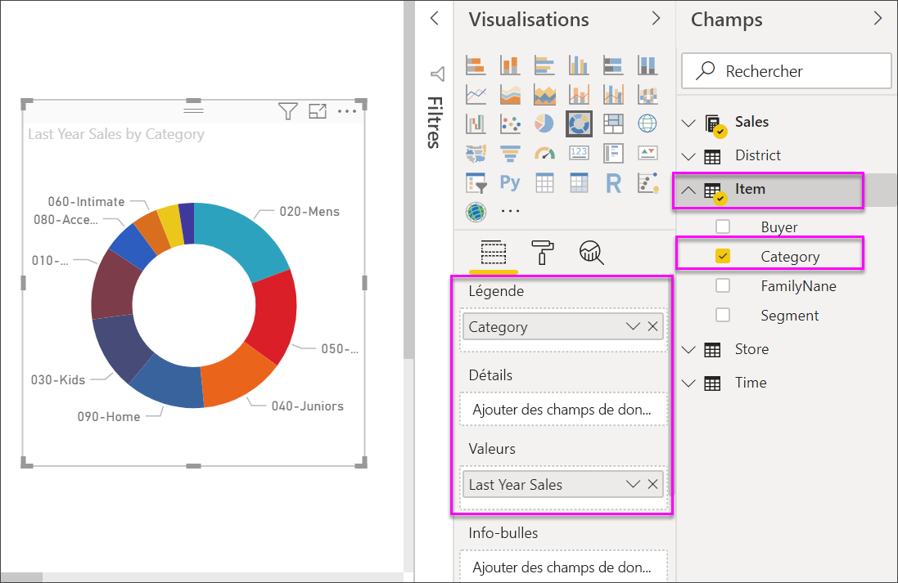

# Graphiques en anneau dans Power BI
Un graphique en anneau est similaire à un graphique en secteurs, car il représente aussi la relation de parties par rapport à un ensemble. La seule différence est que le centre est vide et qu’il y a de la place pour une étiquette ou une icône.

## Créer un graphique en anneau
Ces instructions utilisent l’Exemple Analyse de la vente au détail pour créer un graphique en anneau qui affiche les ventes de cette année par catégorie. [Téléchargez l’exemple](../sample-datasets.md) pour le service Power BI ou Power BI Desktop.

1. Démarrez sur une page de rapport vierge. Si vous utilisez le service Power BI, veillez à ouvrir le rapport en [mode Édition](../service-interact-with-a-report-in-editing-view.md).

2. Dans le volet Champs, sélectionnez **Sales** \> **Last Year Sales** (Ventes > Ventes de l’année dernière).  
   
3. Dans le volet Visualisations, sélectionnez l’icône de graphique en anneau  pour convertir votre histogramme en graphique en anneau. Si **Last Year Sales** (Ventes de l’année dernière) ne figure pas dans la zone **Valeurs**, faites-le glisser vers cette zone.
     
   

4. Sélectionnez **Élément** \> **Catégorie** pour l’ajouter à la zone **Légende**. 
     
    

5. Si vous le souhaitez, [ajustez la taille et la couleur du texte du graphique](power-bi-visualization-customize-title-background-and-legend.md). 

## Considérations et résolution des problèmes
* La somme des valeurs du graphique en anneau doit atteindre 100 %.
* L’utilisation d’un trop grand nombre de catégories peut rendre le graphique difficile à lire et à analyser.
* Les graphiques en anneau sont davantage adaptés pour comparer une section spécifique par rapport à l’ensemble que pour comparer des sections individuelles entre elles. 

## Étapes suivantes
[Graphiques en entonnoir dans Power BI](power-bi-visualization-funnel-charts.md)

[Types de visualisation dans Power BI](power-bi-visualization-types-for-reports-and-q-and-a.md)

