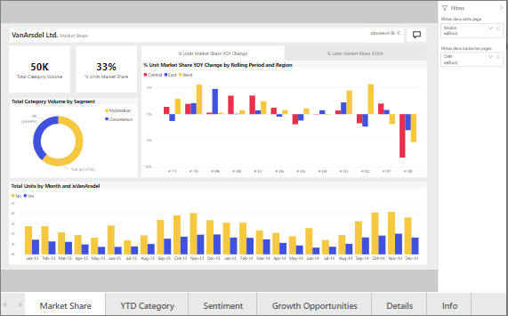
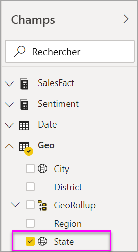
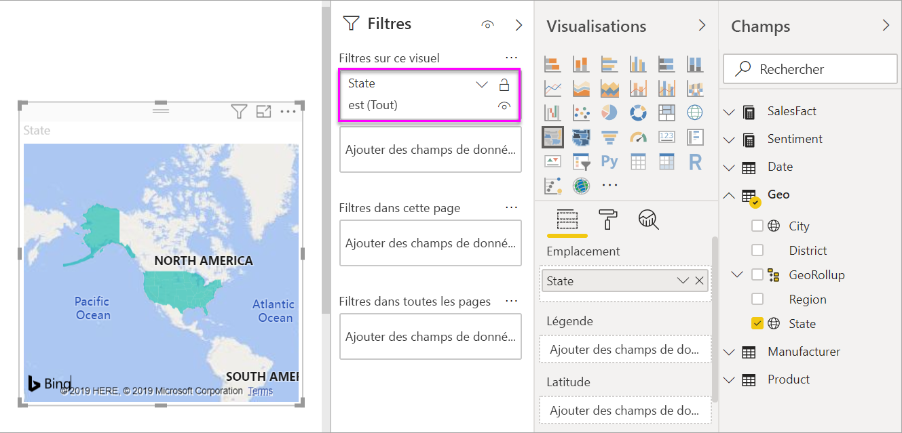
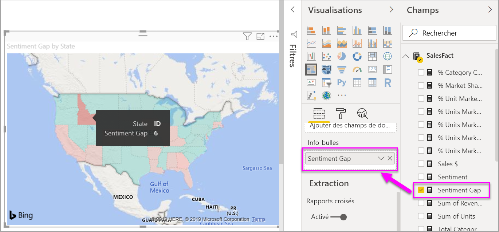

# Cartes choroplèthes dans Power BI
Une carte choroplèthe utilise des ombrages, des teintes ou des motifs pour représenter proportionnellement les variations d’une valeur entre des zones géographiques ou des régions.  Visualisez rapidement les écarts relatifs grâce aux ombrages allant du clair (moins fréquent/plus bas) au foncé (plus fréquent/plus élevé).    

## Ce qui est envoyé à Bing
De par son intégration à Bing, Power BI fournit des coordonnées cartographiques par défaut (processus appelé « géocodage »). Lorsque vous créez une visualisation de carte dans le service Power BI ou Power BI Desktop, les données contenues dans les compartiments **Emplacement**, **Latitude** et **Longitude** (utilisées pour créer cette visualisation) sont envoyées à Bing.

Vous ou votre administrateur devrez peut-être mettre à jour votre pare-feu pour autoriser l’accès aux URL que Bing utilise pour le géocodage.  Il s’agit des URL suivantes :
- https://dev.virtualearth.net/REST/V1/Locations    
- https://platform.bing.com/geo/spatial/v1/public/Geodata    
- https://www.bing.com/api/maps/mapcontrol

Pour plus d’informations sur les données envoyées à Bing et pour obtenir des conseils afin d’augmenter vos chances d’obtenir un géocodage correct, consultez [Trucs et astuces pour les visualisations de carte](power-bi-map-tips-and-tricks.md).

## Quand faut-il utiliser une carte choroplèthe ?
Les cartes choroplèthes sont conseillées :

* pour afficher des données quantitatives sur une carte ;
* pour représenter les relations et les modèles spatiaux ;
* quand vos données sont normalisées ;
* quand vous travaillez avec des données socio-économiques ;
* quand les régions définies sont de grande taille ;
* pour obtenir une vue d’ensemble de la répartition entre les zones géographiques.

### Conditions préalables
- Service Power BI ou Power BI Desktop
- Exemple Vente et marketing

Pour la suite, le didacticiel utilise le service Power BI, et non Power BI Desktop.

## Créer une carte choroplèthe simple
Dans cette vidéo, Kim crée une carte de base et la convertit en carte choroplèthe.

<iframe width="560" height="315" src="https://www.youtube.com/embed/ajTPGNpthcg" frameborder="0" allowfullscreen></iframe>

### Obtenir des données et ajouter une nouvelle page vierge au rapport
1. Pour créer votre propre carte choroplèthe, [téléchargez l’exemple Vente et marketing](../sample-datasets.md) en vous connectant à Power BI et en sélectionnant  **Obtenir les données \> Exemples \> Ventes et marketing\> Se connecter**. Ou obtenez l’application **Power BI Ventes et marketing** sur appsource.com. 

2. Ouvrez le rapport Ventes et marketing.

   
3. Power BI ouvre le rapport. Sélectionnez **Modifier le rapport** pour ouvrir le rapport en [Mode Édition](../service-interact-with-a-report-in-editing-view.md).

4. Ajoutez une nouvelle page en sélectionnant le signe « + » jaune en bas du canevas de rapport.

    

### Créer une carte choroplèthe
1. Dans le volet Champs, sélectionnez le champ **Géo** \> **État**.    

   
2. [Convertissez le graphique](power-bi-report-change-visualization-type.md) en carte choroplèthe. Notez que **État** figure maintenant dans **Emplacement**. Bing Cartes utilise le champ dans **Emplacement** pour créer la carte.  L’emplacement peut être n’importe quel emplacement valide : pays, État, région, ville, code postal ou autre code, etc. Bing Cartes fournit des formats de cartes choroplèthes pour de nombreux emplacements dans le monde. À défaut d’entrée valide pour l’emplacement, Power BI ne peut pas créer la carte choroplèthe.  

   
3. Filtrez la carte pour afficher uniquement la zone continentale des États-Unis.

   a.  En bas du volet Visualisations, recherchez la zone **Filtres** .

   b.  Pointez sur **State** (État) et cliquez sur la flèche de développement  
   

   c.  Cochez la case **All** et décochez la case **AK**.

   
4. Sélectionnez l’icône en forme de rouleau pour ouvrir le volet Mise en forme et choisissez **Couleurs des données**.

    

5. Sélectionnez les trois points verticaux et choisissez **Mise en forme conditionnelle**.

    

6. Utilisez l’écran **Couleur par défaut - Couleurs des données** pour déterminer comment votre carte choroplèthe sera ombrée. Les options à votre disposition incluent quel champ choisir pour la base de l’ombrage et comment appliquer l’ombrage. Dans cet exemple, nous utilisons le champ **SalesFact** > **Sentiment** et en définissant la valeur la plus basse du sentiment en rouge et la valeur la plus élevée en vert. Les valeurs comprises entre la valeur maximale et minimale seront des nuances de rouge et vert. L’illustration en bas de l’écran affiche la plage des couleurs qui seront utilisées. 

    

7. La carte choroplèthe est en rouge et vert. Le rouge représente les indices de sentiment bas et le vert représente les indices de sentiment élevés (sentiment plus positif).  Pour afficher des détails supplémentaires, faites glisser un champ dans la zone Info-bulles.  Ici, j’ai ajouté **Intervalle de sentiment** et mis en surbrillance l’état d’Idaho (ID) et observé que l’intervalle de sentiment est faible, à 6.
   

10. [Enregistrez le rapport](../service-report-save.md).

Power BI vous donne suffisamment de contrôle sur l’apparence de votre carte choroplèthe. Familiarisez-vous avec ces contrôles des couleurs des données jusqu'à ce que vous atteigniez l’aspect souhaité. 

## Mise en surbrillance et filtrage croisé
Pour plus d’informations sur le volet Filtres, consultez [Ajouter un filtre à un rapport](../power-bi-report-add-filter.md).

La mise en surbrillance d’un emplacement sur une carte choroplèthe entraîne le filtrage croisé des autres visualisations sur la page du rapport et vice versa.

1. Commencez par enregistrer ce rapport en sélectionnant **Fichier > Enregistrer**. 

2. Copiez la carte choroplèthe à l’aide de Ctrl+C.

3. En bas du canevas du rapport, sélectionnez l’onglet **Sentiment** pour ouvrir la page de rapport Sentiments.

    

4. Déplacez et redimensionnez les visualisations dans la page afin de libérer de la place, puis collez (Ctrl+V) la carte choroplèthe du rapport précédent.

   

5. Sur la carte choroplèthe, sélectionnez un État.  Cela met en surbrillance les autres visualisations sur la page. La sélection de **Texas**, par exemple, montre que le sentiment est de 74 ; Texas se trouve dans la région centrale \#23.   
   
2. Sélectionnez un point de données sur le graphique en courbes VanArsdel - Sentiment par mois. Cela permet de filtrer la carte choroplèthe pour afficher l’indice de sentiment pour VanArsdel et pas pour la concurrence de VanArsdel.  
   

## Considérations et résolution des problèmes
Les données cartographiques peuvent être ambiguës.  Par exemple, il existe un Paris en France, mais aussi un Paris au Texas. Vos données géographiques sont probablement stockées dans des colonnes distinctes (une colonne pour les noms de ville, une colonne pour les noms d’État ou de région, etc.), ce qui peut empêcher Bing de distinguer les deux Paris. Si votre jeu de données contient déjà des données de latitude et de longitude, Power BI comporte des champs spéciaux permettant de lever toute ambiguïté dans les données cartographiques. Faites simplement glisser le champ qui contient vos données de latitude vers la zone Visualisations \> Latitude.  Faites la même chose pour vos données de longitude.    

Si vous disposez des autorisations nécessaires pour modifier le jeu de données dans Power BI Desktop, regardez cette vidéo en cas de doute sur les cartes.

<iframe width="560" height="315" src="https://www.youtube.com/embed/Co2z9b-s_yM" frameborder="0" allowfullscreen></iframe>

Si vous n’avez pas accès aux données de latitude et de longitude, mais que vous avez accès en modification au jeu de données, [suivez ces instructions pour mettre à jour votre jeu de données](https://support.office.com/article/Maps-in-Power-View-8A9B2AF3-A055-4131-A327-85CC835271F7).

Pour plus d’informations sur les visualisations de carte, consultez [Tips and tricks for map visualizations](../power-bi-map-tips-and-tricks.md) (Trucs et astuces pour les visualisations de carte).

## Étapes suivantes

[Carte de formes](desktop-shape-map.md)

[Types de visualisation dans Power BI](power-bi-visualization-types-for-reports-and-q-and-a.md)