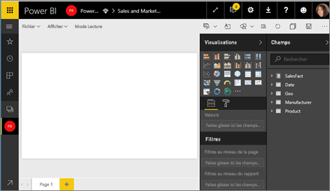
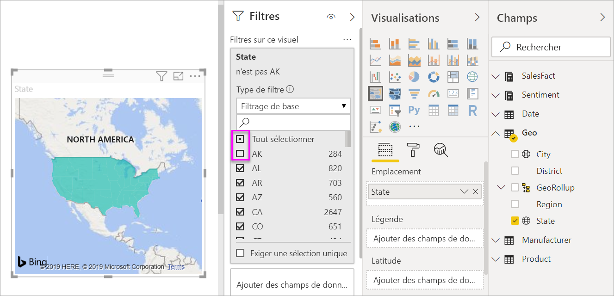

# Cartes choroplèthes dans Power BI
Une carte choroplèthe utilise des ombrages, des teintes ou des motifs pour représenter proportionnellement les variations d’une valeur entre des zones géographiques ou des régions.  Visualisez rapidement les écarts relatifs grâce aux ombrages allant du clair (moins fréquent/plus bas) au foncé (plus fréquent/plus élevé).    

## Ce qui est envoyé à Bing
De par son intégration à Bing, Power BI fournit des coordonnées cartographiques par défaut (processus appelé « géocodage »). Lorsque vous créez une visualisation de carte dans le service Power BI ou Power BI Desktop, les données contenues dans les compartiments **Emplacement**, **Latitude** et **Longitude** (utilisées pour créer cette visualisation) sont envoyées à Bing.

Vous ou votre administrateur devrez peut-être mettre à jour votre pare-feu pour autoriser l’accès aux URL que Bing utilise pour le géocodage.  Il s’agit des URL suivantes :
    * https://dev.virtualearth.net/REST/V1/Locations
    * https://platform.bing.com/geo/spatial/v1/public/Geodata
    * https://www.bing.com/api/maps/mapcontrol

Pour plus d’informations sur les données envoyées à Bing et pour obtenir des conseils afin d’augmenter vos chances d’obtenir un géocodage correct, consultez [Trucs et astuces pour les visualisations de carte](power-bi-map-tips-and-tricks.md).

## Quand faut-il utiliser une carte choroplèthe ?
Les cartes choroplèthes sont conseillées :

* pour afficher des données quantitatives sur une carte ;
* pour représenter les relations et les modèles spatiaux ;
* quand vos données sont normalisées ;
* quand vous travaillez avec des données socio-économiques ;
* quand les régions définies sont de grande taille ;
* pour obtenir une vue d’ensemble de la répartition entre les zones géographiques.

### Conditions préalables
- Service Power BI ou Power BI Desktop
- Exemple Vente et marketing

Pour la suite, le didacticiel utilise le service Power BI, et non Power BI Desktop.

## Créer une carte choroplèthe simple
Dans cette vidéo, Kim crée une carte de base et la convertit en carte choroplèthe.

<iframe width="560" height="315" src="https://www.youtube.com/embed/ajTPGNpthcg" frameborder="0" allowfullscreen></iframe>

1. Pour créer votre propre carte choroplèthe, [téléchargez l’exemple Vente et marketing](../sample-datasets.md) en vous connectant à Power BI et en sélectionnant  **Obtenir les données \> Exemples \> Ventes et marketing\> Se connecter**.
2. Lorsque le message de réussite s’affiche, sélectionnez **mode jeu de données**.

   
3. Power BI ouvre un canevas de rapport vide en [mode Édition](../service-interact-with-a-report-in-editing-view.md).

    
4. Dans le volet Champs, sélectionnez le champ **Géo** \> **État**.    

   
5. [Convertissez le graphique](power-bi-report-change-visualization-type.md) en carte choroplèthe. Notez que **État** figure maintenant dans **Emplacement**. Bing Cartes utilise le champ dans **Emplacement** pour créer la carte.  L’emplacement peut être n’importe quel emplacement valide : pays, État, région, ville, code postal ou autre code, etc. Bing Cartes fournit des formats de cartes choroplèthes pour de nombreux emplacements dans le monde. À défaut d’entrée valide pour l’emplacement, Power BI ne peut pas créer la carte choroplèthe.  

   
6. Filtrez la carte pour afficher uniquement la zone continentale des États-Unis.

   a.  En bas du volet Visualisations, recherchez la zone **Filtres** .

   b.  Pointez sur **State** (État) et cliquez sur la flèche de développement  
   

   c.  Cochez la case **Tous** et décochez la case **AK**.

   
7. Sélectionnez **SalesFact** \> **Sentiment** pour l’ajouter à **Saturation de la couleur**. Le champ dans **Saturation de la couleur** détermine l’ombrage de la carte.  
   
8. La carte choroplèthe a un ombrage vert. Le vert clair représente des indices de sentiment bas et le vert foncé représente des indices de sentiment élevés (sentiment plus positif).  Ici, j’ai mis en surbrillance l’État du Wyoming (WY) et je vois que l’indice de sentiment est très bon (74).  
   
9. [Enregistrez le rapport](../service-report-save.md).

## Mise en surbrillance et filtrage croisé
Pour plus d’informations sur le volet Filtres, consultez [Ajouter un filtre à un rapport](../power-bi-report-add-filter.md).

La mise en surbrillance d’un emplacement sur une carte choroplèthe entraîne le filtrage croisé des autres visualisations sur la page du rapport et vice versa.

Pour poursuivre, copiez et collez votre carte choroplèthe dans la page **Sentiment** du rapport *Sales and Marketing* (Ventes et Marketing).

1. Sur la carte choroplèthe, sélectionnez un État.  Cela met en surbrillance les autres visualisations sur la page. La sélection de **Texas**, par exemple, montre que l’indice de sentiment est 74, que le Texas fait partie de la région centrale \#23 et que l’essentiel du volume des ventes est généré par les segments Moderation et Convenience.   
   
2. Sur le graphique en courbes, basculez entre **Non** et **Oui**. Cela permet de filtrer la carte choroplèthe pour afficher l’indice de sentiment pour VanArsdel et pour la concurrence de VanArsdel.  
   

## Considérations et résolution des problèmes
Les données cartographiques peuvent être ambiguës.  Par exemple, il existe un Paris en France, mais aussi un Paris au Texas. Vos données géographiques sont probablement stockées dans des colonnes distinctes (une colonne pour les noms de ville, une colonne pour les noms d’État ou de région, etc.), ce qui peut empêcher Bing de distinguer les deux Paris. Si votre jeu de données contient déjà des données de latitude et de longitude, Power BI comporte des champs spéciaux permettant de lever toute ambiguïté dans les données cartographiques. Faites simplement glisser le champ qui contient vos données de latitude vers la zone Visualisations \> Latitude.  Faites la même chose pour vos données de longitude.  

Si vous disposez des autorisations nécessaires pour modifier le jeu de données dans Power BI Desktop, regardez cette vidéo en cas de doute sur les cartes.

<iframe width="560" height="315" src="https://www.youtube.com/embed/Co2z9b-s_yM" frameborder="0" allowfullscreen></iframe>

Si vous ne possédez pas de données de latitude et de longitude, [suivez ces instructions pour mettre à jour votre jeu de données](https://support.office.com/article/Maps-in-Power-View-8A9B2AF3-A055-4131-A327-85CC835271F7).

Pour plus d’informations sur les visualisations de carte, consultez [Tips and tricks for map visualizations](power-bi-map-tips-and-tricks.md) (Trucs et astuces pour les visualisations de carte).

## Étapes suivantes
[Ajouter la carte choroplèthe sous forme de vignette de tableau de bord (épingler le visuel)](../consumer/end-user-tiles.md)    
 [Ajouter une visualisation à un rapport](power-bi-report-add-visualizations-i.md)  
 [Types de visualisations dans Power BI](power-bi-visualization-types-for-reports-and-q-and-a.md)    
 [Modifier le type de visualisation utilisé](power-bi-report-change-visualization-type.md)      
D’autres questions ? [Posez vos questions à la communauté Power BI](http://community.powerbi.com/)
