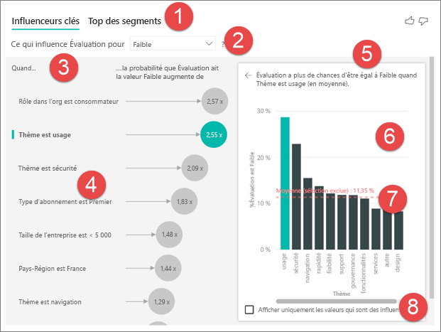
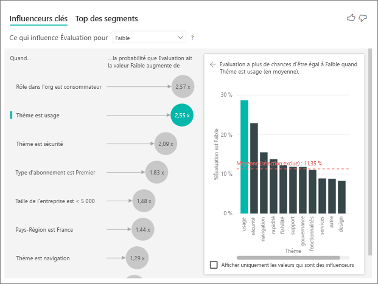
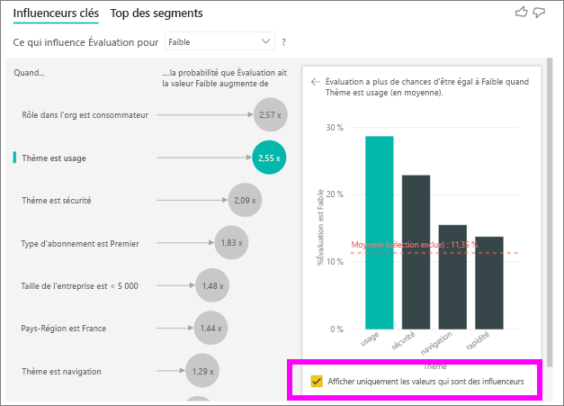
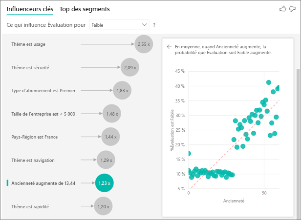
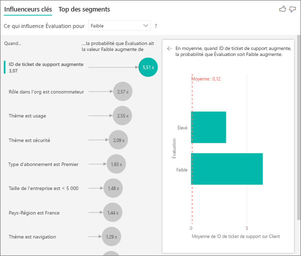
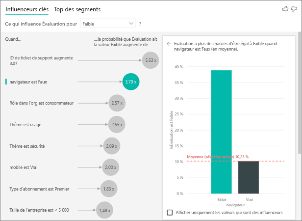
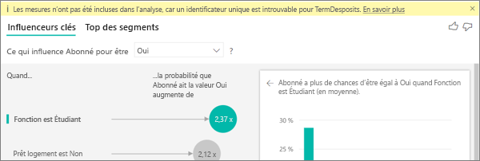

# Visualisation des influenceurs clés
Le visuel d’influenceurs clés vous aide à comprendre les facteurs qui affectent une métrique qui vous intéresse. Il analyse vos données, classe les facteurs qui sont importants et les affiche sous forme d’influenceurs clés. Par exemple, imaginez que vous aimeriez savoir ce qui influence le renouvellement du personnel. L’un des facteurs peut être la longueur du contrat d’emploi et un autre peut être l’âge de l’employé. 
 
## Quand utiliser des influenceurs clés ? 
Le visuel d’influenceur clé constitue un excellent choix quand vous souhaitez : 
- Voir quels facteurs affectent la métrique en cours d’analyse.

- Contraster l’importance relative de ces facteurs. Par exemple, les contrats à court terme ont-ils plus d’impact sur le renouvellement du personnel que les contrats à long terme ? 

## Exigences relatives aux influenceurs clés 
La métrique que vous analysez doit être un champ de catégorie.    

## Caractéristiques du visuel d’influenceur clé

    

1. ***Onglets*** : sélectionnez un onglet pour basculer entre les vues. Influenceurs clés montre les principaux contributeurs à la valeur de métrique sélectionnée. Top des segments montre les principaux segments qui contribuent à la valeur de métrique sélectionnée. Un *segment* est composé d’une combinaison de valeurs.  Par exemple, un segment peut représenter les consommateurs qui sont clients depuis au moins 20 ans et qui habitent dans la région Ouest. 

2. ***Liste déroulante*** : valeur de la métrique en cours d’investigation. Dans cet exemple, nous nous intéressons à la métrique **évaluation** et la valeur que nous avons sélectionnée est **faible**.    

3. ***Répétition*** : aide à interpréter le visuel dans le volet gauche. 

4. ***Volet gauche*** : le volet gauche contient un visuel.  Ici, le volet gauche nous montre une liste des principaux influenceurs clés.

5. ***Répétition*** : aide à interpréter le visuel dans le volet droit.

6. ***Volet droit*** : le volet droit contient un visuel. Ici, l’histogramme affiche toutes les valeurs pour l’**influenceur clé**, **Thème**, qui est sélectionné dans le volet gauche. La valeur spécifique (**Usage**) dans le volet gauche est indiquée en vert et toutes les autres valeurs pour **Thème** sont en noir.

7. ***Ligne moyenne*** : la moyenne est calculée pour toutes les autres valeurs possibles pour **Thème** sauf **usage**. Le calcul s’applique donc à toutes les valeurs en noir. Cela nous indique quel pourcentage des autres **Thèmes** nous a donné une faible évaluation. Autrement dit, quand une évaluation est donnée par un client, celui-ci décrit également la raison ou le **thème** pour l’évaluation. Les thèmes possibles sont l’usage, la vitesse, la sécurité, et ainsi de suite. **Thème** est **Usage** est le deuxième influenceur clé le plus important pour une évaluation faible, d’après notre visuel dans le volet gauche. Si nous faisons la moyenne de tous les autres thèmes et de leur contribution à une évaluation **faible**, nous obtenons le résultat illustré ici en rouge. 

8. ***Case à cocher*** : affiche uniquement les valeurs qui sont des influenceurs.

## Créer un visuel d’influenceurs clés 
 
Regardez cette vidéo pour découvrir comment créer un visuel d’influenceurs clés, puis suivez les étapes ci-dessous pour en créer un vous-même. 

<iframe width="560" height="315" src="https://www.youtube.com/embed/fDb5zZ3xmxU" frameborder="0" allow="accelerometer; autoplay; encrypted-media; gyroscope; picture-in-picture" allowfullscreen></iframe>

Notre responsable produit souhaite identifier les facteurs qui poussent les clients à laisser des avis négatifs sur notre service cloud.  Pour suivre la procédure, ouvrez le [fichier PBIX de commentaires client](https://github.com/Microsoft/powerbi-desktop-samples/blob/master/2019/customerfeedback.pbix) dans Power BI Desktop. Vous pouvez également télécharger le [fichier Excel de commentaires client pour le service Power BI ou Power BI Desktop](https://github.com/Microsoft/powerbi-desktop-samples/blob/master/2019/customerfeedback.xlsx). 

> [!NOTE]
> Le jeu de données de commentaires clients est basé sur [Moro et al., 2014] S. Moro, P. Cortez et P. Rita. A Data-Driven Approach to Predict the Success of Bank Telemarketing. Decision Support Systems, Elsevier, 62:22-31, Juin 2014 

1. Ouvrez le rapport et sélectionnez l’icône d’influenceurs clés.  

    

2. Faites glisser la métrique que vous voulez examiner dans le champ **Analyser**. Le champ **Analyser** prend uniquement en charge les variables catégorielles (discontinues). Ce qui nous intéresse, ce sont les facteurs qui incitent les clients à laisser une évaluation **faible** pour notre service. Nous allons donc sélectionner **Table des clients** > **Évaluation**.    
3. Ensuite, faites glisser les champs qui selon vous pourraient influencer **Évaluation** dans le puits **Expliquer par**. Vous pouvez faire glisser autant de champs que vous le souhaitez. Ici, nous allons commencer avec : 
    - Pays-Région 
    - Rôle dans l’org 
    - Type d’abonnement 
    - Taille de l’entreprise 
    - Thème     
4. Étant donné que nous sommes intéressés par les évaluations négatives, sélectionnez **Faible** dans la liste déroulante **Ce qui influence Évaluation à être**.  

    

L’analyse s’exécute sur le niveau table du champ en cours d’analyse. Ici, nous sommes intéressés par la métrique **Évaluation**, qui est définie à un niveau client (chaque client a attribué un score élevé ou faible). Tous nos facteurs explicatifs doivent être définis au niveau du client pour que le visuel puisse les utiliser. 

Dans l’exemple ci-dessus, tous nos facteurs explicatifs ont une relation un-à-un ou plusieurs-à-un avec notre métrique. Par exemple, chaque score est associé à exactement un thème (celui qui était le thème principal de l’évaluation du client). De même, les clients proviennent d’un pays, ont un type d’appartenance et un rôle dans leur organisation. Nos facteurs explicatifs sont donc déjà des attributs d’un client et aucune transformation n’est nécessaire : le visuel peut les utiliser immédiatement. 

Plus loin dans le tutoriel, nous examinerons des exemples plus complexes où nous aurons des relations un-à-plusieurs. Dans ces cas-là, vous devrez d’abord agréger les colonnes au niveau client avant de pouvoir exécuter l’analyse.  

Les métriques et agrégats utilisés comme facteurs explicatifs sont également évalués au niveau table de la métrique **Analyser**, et nous verrons quelques exemples plus loin dans cet article. 

## Interprétation des influenceurs clés catégoriels 
Jetons un œil à nos influenceurs clés pour les évaluations faibles. 

### Principal facteur influençant la probabilité d’une évaluation faible

Dans notre organisation, nous avons trois rôles : consommateurs, administrateurs et éditeurs. Nous voyons que le fait d’être un consommateur est le principal facteur contribuant à une évaluation faible. 

Plus précisément, nos clients sont 2,57 fois plus susceptibles de nous attribuer un score négatif. Le graphique d’influenceurs clés mentionne **Rôle dans l’org est consommateur** en premier dans la liste sur la gauche. Quand nous sélectionnons **Rôle dans l’org est consommateur**, Power BI nous montre des détails supplémentaires dans le volet droit : l’impact comparatif de chaque **rôle** sur la probabilité d’une évaluation faible.
  
- 14,93 % des consommateurs attribuent un score faible  
- En moyenne, tous les autres rôles attribuent un score faible 5,78 % du temps 
- Les consommateurs sont par conséquent 2,57 fois plus susceptibles d’attribuer un score faible, comparé à tous les autres rôles (différence entre la barre verte et la ligne rouge en pointillés) 

### Deuxième facteur influençant la probabilité d’une évaluation faible

Le visuel d’influenceurs clés peut comparer et classer les facteurs à partir de nombreuses variables différentes.  Notre deuxième influenceur n’a rien à voir avec **Rôle dans l’org**.  Sélectionnez le deuxième influenceur dans la liste, **Thème est usage**. 

Nous constatons ici que le deuxième facteur est lié au thème de l’évaluation par le client. Les clients qui ont commenté sur l’*usage* du produit étaient 2,21 fois plus susceptibles d’attribuer un score faible, comparé aux clients qui ont commenté sur d’autres thèmes, tels que la fiabilité, la conception ou la vitesse. 

Vous pouvez constater d’après les visuels que la moyenne (ligne rouge en pointillés) est passé de 5,78 % à 11,34 %. La moyenne est dynamique, car elle est basée sur la moyenne de toutes les autres valeurs. Dans le cas du premier influenceur, la moyenne excluait le rôle client, tandis que dans le cas de la seconde elle excluait le thème usage. 
 
Si vous cochez la case en bas du visuel, celui-ci effectue un filtrage et affiche uniquement les valeurs influentes (ici, les rôles qui génèrent un score faible). Désormais, nous n’avons plus 12 thèmes, mais seulement les quatre que Power BI a identifiés comme générant des évaluations faibles. 

## Interaction avec d’autres visuels 
 
Chaque fois qu’un utilisateur clique sur un segment, filtre ou autre visuel sur la zone de dessin, le visuel Influenceurs clés réexécute son analyse sur la nouvelle portion de données. Par exemple, faisons glisser Taille de l’entreprise sur le rapport et utilisons-le comme segment. Nous voulons voir si les influenceurs clés pour nos clients en entreprise (taille de l’entreprise supérieure à 50 000) diffèrent de ceux de la population générale.  
 
Quand nous sélectionnons **> 50 000**, l’analyse est réexécutée et nous pouvons observer que les influenceurs ont changé. Pour les clients des grandes entreprises, le principal influenceur pour les évaluations faibles a un **Thème** lié à la **sécurité**. Nous souhaiterons peut-être approfondir nos recherches afin de déterminer s’il existe des fonctionnalités de sécurité spécifiques dont nos clients de grandes entreprises ne sont pas satisfaits. 

## Interprétation des influenceurs clés continus 
 
Jusqu’à présent, nous avons utilisé le visuel pour explorer la manière dont différents champs de catégorie influencent les évaluations faibles. Il est également possible de faire glisser des facteurs continus (par exemple l’âge, la taille, le prix) dans « Expliquer par ». Examinons à présent ce qui se passe si nous déposons « Ancienneté » de la table Client dans « Expliquer par ». Ancienneté représente depuis combien de temps le client utilise le service. 
 
Nous découvrons qu’à mesure que **Ancienneté** augmente, la probabilité de recevoir une évaluation plus faible augmente également. Cette tendance suggère que nos clients plus anciens sont en fait plus susceptibles d’attribuer un score négatif, ce qui est une information intéressante que nous pourrions examiner en détail un peu plus tard.  
 
La visualisation indique que chaque fois que Ancienneté augmente de 13,44 mois, en moyenne la probabilité d’une évaluation faible augmente de 1,23 fois. Ici, 13,44 mois représente l’écart type pour Ancienneté. Ainsi, l’information que nous obtenons examine comment le fait d’augmenter l’ancienneté d’une certaine valeur (l’écart type pour Ancienneté) influence la probabilité de recevoir une évaluation faible. 
 
Le nuage de points du côté droit trace le pourcentage moyen d’évaluations faibles pour chaque valeur d’ancienneté, et inclut une ligne de tendance pour souligner la courbe.  

## Interprétation des mesures/aggrégats en tant qu’influenceurs clés 
 
Pour finir, les utilisateurs peuvent également utiliser des mesures et des agrégats comme facteurs explicatifs dans leur analyse. Par exemple, nous pourrions souhaiter connaître l’impact du nombre de tickets de support client ou de la durée moyenne d’un ticket ouvert sur le score que nous recevons. 
 
Ici, nous voulons voir si le nombre de tickets de support d’un client a un impact sur le score qu’il nous attribue. Nous allons importer l’ID de ticket de support à partir de la table Ticket de support. Un client pouvant avoir plusieurs tickets de support, nous devons agréger l’ID au niveau client. Cette agrégation est importante, car nous exécutons l’analyse au niveau client, et par conséquent tous les facteurs doivent être définis à ce niveau de précision. 
 
Nous allons examiner le nombre d’ID (chaque ligne de client aura donc un nombre de tickets de support associé). Ici, nous constatons qu’à mesure que le nombre de tickets de support augmente, la probabilité de recevoir une évaluation faible est multipliée par 5,51. Le visuel de droite indique le nombre moyen de tickets de support d’après différentes valeurs d’évaluation (au niveau client). 

## Interprétation des résultats : principaux segments 
 
Tandis que l’onglet « Influenceurs clés » permet aux utilisateurs d’évaluer chaque facteur individuellement, ils peuvent basculer vers « Top des segments » pour voir comment une combinaison de facteurs influence la métrique qu’ils analysent. 
 
Top des segments montre initialement une vue d’ensemble de tous les segments qui ont été découverts par Power BI. Dans l’exemple ci-dessous, nous pouvons voir que six segments ont été trouvés. Ces segments sont classés en fonction du pourcentage d’évaluations faibles dans le segment. Nous constatons que le segment 1, par exemple, a 74,3 % d’évaluations de client qui sont faibles.  Plus la bulle est haute, plus la proportion d’évaluations faibles est élevée. La taille de la bulle, quant à elle, représente le nombre de clients inclus dans le segment. 

La sélection d’une bulle permet d’explorer les détails de ce segment. Si nous sélectionnons le Segment 1, par exemple, nous observons qu’il est constitué de clients relativement anciens (qui sont avec nous depuis plus de 29 mois) et qui ont un grand nombre de tickets de support (plus de quatre). Pour finir, il ne s’agit pas d’éditeurs (ils sont donc consommateurs ou administrateurs).  
 
Dans ce groupe, 74,3 % ont donné une faible évaluation. Le client moyen donne une faible évaluation 11,7 % du temps. Ce segment a donc une proportion nettement plus élevée d’évaluations faibles (63 pour cent de plus). Nous constatons aussi que le segment 1 contient environ 2,2 % des données. Il représente donc une partie de la population pouvant être identifiée et ciblée. 

## Considérations et résolution des problèmes 
 
**Quelles sont les limitations de la préversion ?** 
 
Le visuel Influenceurs clés est actuellement en préversion publique et présente plusieurs limitations que les utilisateurs doivent connaître. Les fonctionnalités suivantes ne sont pas disponibles : 
- Analyse des métriques qui sont des agrégats/mesures 
- Utilisation du visuel de manière incorporée 
- Utilisation du visuel sur Power BI Mobile 
- Prise en charge de la sécurité au niveau des lignes (SNL) 
- Prise en charge de DirectQuery 
- Prise en charge des requêtes actives 
 
**Je reçois une erreur qui indique qu’aucun influenceur/segment n’a été trouvé. Pourquoi ?**  

Cette erreur se produit quand vous avez inclus des champs dans **Expliquer par** mais qu’aucun influenceur n’a été trouvé.   
- Vous avez inclus la métrique que vous analysiez à la fois dans « Analyser » et dans « Expliquer par » (vous devez la supprimer de **Expliquer par**). 
- Vos champs explicatifs ont trop de catégories avec peu d’observations. La visualisation a donc plus de difficulté à déterminer quels facteurs sont des influenceurs, car il est difficile de généraliser d’après seulement quelques observations. 
- Vos facteurs explicatifs ont un nombre suffisant d’observations pour effectuer des généralisations, mais la visualisation n’a trouvé aucune corrélation significative à signaler. 
 
**Je reçois une erreur indiquant que la métrique que je suis en train d’analyser n’a pas suffisamment de données pour exécuter l’analyse. Pourquoi ?**  

La visualisation opère par la recherche de modèles dans les données pour un groupe (par exemple les clients qui ont donné des évaluations faibles) par rapport à d’autres groupes (par exemple les clients qui ont donné des évaluations élevées). Si les données dans votre modèle ont très peu d’observations, il est difficile de trouver des modèles. Si la visualisation n’a pas suffisamment de données pour trouver des influenceurs significatifs, elle signale que davantage de données sont nécessaires pour exécuter l’analyse. Nous vous recommandons d’avoir au moins 100 observations pour l’état sélectionné (clients avec renouvellement) et au moins 10 observations pour les états que vous utilisez à des fins de comparaison (clients sans renouvellement).  
 
**Je reçois une erreur indiquant qu’un champ dans « Expliquer par » n’est pas lié de manière unique à la table contenant la métrique que je suis en train d’analyser. Pourquoi ?**  
 
L’analyse s’exécute sur le niveau table du champ en cours d’analyse. Par exemple, si vous analysez les commentaires des clients pour votre service, vous pourriez avoir une table qui indique si un client a donné une évaluation élevée ou faible. Dans ce cas, votre analyse s’exécuterait au niveau de la table de clients. 

Si vous avez une table associée qui est définie à un niveau plus précis que celle qui contient votre métrique, vous recevez cette erreur. Illustrons cela par un exemple : 
 
- Vous analysez ce qui pousse les clients à donner de faibles évaluations pour votre service. 
- Vous souhaitez vérifier si l’appareil sur lequel le client utilise votre service influence son évaluation. 
- Un client peut consommer le service de plusieurs façons.   
- Dans l’exemple ci-dessous, le client 10000000 utilise un navigateur et une tablette pour interagir avec le service. 

Si vous essayez d’utiliser la colonne de l’appareil en tant que facteur explicatif, vous recevez l’erreur suivante : 

Ceci est dû au fait que l’appareil n’est pas défini au niveau du client : un client peut consommer le service sur plusieurs appareils. Pour que la visualisation trouve des modèles, l’appareil doit devenir un attribut du client. Dans ce cas, j’ai plusieurs solutions en fonction de ma compréhension de l’entreprise : 
 
- Je peux changer la synthèse de l’appareil, par exemple si j’estime que le nombre d’appareils pourrait avoir un impact sur le score qu’un client attribue. 
- Je peux faire pivoter la colonne de l’appareil pour voir si la consommation du service sur un appareil spécifique influence l’évaluation d’un client.  
 
Dans cet exemple, j’ai fait pivoté mes données pour créer des colonnes pour « navigateur », « mobile » et « tablette ». Je peux désormais les utiliser dans « Expliquer par ». Nous constatons que tous les appareils sont des influenceurs, le navigateur ayant le plus grand impact sur le score attribué par le client. 

Plus précisément, les clients qui n’utilisent pas le navigateur pour consommer le service sont 3,79 fois plus susceptibles d’attribuer un faible score que ceux qui en utilisent un. Plus bas dans la liste, nous observons que dans le cas du mobile c’est l’inverse. Les clients qui utilisent l’application mobile sont plus susceptibles d’attribuer un faible score que ceux qui ne l’utilisent pas.  

**Je reçois un avertissement signalant que les mesures n’ont pas été incluses dans mon analyse. Pourquoi ?** [2052261] 

L’analyse s’exécute sur le niveau table du champ en cours d’analyse. Si vous analysez le taux d’attrition des clients, vous pourriez avoir une table qui indique si un client a renouvelé son contrat ou non. Dans ce cas, votre analyse s’exécuterait au niveau de la table de clients.
 
Les mesures et agrégats sont par défaut analysés à ce niveau table. Si nous avions une mesure « Dépense mensuelle moyenne », elle serait analysée au niveau de la table des clients.  

Si la table des clients n’a pas d’identificateur unique, nous ne pouvons pas évaluer la mesure et elle est ignorée par l’analyse. Pour éviter cela, vérifiez que la table avec votre mesure (ici, la table des clients) a un identificateur unique (par exemple l’ID client). Il est également très facile d’ajouter une colonne d’index à l’aide de Power Query.
 
**Je reçois un avertissement signalant que la mesure que je suis en train d’analyser a plus de 10 valeurs uniques, et que cela peut avoir une incidence sur la qualité de mon analyse. Pourquoi ?**  

La visualisation d’intelligence artificielle est optimisée pour l’analyse des catégories (par exemple, le renouvellement est « Oui » ou « Non », la satisfaction des clients est « Élevée », « Moyenne » ou « Faible », etc.). L’augmentation du nombre de catégories à analyser signifie que nous avons moins d’observations par catégorie. Il est donc plus difficile à la visualisation de détecter des modèles dans les données. 

Pour trouver les plus forts influenceurs, nous vous recommandons de regrouper les valeurs similaires dans une même unité. Par exemple, si vous avez une métrique pour le prix, vous obtiendrez sans doute de meilleurs résultats en regroupant les prix similaires dans des compartiments tels que « Élevé », « Moyen » et « Faible », par rapport à l’utilisation de points de prix individuels. 

**Il y a des facteurs dans mes données qui devraient visiblement être des influenceurs clés, mais qui ne le sont pas. À quoi cela peut-il être dû ?**

Dans l’exemple ci-dessous, nous voyons que les clients qui sont des consommateurs ont tendance à donner de faibles évaluations (14,93 % d’entre elles le sont). Curieusement, le rôle d’administrateur présente également une proportion élevée de faibles évaluations (13,42 %), mais n’est pas considéré comme un influenceur. 

Ceci est dû au fait que la visualisation prend aussi en considération le nombre de points de données lors de la recherche d’influenceurs. Dans l’exemple ci-dessous, nous avons plus de 29 000 consommateurs et 10 fois moins d’administrateurs (environ 2 900). De plus, seuls 390 d’entre eux ont donné une faible évaluation. Par conséquent, le visuel n’a pas suffisamment de données pour déterminer s’il a réellement détecté un modèle avec les évaluations des administrateurs ou s’il s’agit simplement d’une déduction hasardeuse.  

**Comment les influenceurs clés sont calculés ?**

En arrière-plan, la visualisation d’intelligence artificielle exécute une régression logistique pour calculer les influenceurs clés. Une régression logistique est un modèle statistique qui compare différents groupes. Si nous recherchions ce qui motive les faibles évaluations, la régression logistique examinerait en quoi les clients qui ont attribué un faible score diffèrent de ceux ayant attribué un score élevé. Si nous avions plusieurs catégories (score élevé, score neutre, score faible), nous examinerions en quoi les clients qui ont donné une faible évaluation diffèrent des autres (c’est-à-dire de ceux ayant donné une évaluation élevée ou neutre). 
 
La régression logistique recherche des modèles dans les données, autrement dit des indices suggérant en quoi les clients qui ont donné une faible évaluation peuvent différer de ceux ayant donné une évaluation élevée. Elle pourrait par exemple détecter que les clients qui ont de nombreux tickets de support présentent un pourcentage beaucoup plus élevé de faibles évaluations que ceux qui en ont peu ou aucun.
 
La régression logistique prend également en compte le nombre de points de données présents. Si, par exemple, les clients qui jouent un rôle d’administrateur attribuent des scores proportionnellement plus négatifs, mais qu’il n’y a que quelques administrateurs, cela ne sera pas considéré comme un facteur d’influence car il n’y aura pas assez de points de données disponibles pour déduire un modèle. Un test statistique (test de Wald) est utilisé pour déterminer si un facteur est considéré comme un influenceur. Le visuel utilise une valeur p de 0,05 pour déterminer le seuil. 
 
**Comment les segments sont calculés ?**

En arrière-plan, la visualisation d’intelligence artificielle exécute un arbre de décision pour trouver des sous-groupes intéressants. L’objectif de l’arbre de décision est d’obtenir un sous-groupe de points de données qui est relativement élevé dans la métrique qui nous intéresse (par exemple, les clients ayant donné une faible évaluation). 

L’arbre de décision prend chaque facteur explicatif et tente d’identifier quel facteur lui donnera la meilleure « division ». Par exemple, si nous filtrons les données pour inclure uniquement les grandes entreprises, cela permettra-il de séparer les clients qui nous ont donné une évaluation élevée de ceux qui nous en ont donné une faible ? Ou peut-être vaudrait-il mieux filtrer les données pour inclure uniquement les clients qui ont commenté sur la sécurité ? 

Une fois que l’arbre de décision a effectué une division, il prend ce sous-groupe de données (par exemple les clients qui ont commenté sur la sécurité) et tente de déterminer quelle serait la meilleure division suivante pour ce sous-groupe de données. Après chaque division, il prend également en compte le nombre de points de données dont il dispose afin de déterminer si ce groupe est suffisamment représentatif pour en déduire un modèle, ou s’il pourrait simplement s’agir d’une anomalie dans les données (et que ce n’est donc pas un segment réel). (Un autre test statistique est appliqué pour vérifier la signification statistique de la condition de division, avec une valeur de p égale à 0,05). 

Une fois que l’arbre de décision a terminé, il prend toutes les divisions (commentaires sur la sécurité, grande entreprise) et crée des filtres Power BI. Cette combinaison de filtres est empaqueté en tant que segment dans le visuel. 
 
**Pourquoi certains facteurs deviennent des influenceurs ou cessent d’en être à mesure que je fais glisser davantage de champs dans « Expliquer par » ?**

La visualisation évalue tous les facteurs explicatifs ensemble. Cela signifie que même si en soi un facteur peut être un influenceur, pris en considération avec d’autres facteurs il peut ne pas l’être. Supposez que nous analysons les prix du marché de l’immobilier, avec le nombre de chambres et la taille de la maison comme facteurs explicatifs : 
- En soi, un nombre de chambres plus élevé peut faire augmenter le prix de la maison. 
- Le fait d’inclure la taille de la maison dans l’analyse signifie que nous pouvons désormais observer ce qui se passe au niveau des chambres en maintenant constante la taille de la maison. 
- Si nous fixons la taille de la maison à 150 mètres carrés, il est peu probable que le fait d’augmenter de manière continue le nombre de chambres augmentera sensiblement le prix de la maison. Le nombre de chambres ne sera peut-être pas un facteur aussi important qu’il l’était avant la prise en compte de la taille de la maison. 

## Étapes suivantes
[Graphiques en entonnoir dans Power BI](power-bi-visualization-combo-chart.md)

[Types de visualisation dans Power BI](power-bi-visualization-types-for-reports-and-q-and-a.md)
