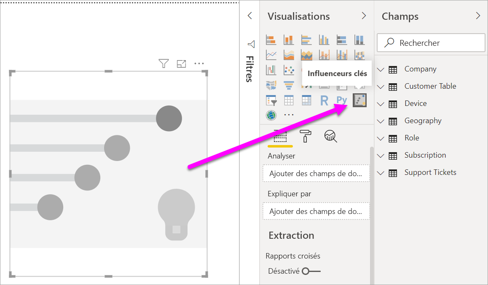
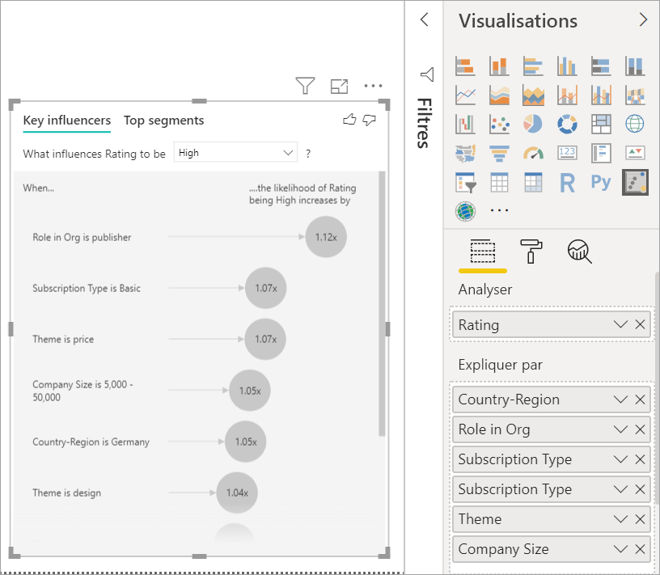
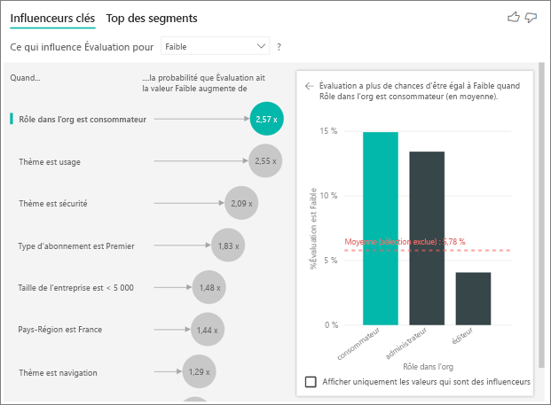
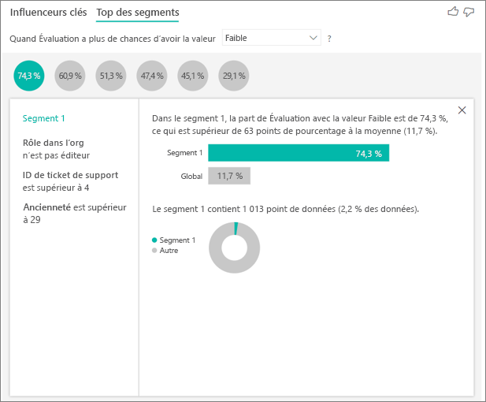
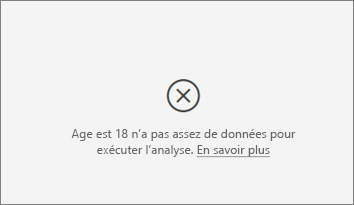
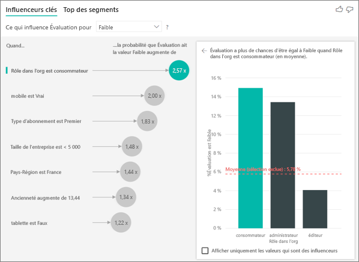

# Visualisation des influenceurs clés
Les facteurs d’influence clés visual vous aidera à comprendre les facteurs qu’une métrique que vous êtes intéressé par le lecteur. Il analyse vos données, classe les facteurs qui sont importants et les affiche sous forme d’influenceurs clés. Par exemple, supposons que vous souhaitez déterminer les influences roulement, qui est également connu sous le nom d’activité. L’un des facteurs peuvent être la longueur de contrat d’emploi, et un autre facteur peut être âge de l’employé. 
 
## Quand utiliser des facteurs d’influence clés 
Le visuel de facteurs d’influence clés est un bon choix si vous souhaitez : 
- Voir les facteurs qui affectent la mesure en cours d’analyse.
- Par contraste, l’importance relative de ces facteurs. Par exemple, les contrats à court terme ont-ils plus d’impact sur le renouvellement du personnel que les contrats à long terme ? 

## Exigences relatives aux influenceurs clés 
La métrique que vous analysez doit être des champs numériques ou catégorielles (agrégats et les mesures ne sont pas encore pris en charge).

## Fonctionnalités des facteurs d’influence clés visual

1. **Onglets**: Sélectionnez cet onglet pour basculer entre les vues. **Les facteurs d’influence de la clé** vous montre les principaux contributeurs à la valeur de métrique sélectionnée. **Top des segments** vous montre les segments principaux qui contribuent à la valeur de métrique sélectionnée. Un *segment* est composé d’une combinaison de valeurs. Par exemple, un segment peut être consommateurs qui ont été les clients au moins 20 ans et en direct dans la région Ouest. 

2. **Zone de liste déroulante**: La valeur de la métrique sous investigation. Dans cet exemple, examinez la métrique **évaluation**. La valeur sélectionnée est **faible**.

3. **Retraitement**: Il vous permet d’interpréter l’élément visuel dans le volet gauche.

4. **Volet gauche**: Le volet gauche contient un élément visuel. Dans ce cas, le volet gauche affiche une liste des principaux facteurs d’influence clés.

5. **Retraitement**: Il vous permet d’interpréter l’élément visuel dans le volet droit.

6. **Volet droit**: Le volet droit contient un élément visuel. Dans ce cas, l’histogramme affiche toutes les valeurs pour le décideur clé **thème** qui a été sélectionnée dans le volet gauche. La valeur spécifique de **convivialité** dans le volet gauche apparaît en vert. Toutes les autres valeurs pour **thème** s’affichent en noir.

7. **Ligne moyenne**: La moyenne est calculée pour toutes les autres valeurs possibles pour **thème** sauf **convivialité**. Le calcul s’applique donc à toutes les valeurs en noir. Il vous indique quel pourcentage de l’autre **thèmes** vous a donné une évaluation la moins élevée. En d’autres termes, lorsqu’une évaluation est donnée par un client, ce client décrit également la raison ou le thème de l’évaluation. Certains thèmes sont la sécurité, la vitesse et la facilité d’utilisation. 

   **Thème est la facilité d’utilisation** est le décideur clé la plus élevée de seconde pour une évaluation la moins élevée, en fonction de l’élément visuel dans le volet gauche. Moyenne de tous les autres thèmes et leur contribution à une évaluation de **faible**, vous obtenez le résultat en rouge. De tous les autres thèmes donnés, sont supérieures aux seuls 11.35 % **convivialité**.

8. **Case à cocher**: **Afficher uniquement les valeurs qui sont des facteurs d’influence**.

## Créer un visuel d’influenceurs clés 
 
Regardez cette vidéo pour apprendre à créer un facteurs d’influence clés visuel. Ensuite, procédez comme suit pour en créer un. 

<iframe width="560" height="315" src="https://www.youtube.com/embed/fDb5zZ3xmxU" frameborder="0" allow="accelerometer; autoplay; encrypted-media; gyroscope; picture-in-picture" allowfullscreen></iframe>

Votre responsable de produit veut vous permettent de déterminer laquelle facteurs clients prospect pour laisser les révisions négatif sur votre service cloud. Pour suivre la procédure, ouvrez le [fichier PBIX de commentaires client](https://github.com/Microsoft/powerbi-desktop-samples/blob/master/2019/customerfeedback.pbix) dans Power BI Desktop. Vous pouvez également télécharger le [fichier Excel de commentaires client pour le service Power BI ou Power BI Desktop](https://github.com/Microsoft/powerbi-desktop-samples/blob/master/2019/customerfeedback.xlsx). 

> [!NOTE]
> Le jeu de données de commentaires des clients se base sur [Moro et al., 2014] S. Moro, P. Cortez et P. Rita. « Une approche orientée données pour prédire la réussite de la banque télémarketing. » *Systèmes de prise en charge de décision*, Elsevier, 62:22-31, juin 2014. 

1. Ouvrez le rapport, puis sélectionnez le **clé des facteurs d’influence** icône. 

    

2. Déplacer la mesure que vous voulez examiner dans le **analyser** champ. Le **analyser** champ prend en charge uniquement pour les variables catégorielles ou séparés,. Pour voir ce qui gouverne un client évaluation du service est faible, sélectionnez **Table Customer** > **évaluation**. 
3. Déplacer les champs que vous jugez peuvent influencer **évaluation** dans le **expliquent par** champ. Vous pouvez déplacer autant de champs que vous le souhaitez. Dans ce cas, démarrez avec :
    - Pays-Région 
    - Rôle dans l’org 
    - Type d’abonnement 
    - Taille de l’entreprise 
    - Thème 
1. Pour mettre l’accent sur les évaluations négatif, sélectionnez **faible** dans le **élément qui influence le contrôle d’accès pour être** zone de liste déroulante.  

    

L’analyse s’exécute sur le niveau de la table du champ qui est en cours d’analyse. Dans ce cas, il a le **évaluation** métrique. Cette mesure est définie au niveau d’un client. Chaque client a donné un score élevé ou un faible score. Tous les facteurs explicatifs doivent être définis au niveau du client pour l’élément visuel rendre leur utilisation. 

Dans l’exemple précédent, tous les facteurs explicatifs ont un-à-un ou une relation plusieurs-à-un avec la métrique. Dans ce cas, chaque score a exactement un thème associé. Ce thème a été le principal objectif de la révision du client. De même, les clients proviennent d’un pays, ont un type d’appartenance et effectuer un rôle dans leur organisation. Les facteurs d’explicatifs sont déjà les attributs d’un client, et aucune transformation n’est nécessaire. L’élément visuel peut rendre une utilisation immédiate de leur. 

Plus loin dans ce didacticiel, vous examinez les exemples plus complexes qui ont des relations un-à-plusieurs. Dans ce cas, les colonnes doivent tout d’abord être agrégées au niveau du client avant de pouvoir exécuter l’analyse. 

Mesures et agrégats utilisés comme facteurs explicatifs sont également évalués au niveau de la table de la **analyser** métrique. Certains exemples sont présentés plus loin dans cet article. 

## Interpréter les facteurs d’influence clés catégorielles 
Jetons un œil sur les facteurs d’influence clés pour les classements peu élevés. 

### Top seul facteur qui influence la probabilité d’une évaluation égale à faible

L’organisation dans cet exemple comporte trois rôles : consommateur, administrateur et serveur de publication. En cours d’un consommateur constitue un facteur supérieur qui participe à une évaluation la moins élevée. 

Plus précisément, vos consommateurs sont 2,57 fois plus susceptibles de donner à votre service à un score négatif. Les facteurs d’influence clés du graphique répertorie **rôle de l’organisation est consommateur** premier dans la liste sur la gauche. En sélectionnant **rôle de l’organisation est consommateur**, Power BI affiche des détails supplémentaires dans le volet droit. L’effet comparative de chaque rôle sur la probabilité d’une évaluation égale à faible est indiqué.
  
- % de 14.93 des consommateurs donnent un faible score. 
- En moyenne, tous les autres rôles donnent un faible score % 5.78 du temps.
- Les consommateurs sont 2,57 fois plus susceptibles de donner un faible score par rapport à tous les autres rôles. Vous pouvez le déterminer en divisant la barre verte à la ligne en pointillés rouge. 

### Deuxième facteur ayant une influence sur la probabilité d’une évaluation égale à faible

Les facteurs d’influence clés visual compare et classe les facteurs à partir de nombreuses variables différentes. Le deuxième décideur n’a rien à voir avec **rôle de l’organisation**. Sélectionnez le deuxième décideur dans la liste, qui est **thème est la facilité d’utilisation**. 

Le second facteur est lié au thème de révision du client. Les clients qui commenté sur la facilité d’utilisation du produit ont été fois 2,55 susceptibles de donner un faible score par rapport aux clients qui commenté autres thèmes, tels que la fiabilité, de conception ou de vitesse. 

Entre les éléments visuels, la moyenne, ce qui est indiquée par la ligne en pointillés rouge, remplacé par 5.78 % 11.34 %. La moyenne est dynamique car elle est basée sur la moyenne de toutes les autres valeurs. Pour le décideur premier, la moyenne exclu du rôle client. Pour le deuxième décideur, il exclue le thème de la facilité d’utilisation. 
 
Sélectionnez le **affichent uniquement les valeurs qui sont des facteurs d’influence** case à cocher pour filtrer en utilisant uniquement les valeurs d’influents. Dans ce cas, ils sont les rôles qui dirigent un faible score. Douze thèmes sont réduits pour les quatre Power BI est identifié en tant que les thèmes qui pilotent les classements peu élevés. 

## Interagir avec d’autres visuels 
 
Chaque fois que vous sélectionnez un segment, le filtre ou autre élément visuel sur la zone de dessin, les facteurs d’influence clés visual réexécute son analyse sur la nouvelle partie de données. Par exemple, vous pouvez déplacer **taille de l’entreprise** dans le rapport et l’utiliser comme un segment. Utilisez-le pour voir si les facteurs d’influence clés pour vos clients d’entreprise diffèrent de celles de la population. Une taille de l’entreprise enterprise est supérieure à 50 000 employés.
 
En sélectionnant **> 50 000** rediffusions l’analyse et vous pouvez voir que les facteurs d’influence modifié. Pour les grandes entreprises, le décideur supérieur pour les classements peu élevés a un thème relatifs à la sécurité. Vous pouvez également examiner plus en détail s’il existe des fonctionnalités de sécurité spécifiques que vos clients de grande taille sont satisfaits. 

## Interpréter les facteurs d’influence clés continues 
 
Jusqu’ici, vous avez vu comment utiliser l’élément visuel pour Explorer la manière dont les différents champs de catégorie influencer les classements peu élevés. Il est également possible d’avoir continue facteurs tels que l’âge, de hauteur et de prix dans la **expliquent par** champ. Jetons un œil à ce qui se passe lorsque **ancienneté** est déplacé à partir de la table customer dans **expliquent par**. Ancienneté représente la durée pendant laquelle un client a utilisé le service. 
 
Comme l’ancienneté augmente, la probabilité de réception d’un niveau inférieur augmente également. Cette tendance suggère que les clients à long terme sont plus susceptibles de donner un score négatif. Cette information est intéressante et l’autre que vous pouvez effectuer le suivi plus tard. 
 
La visualisation montre que chaque fois qu’ancienneté augmente par mois 13.44, en moyenne la probabilité d’une évaluation la moins élevée augmente de 1,23 fois. Ici, 13,44 mois représente l’écart type pour Ancienneté. Afin de l’information que vous recevez examine l’augmenter en fonction d’une quantité standard, qui est l’écart d’ancienneté, affecte la probabilité de réception d’une évaluation la moins élevée. 
 
Le nuage de points dans le volet droit trace le pourcentage moyen de classements peu élevés pour chaque valeur du titre. Il met en évidence la pente avec une courbe de tendance.

## Interpréter les mesures et agrégats comme facteurs d’influence clés 
 
Vous pouvez utiliser des mesures et des agrégats comme facteurs explicatifs au sein de votre analyse. Par exemple, vous pouvez souhaiter voir l’effet du nombre de tickets de support client ou la durée moyenne d’un ticket ouvert sur le score que vous recevez. 
 
Dans ce cas, vous souhaitez voir si le nombre de tickets de support qui a un client a un impact sur le score de que leur donnent. Maintenant vous importez des **prennent en charge les ID de Ticket** à partir de la table de ticket de support. Comme un client peut avoir plusieurs tickets de support, vous agréger l’ID au niveau du client. Agrégation est importante, car l’analyse s’exécute au niveau du client, tous les pilotes doivent être définis au niveau de granularité. 
 
Nous allons examiner le nombre de codes. Chaque ligne du client a un nombre de tickets de support associée. Dans ce cas, comme le nombre d’augmentations de tickets de prise en charge, la probabilité de l’évaluation va basse des 5.51 périodes. L’élément visuel sur la droite affiche le nombre moyen de tickets de prise en charge par les différentes **évaluation** valeurs évaluées au niveau du client. 

## Interprétation des résultats : Top des segments 
 
Vous pouvez utiliser la **clé des facteurs d’influence** onglet pour évaluer chaque facteur individuellement. Vous pouvez également utiliser le **principaux segments** onglet pour voir comment une combinaison de facteurs affecte la métrique que vous analysez. 
 
Segments supérieurs ne montrent initialement une vue d’ensemble de tous les segments Power BI découverts. L’exemple suivant montre que six segments ont été trouvés. Ces segments sont classées en fonction du pourcentage de classements peu élevés du segment. Segment 1, a, par exemple, les évaluations de client 74.3 % qui manquent. Plus la bulle est haute, plus la proportion d’évaluations faibles est élevée. La taille de la bulle représente le nombre de clients est inclus dans le segment. 

La sélection d’une bulle permet d’explorer les détails de ce segment. Si vous sélectionnez le Segment 1, par exemple, trouvez-vous qu’il est constitué par les clients relativement établis. Ils ont clients depuis plus de 29 mois et ont plus de quatre des tickets de support. Enfin, ils ne sont pas les serveurs de publication, afin qu’elles soient consommateurs ou les administrateurs. 
 
Dans ce groupe, % 74.3 des clients a donné une évaluation la moins élevée. Le client moyen a donné une faible rating 11,7 % du temps, par conséquent, ce segment a une plus grande proportion de classements peu élevés. Il est plus élevé de points de pourcentage 63. Segment 1 contient également environ 2,2 % des données, afin qu’il représente une partie adressable de la population. 

## Utilisation des données numériques

Si vous déplacez un champ numérique dans le **analyser** champ, vous pouvez choisir comment gérer ce scénario. Vous pouvez modifier le comportement de l’élément visuel en accédant à la **volet Mise en forme** et commutation entre **catégorielles Type d’analyse** et **Type d’analyse continue**.

Un **Type d’analyse catégorielles** se comporte comme décrit ci-dessus. Par exemple, si vous visualisiez scores d’enquête comprises entre 1 et 10, vous pouvez demander à « Élément qui influence le Scores d’enquête est 1 ? »

Un **Type d’analyse continue** modifie la question à un autre continue. Dans l’exemple ci-dessus, notre nouvelle question serait « Élément qui influence le Scores d’enquête pour augmenter/diminuer ? »

Cette distinction est très utile lorsque vous avez un grand nombre de valeurs uniques dans le champ que vous analysez. Dans l’exemple ci-dessous, nous allons au prix de la maison. Il n’est pas très pertinent de poser « Élément qui influence le prix de maison à être 156,214 ? » car il s’agit très spécifiques et nous sont risque de ne pas avoir suffisamment de données pour déduire un modèle.

Au lieu de cela nous souhaiterons peut-être demander, « Élément qui influence le prix de maison à augmenter » ? qui permet de traiter les prix de la maison comme une plage au lieu des valeurs distinctes.

## Interprétation des résultats : Influenceurs clés 

Dans ce scénario, nous examinons « Élément qui influence le prix de maison à augmenter ». Nous nous intéressons à plusieurs facteurs explicatifs susceptible d’affecter un prix maison comme **année généré** (année la maison a été créée), **KitchenQual** (qualité cuisine) et **YearRemodAdd** (la maison a été remaniée année). 

Dans l’exemple ci-dessous, nous examinons notre Influenceur supérieur qui est la qualité de cuisine qui est Excellent. Les résultats sont très similaires à ceux que nous avons vu lorsque nous étions analysant des métriques catégorielles avec quelques différences importantes :

- L’histogramme sur la droite consulte les moyennes plutôt que des pourcentages. Il donc nous montre ce que le prix moyen de maison d’une maison avec une excellente cuisine est (vert de la barre) par rapport au prix moyen de maison d’une maison sans une excellente cuisine (ligne en pointillés)
- Le numéro dans la bulle est toujours la différence entre la ligne en pointillés rouge et une barre verte, mais elle est exprimée sous forme de nombre (158$. 49K) au lieu d’une probabilité (1.93 x). Ainsi moyenne, maisons avec cuisines excellents sont presque $160 Ko plus cher que les maisons sans cuisines excellents.

Dans l’exemple ci-dessous, que nous nous intéressons à l’impact un facteur continu (année maison a été remaniée) a sur le tarif de la maison. Les différences par rapport à la façon dont nous analysons les facteurs d’influence continues pour les mesures catégorielles sont les suivantes :

-   Le nuage de points dans le volet droit trace le prix moyen maison pour chaque valeur distincte de l’année remaniée. 
-   La valeur dans la bulle est affichée par la quantité de la maison moyenne prix augmente (dans ce cas 2 $. 87k) lorsque l’année la maison a été remaniée augmente par son écart type (dans ce cas de 20 ans)

Enfin, nous nous intéressons à l’année moyenne des mesures dans le cas d’une maison a été créée. L’analyse ici est la suivante :

-   Le nuage de points dans le volet droit trace le prix moyen maison pour chaque valeur distincte dans la table
-   La valeur dans la bulle est affichée par la quantité de la maison moyenne prix augmente (dans ce cas 1 $. 35K) lorsque l’année moyenne augmente par son écart type (dans ce cas 30 ans)

## Interprétation des résultats : Segments supérieurs

Segments supérieurs pour cibles numériques affichent les groupes où la maison quotidiens en moyenne sont supérieures dans le jeu de données globale. Par exemple, ci-dessous nous pouvons voir que **Segment 1** se compose de maisons où **GarageCars** (nombre de voitures au garage peut tenir) est supérieure à 2 et la **RoofStyle** est Hip. Maisons avec ces caractéristiques ont un prix moyen de $355K par rapport à la moyenne globale dans les données qui sont $180 Ko.

## Considérations et résolution des problèmes 
 
**Quelles sont les limitations pour la version préliminaire ?** 
 
Les facteurs d’influence clés visual est actuellement en version préliminaire publique, et il présente certaines limitations. Incluent des fonctionnalités qui n’est pas disponible : 
- Analyse des métriques qui sont des agrégats ou des mesures.
- Utilisation de l’élément visuel dans Power BI Embedded.
- Utilisation de l’élément visuel dans les applications mobiles Power BI.
- RLS prend en charge.
- Diriger la prise en charge de la requête.
- Prise en charge des connexions en direct.

**Je vois une erreur sans les facteurs d’influence ou des segments ont été trouvés. Pourquoi ?** 

Cette erreur se produit lorsque vous avez inclus des champs dans **expliquent par** mais pas les facteurs d’influence a été trouvées. 
- Vous avez inclus la métrique vous ont été analyse dans les deux **analyser** et **expliquent par**. Supprimez-le de **expliquent par**. 
- Vos champs explicatifs ont trop de catégories avec peu d’observations. Cette situation complique la visualisation déterminer quels facteurs sont les facteurs d’influence. Il est difficile de généraliser en fonction uniquement quelques observations. Si vous analysez un champ numérique, vous souhaiterez basculer de **Analysis catégorielles** à **analyse en continu** dans le **volet Mise en forme** sous le  **Analyse** carte.
- Votre facteurs explicatifs ont suffisamment observations afin de généraliser, mais la visualisation n’a pas trouvé les corrélations significatives au rapport.
 
**Que la mesure que je suis analyse n’a pas suffisamment de données pour exécuter l’analyse sur l’erreur s’affiche. Pourquoi ?** 

La visualisation fonctionne en examinant les modèles dans les données pour un groupe par rapport à d’autres groupes. Par exemple, il recherche les clients qui a donné les classements peu élevés par rapport aux clients ayant donné les classements élevés. Si les données dans votre modèle ont uniquement quelques observations, les modèles sont difficiles à trouver. Si la visualisation n’a pas suffisamment de données pour rechercher les facteurs d’influence significatives, il indique que davantage de données est nécessaire pour exécuter l’analyse. 

Nous vous recommandons d’avoir au moins 100 observations pour l’état sélectionné. Dans ce cas, l’état est les clients ayant d’activité. Vous devez également les observations au moins 10 pour les États que vous utilisez pour la comparaison. Dans ce cas, l’état de la comparaison est les clients qui ne l’ATTRITION.

Si vous analysez un champ numérique, vous souhaiterez basculer de **Analysis catégorielles** à **analyse en continu** dans le **volet Mise en forme** sous le  **Analyse** carte.

**Je vois une erreur qui un champ dans *expliquent par* n’est pas unique liés à la table qui contient la mesure que je suis analyse. Pourquoi ?**
 
L’analyse s’exécute sur le niveau de la table du champ qui est en cours d’analyse. Par exemple, si vous analysez les commentaires des clients pour votre service, vous pouvez avoir une table qui vous indique si un client a donné une évaluation élevée ou un classement faible. Dans ce cas, votre analyse est en cours d’exécution au niveau de la table customer. 

Si vous avez une table associée qui est définie à un niveau plus granulaire que la table qui contient votre mesure, vous voyez cette erreur. Voici un exemple : 
 
- Vous analysez ce qui gouverne les clients afin de donner les classements peu élevés de votre service.
- Vous souhaitez voir si l’appareil sur lequel le client utilise votre service a un impact sur les révisions de que leur donnent.
- Un client peut utiliser le service de plusieurs façons différentes.
- Dans l’exemple suivant, client 10000000 utilise un navigateur et une tablette pour interagir avec le service.

Si vous essayez d’utiliser la colonne de l’appareil comme un facteur d’explicatif, vous consultez l’erreur suivante : 

Cette erreur s’affiche parce que l’appareil n’est pas définie au niveau du client. Un client peut consommer le service sur plusieurs appareils. Pour la visualisation rechercher des modèles, l’appareil doit être un attribut du client. Il existe plusieurs solutions qui dépendent de votre compréhension de l’entreprise : 
 
- Vous pouvez modifier la synthèse des appareils à compter. Par exemple, utiliser nombre si le nombre d’appareils peut-être affecter le score qui donne un client. 
- Vous pouvez faire pivoter la colonne de périphérique pour voir si la consommation du service sur un appareil spécifique influence contrôle d’accès d’un client.
 
Dans cet exemple, les données a été croisées dynamiquement pour créer des colonnes du navigateur, mobile et des tablettes. Vous pouvez désormais utiliser ces appareils spécifiques dans **expliquent par**. Tous les appareils semblent pour être des facteurs d’influence et le navigateur a la plus grande charge pour le résultat du client.

Plus précisément, les clients qui n’utilisent pas le navigateur pour consommer le service sont 3,79 fois plus susceptibles de donner un faible score que les clients qui achètent. Plus bas dans la liste, pour mobile l’inverse est vrai. Les clients qui utilisent l’application mobile sont plus susceptibles de donner un faible score que les clients ne savent pas. 

**Je vois un avertissement que les mesures ne sont pas inclus dans mon analyse. Pourquoi ?** 

L’analyse s’exécute sur le niveau de la table du champ qui est en cours d’analyse. Si vous analysez l’ATTRITION des clients, vous pouvez avoir une table qui vous indique si un client hautement évolutives ou non. Dans ce cas, votre analyse s’exécute au niveau de la table customer.
 
Mesures et les agrégats sont par défaut analysée au niveau de la table. S’il existait une mesure pour une dépense mensuelle moyenne, il est analysé au niveau de la table customer. 

Si la table customer n’a pas un identificateur unique, vous ne pouvez pas évaluer la mesure et il est ignoré par l’analyse. Pour éviter cette situation, assurez-vous que la table avec votre mesure possède un identificateur unique. Dans ce cas, il est la table customer et l’identificateur unique est l’ID du client. Il est également facile d’ajouter une colonne d’index à l’aide de Power Query.
 
**Je vois un avertissement que la mesure que je suis analyse possède plus de 10 valeurs uniques et que cette quantité peut affecter la qualité de mon analyse. Pourquoi ?** 

La visualisation de l’intelligence artificielle pour analyser les champs de catégorie et les champs numériques. Dans le cas des champs de catégorie, un exemple est peut-être ATTRITION est Oui ou non, et la Satisfaction des clients est élevé, moyen ou faible. Augmentation du nombre de catégories pour analyser signifie moins d’observations par catégorie. Cette situation complique la visualisation rechercher des modèles dans les données. 

Lors de l’analyse des champs numériques vous avez le choix entre en traitant les champs numériques tels que le texte auquel cas vous allez exécuter la même analyse comme vous le feriez pour les données catégoriques (**Analysis catégorielles**). Si vous avez un grand nombre de distinctes, nous vous recommandons de valeurs basculer l’analyse vers **analyse en continu** que cela signifie que nous pouvons déduire des modèles de lorsque les numéros d’augmenter ou diminuer au lieu de traiter les valeurs distinctes que. Vous pouvez passer de **Analysis catégorielles** à **analyse en continu** dans le **volet Mise en forme** sous le **Analysis** carte.

Pour rechercher les facteurs d’influence plus puissants, nous vous recommandons de regrouper des valeurs similaires en une seule unité. Par exemple, si vous avez une métrique pour les prix, vous êtes susceptible d’obtenir de meilleurs résultats en regroupant des prix similaires en haute, moyenne et faible catégories par rapport à l’aide de points de prix. 

**Il existe des facteurs de mes données ressembler, ils doivent être des facteurs d’influence clés, mais ils ne sont pas. À quoi cela peut-il être dû ?**

Dans l’exemple suivant, les clients qui sont des consommateurs déterminent les classements peu élevés, avec % 14.93 d’évaluations qui manquent. Le rôle d’administrateur a également une proportion élevée de classements peu élevés, à 13.42 %, mais il n’est pas considéré comme un décideur. 

La raison de cette détermination est que la visualisation prend également en compte le nombre de points de données lorsqu’il détecte les facteurs d’influence. L’exemple suivant comprend plus de 29 000 consommateurs et 10 fois moins d’administrateurs, environ 2,900. 390 seul d'entre eux a donné une évaluation la moins élevée. L’élément visuel n’a pas suffisamment de données pour déterminer s’il a trouvé un modèle de contrôle d’accès administrateur, ou si elle est simplement une occasion de vous trouver. 

**Comment calculer les facteurs d’influence clés pour l’analyse par catégorie ?**

Dans les coulisses, la visualisation de l’intelligence artificielle utilise [ML.NET](https://dotnet.microsoft.com/apps/machinelearning-ai/ml-dotnet) pour exécuter une régression logistique pour calculer les facteurs d’influence clés. Une régression logistique est un modèle statistique qui compare différents groupes. 

Si vous souhaitez voir ce qui gouverne les classements peu élevés, la régression logistique examine comment les clients qui a donné un faible score diffèrent des clients qui a donné un score élevé. Si vous avez plusieurs catégories, telles que des scores haute, basse et neutres, vous examinez comment les clients ayant donné une évaluation égale à faible diffèrent des clients qui n’a pas de donner une évaluation la moins élevée. Dans ce cas, comment les clients qui a donné un faible score diffère les clients ayant donné une évaluation élevée ou une évaluation neutre ? 
 
La régression logistique recherche des modèles dans les données et recherche de comment les clients ayant donné une évaluation la moins élevée peuvent différer de clients ayant donné une évaluation élevée. Il peut rechercher, par exemple, que les clients avec des tickets de support plus donnent un pourcentage plus élevé de classements peu élevés que les clients avec peu ou pas des tickets de support.
 
La régression logistique prend également en compte le nombre de points de données est présent. Par exemple, si les clients qui jouent un rôle d’administrateur donnent scores proportionnellement plus négatives, mais il existe quelques administrateurs uniquement, ce facteur n’est pas considéré comme influence. Cette détermination est faite, car il n’existe pas suffisamment de points de données déduire un modèle. Un test statistique, appelé un test de Wald vous disent tout, est utilisé pour déterminer si un facteur est considéré comme un décideur. Le visuel utilise une valeur p de 0,05 pour déterminer le seuil. 

**Comment calculer les facteurs d’influence clés pour l’analyse numérique ?**

Dans les coulisses, la visualisation de l’intelligence artificielle utilise [ML.NET](https://dotnet.microsoft.com/apps/machinelearning-ai/ml-dotnet) pour exécuter une régression linéaire pour calculer les facteurs d’influence clés. Une régression linéaire est un modèle statistique qui examine comment le résultat du champ que vous analysez change en fonction de vos facteurs explicatifs.

Par exemple, si nous analysons le prix de la maison, une régression linéaire allons examiner l’impact ayant qu'une excellente cuisine aura sur le prix de la maison. Maisons avec cuisines excellents ont généralement des prix de maison supérieur ou inférieur par rapport aux maisons sans cuisines excellents ?

La régression linéaire prend également en compte le nombre de points de données. Par exemple, si maisons tribunaux de tennis ayant un prix plus élevés, mais nous avons très peu maisons qui ont un court de tennis, ce facteur n'est pas considéré comme influence. Cette détermination est faite, car il n’existe pas suffisamment de points de données déduire un modèle. Un test statistique, appelé un test de Wald vous disent tout, est utilisé pour déterminer si un facteur est considéré comme un décideur. Le visuel utilise une valeur p de 0,05 pour déterminer le seuil. 

**Comment les segments sont calculés ?**

Dans les coulisses, la visualisation de l’intelligence artificielle utilise [ML.NET](https://dotnet.microsoft.com/apps/machinelearning-ai/ml-dotnet) pour exécuter un arbre de décision pour trouver les sous-groupes intéressantes. L’objectif de l’arbre de décision est de vous retrouver avec un sous-groupe de points de données est relativement élevé dans la mesure qui que vous intéresse. Il peut s’agir de clients avec les classements peu élevés ou les maisons à un prix élevé.

L’arbre de décision prend chaque facteur d’explicatif et qu’il tente de raison facteur lui donne le meilleur *fractionner*. Par exemple, si vous filtrez les données pour inclure uniquement les grandes entreprises, qui sépare les clients ayant donné une évaluation élevée et une évaluation égale à faible ? Ou peut-être mieux pour filtrer les données pour inclure uniquement les clients qui commenté sur la sécurité ? 

Une fois que l’arbre de décision effectue un fractionnement, il prend le sous-groupe de données et détermine la meilleure séparation suivante pour ces données. Dans ce cas, le sous-groupe est les clients qui commenté sur la sécurité. Après chaque fractionnement, il peut également s’il dispose de suffisamment de points de données pour ce groupe à être suffisamment représentative pour déduire un modèle à partir d’ou s’il s’agit d’une anomalie dans les données et pas un segment réel. Un autre test statistique est appliqué pour vérifier la signification statistique de la condition de division avec p-valeur de 0,05. 

Une fois l’exécution de l’arbre de décision est terminée, il prend tous les fractionnements, notamment les commentaires de la sécurité et de grande entreprise et crée des filtres de Power BI. Cette combinaison de filtres est empaqueté en tant que segment dans le visuel. 
 
**Pourquoi certains facteurs deviennent des facteurs d’influence ou cesse d’être des facteurs d’influence que déplacer davantage de champs dans le *expliquent par* champ ?**

La visualisation évalue tous les facteurs explicatifs ensemble. Un facteur peut être un décideur par lui-même, mais lorsqu’il est considéré comme avec d’autres facteurs c’est peut-être pas. Supposons que vous souhaitez analyser ce qui gouverne un prix de maison à être élevé, avec chambres et taille de maison comme facteurs explicatifs :

- En soi, chambres plus peuvent être un pilote pour connaître les prix de la maison doit être élevée.
- Taille de maison y compris dans l’analyse signifie que vous observez ce qui se passe chambres tandis que la taille de la maison reste constante.
- Si la taille de la maison est fixée à 1 500 pieds carrés, il est peu probable qu’une augmentation continue du nombre de chambres qui augmente considérablement le prix de la maison. 
- Chambres n’est peut-être pas aussi importants d’un facteur qu’il avait avant la taille de la maison a été considéré. 

## Étapes suivantes
- [Graphiques en entonnoir dans Power BI](power-bi-visualization-combo-chart.md)
- [Types de visualisation dans Power BI](power-bi-visualization-types-for-reports-and-q-and-a.md)
