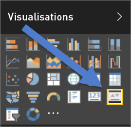
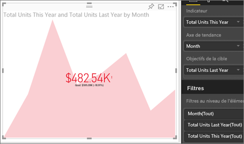

# Éléments visuels des indicateurs de performance clés
Un indicateur de performance clé (KPI) est un indice visuel qui représente la marge de progression réalisée en vue d’atteindre un objectif mesurable. Pour plus d’informations sur les indicateurs de performances clés, consultez [Microsoft Developer Network](https://msdn.microsoft.com/library/hh272050).

## Quand utiliser un indicateur de performance clé ?
Les indicateurs de performances clés sont recommandés :

* pour mesurer la progression (dans quel domaine suis-je en avance ou en retard ?)
* pour mesurer ce qu’il vous reste à faire pour atteindre un objectif (suis-je en avance ou en retard ?)   

## Configuration requise pour les visuels d’indicateurs de performances clés
Un indicateur de performance clé (KPI) se base sur une mesure spécifique et est conçu pour vous aider à évaluer le statut et la valeur actuelle d’une mesure par rapport à un objectif défini. Ainsi, les visuels d’indicateurs de performances clés nécessitent une mesure de *base* qui évalue une mesure ou un valeur, en fonction d’une valeur définie ou d’une *cible* et d’un seuil ou d’un objectif.

> [!NOTE]
> Actuellement, un jeu de données d’indicateurs de performances clés doit contenir des valeurs cibles pour un indicateur de performance clé. Si votre jeu de données n’en contient pas, vous pouvez créer des objectifs en ajoutant une feuille Excel contenant des objectifs à votre modèle de données ou fichier PBIX.
> 
> 

## Création d’un indicateur de performance clé
Pour effectuer la procédure, connectez-vous au service Power BI et sélectionnez **Obtenir des données > Exemples > Exemple Analyse de la vente au détail**. Nous allons créer un indicateur de performance clé qui mesure la progression réalisée en vue d’atteindre un objectif de vente.

Vous pouvez également écouter Will qui vous montre comment créer des éléments visuels de métrique uniques : jauges, cartes et indicateurs de performance clés.

<iframe width="560" height="315" src="https://www.youtube.com/embed/xmja6EpqaO0?list=PL1N57mwBHtN0JFoKSR0n-tBkUJHeMP2cP" frameborder="0" allowfullscreen></iframe>

1. Ouvrez le rapport en [mode Édition](../consumer/end-user-reading-view.md) et [ajouter une nouvelle page](../power-bi-report-add-page.md).    
2. Sélectionnez **Ventes > Nombre total d’unités cette année**.  Il s’agit de l’indicateur.
3. Ajoutez **Temps > Mois**.  Ceci représente la tendance.
4. IMPORTANT : Triez le graphique par **mois**. Une fois que vous convertissez la visualisation en indicateur de performance clé, il n’existe aucune option de tri.

    
5. Convertissez l’élément visuel en indicateur de performance clé en sélectionnant l’icône correspondante dans le volet de visualisation.
   
    
6. Ajoutez un objectif. Ajoutez les ventes de l’année précédente comme objectif. Faites glisser **Nombre total d’unités l’année dernière** dans le champ **Objectifs cibles**.
   
    
7. Vous pouvez aussi formater l’indicateur de performance clé en sélectionnant l’icône représentant un rouleau qui ouvre le volet de Mise en forme.
   
   * **Indicateur** : contrôle les unités d’affichage de l’indicateur et les décimales.
   * **Axe de tendance** : quand il est **activé**, l’axe de tendance est affiché en arrière-plan de l’élément visuel de l’indicateur de performance clé.  
   * **Objectifs** : quand il est **activé**, l’élément visuel affiche l’objectif et la distance restante pour atteindre l’objectif, sous forme de pourcentage.
   * **Code couleur > Direction** : certains indicateurs de performances clés sont considérés comme *meilleurs* pour des valeurs plus élevées et d’autres sont considérés comme *meilleurs* pour des valeurs plus faibles. Par exemple, les bénéfices par rapport au temps d’attente. De manière générale, une valeur plus élevée pour les bénéfices est mieux considérée qu’une valeur de temps d’attente élevée. Sélectionnez **une valeur élevée est meilleure** et modifiez éventuellement les paramètres de couleur.

1. Une fois l’indicateur de performance clé paramétré comme vous le souhaitez, [épinglez-le à un tableau de bord](../service-dashboard-pin-tile-from-report.md).

Les indicateurs de performances clés sont également disponibles sur vos appareils mobiles, ce qui vous permet de toujours rester connecté.

## Considérations et résolution des problèmes
* Si votre indicateur de performance clé ne ressemble pas à celui ci-dessus, vous devez peut-être effectuer un tri par mois. Étant donné que les indicateurs de performance clés n’ont pas d’option de tri, vous devez trier par mois *avant* de convertir votre visualisation en indicateur de performance clé.

## Étapes suivantes

[Visualisations dans des rapports Power BI](power-bi-report-visualizations.md)

D’autres questions ? [Posez vos questions à la communauté Power BI](http://community.powerbi.com/)

