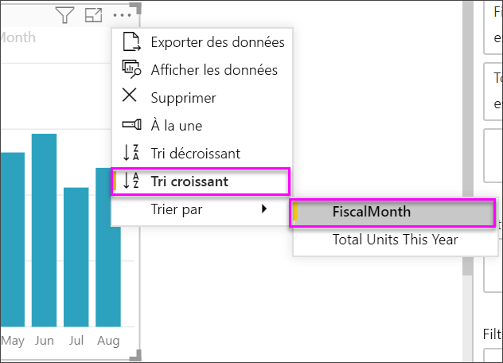
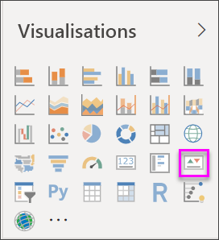

# Créer des visuels d’indicateur de performance clé (KPI)

[!INCLUDE[consumer-appliesto-nyyn](../includes/consumer-appliesto-nyyn.md)]

[!INCLUDE [power-bi-visuals-desktop-banner](../includes/power-bi-visuals-desktop-banner.md)]

Un indicateur de performance clé (KPI) est un indice visuel qui représente la marge de progression réalisée en vue d’atteindre un objectif mesurable. Pour plus d’informations sur les indicateurs de performance clé (KPI), consultez [Indicateurs de performance clés (KPI) dans PowerPivot](https://support.office.com/en-us/article/Key-Performance-Indicators-KPIs-in-Power-Pivot-E653EDEF-8A21-40E4-9ECE-83A6C8C306AA).

## Quand utiliser un indicateur de performance clé ?

Les indicateurs de performances clés sont recommandés :

* Pour mesurer la progression. Répond à la question : dans quel domaine suis-je en avance ou en retard ?

* Pour mesurer ce qu’il vous reste à faire pour atteindre un objectif. Répond à la question : suis-je en avance ou en retard ?

## Conditions requises pour les indicateurs de performance clés

Un concepteur base le visuel d’un indicateur de performance clé (KPI) sur une mesure spécifique. L’objectif du KPI est de vous aider à évaluer le statut et la valeur actuelle d’une mesure par rapport à un objectif défini. Un visuel d’indicateur de performance clé requiert une mesure de *base* qui renvoie une valeur, une mesure ou une valeur *cible* et un *seuil* ou un *objectif*.

Un jeu de données d’indicateurs de performances clés doit contenir des valeurs cibles pour un indicateur de performance clé. Si votre jeu de données n’en contient pas, vous pouvez créer des objectifs en ajoutant une feuille Excel contenant des objectifs à votre modèle de données ou fichier PBIX.

## Prérequis

Ce tutoriel utilise le [fichier PBIX de l’exemple Analyse de la vente au détail](https://download.microsoft.com/download/9/6/D/96DDC2FF-2568-491D-AAFA-AFDD6F763AE3/Retail%20Analysis%20Sample%20PBIX.pbix).

1. Dans la section supérieure gauche de la barre de menus, sélectionnez **Fichier** > **Ouvrir**.

1. Rechercher votre copie du **fichier PBIX de l’exemple Analyse de la vente au détail**

1. Ouvrez le **fichier .PBIX de l’exemple Analyse de la vente au détail** dans la vue de rapport. 

1. Sélectionnez **+** pour ajouter une nouvelle page. 

> [!NOTE]
> Pour que vous puissiez partager votre rapport avec un collègue Power BI, il faut que vous disposiez tous deux de licences individuelles Power BI Pro ou que le rapport soit enregistré dans une capacité Premium.    

## Création d’un indicateur de performance clé

Dans cet exemple, vous allez créer un indicateur de performance clé qui mesure votre progression réalisée en vue d’atteindre un objectif de vente.

1. Dans le volet **Champs** , sélectionnez **Sales > This Year Sales (Ventes > Ventes de cette année)** .  Cette valeur servira d’indicateur.

1. Ajoutez **Heure > MoisFiscal**.  Cette valeur représentera la tendance.

1. Dans le coin supérieur droit du visuel, sélectionnez les points de suspension et vérifiez que Power BI a trié les colonnes par ordre croissant selon le champ **MoisFiscal**.

    > [!IMPORTANT]
    > Une fois que vous convertissez la visualisation en indicateur de performance clé, il n’existe **aucune** option de tri. Vous devez désormais trier correctement le visuel.

    

    Une fois correctement trié, votre visuel ressemblera à ceci :

    

1. Convertissez le visuel en indicateur de performance clé en sélectionnant l’icône **KPI** dans le volet **Visualisation**.

    

1. Pour ajouter un objectif, faites glisser **Nombre total d’unités l’année dernière** dans le champ **Objectifs cibles**.

    

1. Vous pouvez aussi formater l’indicateur de performance clé en sélectionnant l’icône représentant un rouleau qui ouvre le volet de Mise en forme.

    * **Indicateur**  : contrôle les unités d’affichage de l’indicateur et les décimales.

    * **Axe de tendance**  : quand il est **activé** , le visuel affiche l’axe de tendance en arrière-plan du visuel de l’indicateur de performance clé.  

    * **Objectifs**  : quand il est **activé** , le visuel affiche l’objectif et la distance restante pour atteindre l’objectif, sous forme de pourcentage.

    * **Code couleur > Direction** : certains indicateurs de performances clés sont considérés comme meilleurs pour des valeurs *plus élevées* et d’autres sont considérés comme meilleurs pour des valeurs *plus faibles*. Par exemple, les bénéfices par rapport au temps d’attente. De manière générale, une valeur plus élevée pour les bénéfices est mieux considérée qu’une valeur de temps d’attente élevée. Sélectionnez **Correct vers le haut** et modifiez éventuellement les paramètres de couleur.

Les indicateurs de performance clés sont également faciles à trouver et à installer dans le service Power BI et sur vos appareils mobiles. Vous pouvez ainsi garder à tout moment le contact avec votre entreprise.

## Considérations et résolution des problèmes

Si votre indicateur de performance clé ne ressemble pas à celui ci-dessus, peut-être n’avez pas effectué un tri par **MoisFiscal**. Les indicateurs de performance clés ne proposent aucune option de tri. Vous devrez recommencer et trier par **MoisFiscal** *avant* de convertir votre visualisation en indicateur de performance clé.

## Étapes suivantes

* [Trucs et astuces pour les visualisations de carte Power BI](power-bi-map-tips-and-tricks.md)

* [Types de visualisation dans Power BI](power-bi-visualization-types-for-reports-and-q-and-a.md)

D’autres questions ? [Posez vos questions à la communauté Power BI](https://community.powerbi.com/)
