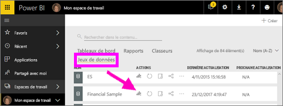
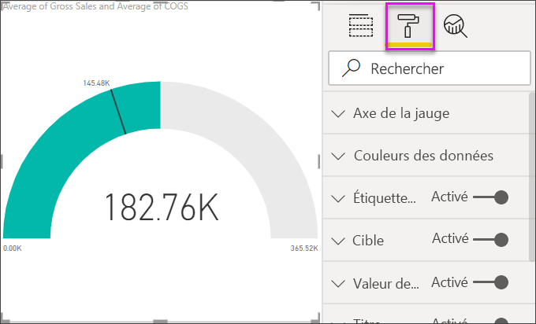

# Graphiques en jauge radiale dans Power BI
Un graphique en jauge radiale est en forme d’arc de cercle. Il affiche une seule valeur qui mesure la progression vers un objectif/indicateur de performance clé.  L’objectif (valeur cible) est représenté par la ligne (aiguille). La progression vers l’objectif est représentée par l’ombrage.  La valeur représentant cette progression est indiquée en caractères gras à l’intérieur de l’arc. Toutes les valeurs possibles sont réparties uniformément le long de l’arc, de la valeur minimale (la plus à gauche) à la valeur maximale (la plus à droite).

Dans l’exemple ci-dessous, un concessionnaire automobile effectue le suivi de la moyenne des ventes mensuelles réalisées par son équipe de vente. L’objectif, représenté par l’aiguille noire, est d’atteindre 140 ventes.  La moyenne minimale de ventes mensuelles possible est 0 et la moyenne maximale a été définie à 200.  L’ombrage bleu indique une moyenne actuelle de 120 ventes ce mois-ci. Heureusement, il reste encore une semaine pour atteindre l’objectif fixé.

## Quand faut-il utiliser un graphique en jauge radiale ?
Les graphiques en jauge radiale sont conseillés pour :

* montrer la progression vers un objectif ;
* représenter une mesure en centiles, comme un indicateur de performance clé ;
* montrer l’intégrité d’une seule mesure ;
* afficher des informations faciles à comprendre et à analyser.

### Conditions préalables
 - Service Power BI ou Power BI Desktop
 - Classeur Excel d’exemples financiers : [télécharger directement l’exemple](http://go.microsoft.com/fwlink/?LinkID=521962).

## Créer une jauge radiale simple
Ces instructions utilisent le service Power BI. Pour suivre la procédure, connectez-vous à Power BI et ouvrez le fichier Excel d’exemple financier.  

Vous pouvez également écouter Will qui vous montre comment créer des éléments visuels de métrique uniques : jauges, cartes et indicateurs de performance clés.

<iframe width="560" height="315" src="https://www.youtube.com/embed/xmja6EpqaO0?list=PL1N57mwBHtN0JFoKSR0n-tBkUJHeMP2cP" frameborder="0" allowfullscreen></iframe>

### Étape 1 : Ouvrir le fichier Excel d’exemple financier
1. [Téléchargez le fichier Excel d’exemple financier](../sample-financial-download.md) si ce n’est pas déjà fait. Notez l’endroit où vous l’enregistrez.

2. Ouvrez le fichier dans le ***service Power BI*** en sélectionnant **Obtenir des données \>Fichiers** et en accédant à l’emplacement où vous avez enregistré le fichier. Sélectionnez **Importer**. L’exemple financier est ajouté à votre espace de travail en tant que jeu de données.

3. Dans la liste de contenu **Jeu de données**, sélectionnez **Financial Sample** (Exemple financier) pour l’ouvrir en mode Exploration.

    

### Étape 2 : Créer une jauge pour effectuer le suivi du chiffre d’affaires brut
1. Dans le volet **Champs** , sélectionnez **Gross Sales**(Chiffre d’affaires brut).
   
   
2. Changez l’agrégation en **Moyenne**.
   
   
3. Sélectionnez l’icône en forme de jauge  pour convertir l’histogramme en jauge.
   
   Par défaut, Power BI crée un graphique en jauge où la valeur actuelle (dans cet exemple, le chiffre d’affaires brut moyen) est présumée être au milieu de la jauge. Le chiffre d’affaires brut moyen étant de 182 760 $, la valeur de départ (Minimum) est définie sur 0 et la valeur de fin (Maximum) est définie sur le double de la valeur actuelle.
   
   

### Étape 3 : Sélectionner la valeur cible
1. Faites glisser **COGS** vers **Valeur cible** .
2. Changez l’agrégation en **Moyenne**.
   Power BI ajoute une aiguille pour représenter la valeur cible **145 480 $**. Comme vous pouvez le remarquer, l’objectif a même été dépassé.
   
   
   
   > [!NOTE]
   > Vous pouvez également entrer manuellement une valeur cible.  Consultez « Utiliser les options de mise en forme pour définir manuellement les valeurs Minimum, Maximum et Cible » ci-dessous.
   > 
   > 

### Étape 4 : Définir une valeur maximale
Dans l’étape 2, Power BI a utilisé le champ Valeur pour définir automatiquement un minimum (valeur de départ) et un maximum (valeur de fin).  Comment faire pour définir votre propre valeur maximale ?  Supposons qu’au lieu de définir la valeur maximale possible au double de la valeur actuelle, vous souhaitez la définir au chiffre d’affaires brut le plus élevé dans votre jeu de données ? 

1. Faites glisser **Gross Sales** (Chiffre d’affaires brut) de la liste **Champs** vers **Valeur maximale** .
2. Changez l’agrégation en **Maximum**.
   
   
   
   La jauge est redessinée avec une nouvelle valeur de fin (1,21 million de chiffre d’affaires brut).
   
   

### Étape 5 : Enregistrer votre rapport
1. [Enregistrez le rapport](../service-report-save.md).
2. [Ajoutez le graphique en jauge sous forme de vignette de tableau de bord](../service-dashboard-pin-tile-from-report.md). 

## Utilisez les options de mise en forme pour définir manuellement les valeurs Minimum, Maximum et Cible.
1. Supprimez **Max of Gross Sales** (Chiffre d’affaires brut maximum) de **Valeur maximale** .
2. Ouvrez le volet de mise en forme en sélectionnant l’icône en forme de rouleau.
   
   
3. Développez l’ **axe de la jauge** et entrez des valeurs pour **Min** et **Max**.
   
    
4. Supprimez la valeur cible actuelle en supprimant la coche à côté de **COGS**.
   
    
5. Lorsque le champ **Cible** apparaît sous **Axe de la jauge**, entrez une valeur.
   
    
6. Éventuellement, continuez la mise en forme de votre graphique de type Jauge.

## Étape suivante

[Jauges dans Power BI](power-bi-visualization-kpi.md)

[Types de visualisation dans Power BI](power-bi-visualization-types-for-reports-and-q-and-a.md)
