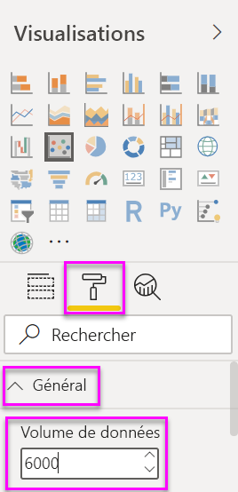
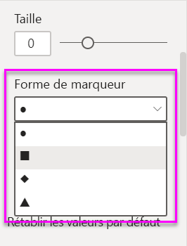
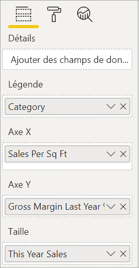
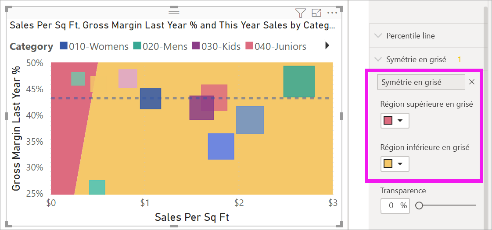
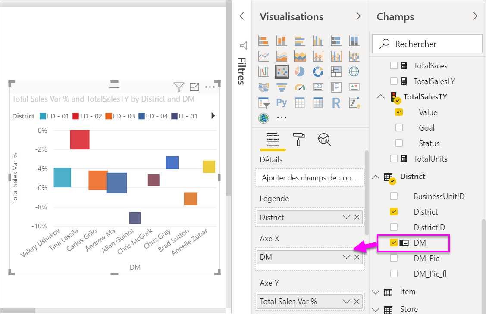
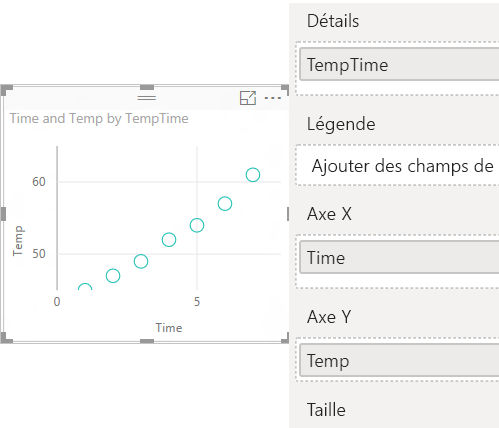

# Nuages de points, graphiques en bulles et graphiques à points dans Power BI

[!INCLUDE[consumer-appliesto-nyyn](../includes/consumer-appliesto-nyyn.md)]

[!INCLUDE [power-bi-visuals-desktop-banner](../includes/power-bi-visuals-desktop-banner.md)]

Un nuage de points a toujours deux axes de valeur pour afficher un jeu de données numériques sur l’axe horizontal et un autre jeu de valeurs numériques sur l’axe vertical. Le graphique affiche les points à l’intersection d’une valeur numérique x et y, en associant ces valeurs en points de données uniques. Power BI peut distribuer ces points de données uniformément ou non sur l’axe horizontal. Tout dépend des données que le graphique représente.

Vous pouvez définir le nombre de points de donnée, dans la limite maximale de 10 000.  

## Choix de l’utilisation d’un nuage de points, d’un graphique en bulles ou d’un graphique à points

### Graphiques en nuages de points et graphiques en bulles

Un nuage de points montre la relation entre deux valeurs numériques. Un graphique en bulles remplace les points de données par des bulles, la *taille* de la bulle représentant une troisième dimension supplémentaire des données.

Les nuages de points sont conseillés dans les cas suivants :

* Pour afficher les relations entre deux valeurs numériques.

* Pour tracer les deux groupes de nombres sous la forme d’une série de coordonnées x et y.

* À la place d’un graphique en courbes lorsque vous souhaitez modifier l’échelle de l’axe horizontal.

* Pour transformer l’axe horizontal en échelle logarithmique.

* Pour afficher les données de feuille de calcul qui incluent des paires ou des jeux groupés de valeurs.

    > [!TIP]
    > Dans un nuage de points, vous pouvez ajuster les échelles indépendantes des axes pour afficher plus d’informations sur les valeurs groupées.

* Pour afficher des modèles dans de grands jeux de données, par exemple en affichant des valeurs hors norme, des clusters et des tendances linéaires ou non linéaires.

* Pour comparer un grand nombre de points de données sans distinction de temps.  Plus vous incluez de données dans un nuage de points, meilleures sont les comparaisons possibles.

En plus de ce que les graphiques à nuages de points peuvent faire pour vous, les graphiques à bulles sont très utiles dans les cas suivants :

* Si vos données comportent trois séries de données contenant chacune un jeu de valeurs.

* Pour présenter des données financières.  Différentes tailles de bulles sont utiles pour souligner visuellement des valeurs spécifiques.

* Pour utiliser des quadrants.

### Graphiques à points

Un graphique à points est similaire à un graphique en bulles et à un graphique à nuage de points, mais il est également utilisé pour tracer des données de catégories sur l’axe X.

Ces graphiques sont très utiles si vous voulez inclure des données de catégorie sur l’axe X.

## Prérequis

Ce tutoriel utilise le [fichier PBIX de l’exemple Analyse de la vente au détail](https://download.microsoft.com/download/9/6/D/96DDC2FF-2568-491D-AAFA-AFDD6F763AE3/Retail%20Analysis%20Sample%20PBIX.pbix).

1. Dans la section supérieure gauche de la barre de menus, sélectionnez **Fichier** > **Ouvrir**.
   
2. Rechercher votre copie du **fichier PBIX de l’exemple Analyse de la vente au détail**

1. Ouvrez le **fichier PBIX de l’exemple Analyse de la vente au détail** dans la vue Rapport .

1. Sélectionner  pour ajouter une nouvelle page.

> [!NOTE]
> Pour que vous puissiez partager votre rapport avec un collègue Power BI, il faut que vous disposiez tous deux de licences individuelles Power BI Pro ou que le rapport soit enregistré dans une capacité Premium.    

## Créer un nuage de points

1. Démarrez sur une page de rapport vide et, dans le volet **Champs**, sélectionnez ces champs :

    * **Ventes** > **Ventes par mètre carré**

    * **Ventes** >  **% d’écart des ventes totales**

    * **District** > **District**

    

1. Dans le volet **Visualisation**, sélectionnez . pour convertir l’histogramme des colonnes du cluster en un nuage de points.

   

1. Faites glisser **District** depuis **Détails** vers **Légende**.

    Power BI affiche un nuage de points qui trace le **% d’écart des ventes totales** sur l’axe Y et les **Ventes par mètre carré** sur l’axe X. Les couleurs de points de données représentent des districts :

    

Ajoutons à présent une troisième dimension.

## Créer un graphique en bulles

1. Dans le volet **Champs**, faites glisser **Ventes** > **Ventes de cette année** > **Valeur** vers le puits **Taille**. Les points de données se développent en volumes proportionnels à la valeur des ventes.

   

1. Pointez sur une bulle. La taille de la bulle reflète la valeur de la zone **Ventes de cette année**.

    

1. Pour définir le nombre de points de données à afficher dans votre graphique à bulles, dans la section **Format** du volet **Visualisations**, développez **Général** et ajustez le **Volume de données**.

    

    Vous pouvez définir le volume maximal de données sur n’importe quel nombre jusqu’à 10 000. Quand vous atteignez des nombres très élevés, nous vous suggérons de commencer par tester pour vérifier que vous conservez de bonnes performances.

    > [!NOTE]
    > Des points de données supplémentaires peuvent allonger le temps de chargement. Si vous choisissez de publier des rapports avec des limites à l’extrémité supérieure de l’échelle, testez également vos rapports sur le web et les appareils mobiles. Vous devez en effet vérifier que les performances sur le graphique correspondent aux attentes de vos utilisateurs.

1. Continuez la mise en forme des couleurs, étiquettes, titres, arrière-plan, etc. de la visualisation. Pour [améliorer l’accessibilité](../create-reports/desktop-accessibility-overview.md), ajoutez des formes de marqueur à chaque ligne. Pour sélectionner la forme de marqueur, développez **Formes**, sélectionnez **Forme de marqueur**, puis choisissez une forme.

    

    Changez la forme de marqueur en losange, triangle ou carré. L’utilisation d’une forme de marqueur différente pour chaque ligne permet aux lecteurs du rapport de différencier plus facilement les lignes (ou aires) les unes des autres.

1. Ouvrez le volet Analytique  pour ajouter des informations à votre visualisation.  
    - Ajoutez une ligne médiane. Sélectionnez **Ligne Médiane** > **Ajouter**. Par défaut, Power BI ajoute une ligne médiane pour *Sales Per Sq Ft*. Ce n’est pas très utile, car nous savons qu’il y a 10 points de données et que la médiane est créée avec cinq points de données de chaque côté. Basculez plutôt la **mesure** sur *Total sales variance %* .  

        

    - Ajoutez la symétrie en grisé pour voir les points dont la valeur de la mesure sur l’axe X est supérieure à celle de la mesure sur l’axe Y, et vice versa. Quand vous activez la symétrie en grisé dans le volet Analytique, Power BI affiche l’arrière-plan de votre nuage de points de façon symétrique en fonction des limites supérieure et inférieure de l’axe actuel. Vous pouvez ainsi identifier très rapidement la mesure d’axe que privilégie un point de données, en particulier quand la plage de vos axes X et Y est différente.

        a. Remplacez le champ **Total sales variance %** par **Gross margin last year %** .

        

        b. Dans le volet Analytique, ajoutez **Symétrie en grisé** Avec la symétrie en grisé, nous pouvons voir que la catégorie Hosiery (bulle verte dans la zone rose) est la seule qui privilégie la marge brute plutôt que ses ventes par surface de magasin. 

        

    - Poursuivez l’exploration du volet Analytique pour découvrir des insights intéressants dans vos données. 

        

## Créer un graphique à points

Pour créer un graphique à points, remplacez le champ **Axe X** numérique par un champ de catégorie.

Dans le volet **Axe X**, supprimez **Sales per sq ft** et remplacez-le par **District** > **District Manager**.

## Considérations et résolution des problèmes

### Votre nuage de points a un seul point de données

Votre nuage de points a-t-il uniquement un point de données qui regroupe toutes les valeurs sur les axes X et Y ?  Ou regroupe-t-il toutes les valeurs le long d’une unique ligne horizontale ou verticale ?

Ajoutez un champ au puits **Détails** pour indiquer à Power BI comment regrouper les valeurs. Le champ doit être unique pour chaque point à tracer. Un simple numéro de ligne ou un champ ID suffit.

Si vous n’en avez pas dans vos données, créez un champ qui concatène les valeurs X et Y pour les convertir en élément unique par point :

Pour créer un champ, [utilisez l’éditeur de requête Power BI Desktop pour ajouter une colonne d’index](../create-reports/desktop-add-custom-column.md) à votre jeu de données. Ajoutez ensuite cette colonne au puits **Détails** de la visualisation.

## Étapes suivantes

Les articles suivants pourraient également vous intéresser :

* [Échantillonnage à haute densité dans les nuages de points Power BI](../create-reports/desktop-high-density-scatter-charts.md)
* [Types de visualisation dans Power BI](power-bi-visualization-types-for-reports-and-q-and-a.md)
* [Conseils pour trier et distribuer des tracés de données dans les rapports Power BI](../guidance/report-tips-sort-distribute-data-plots.md)

D’autres questions ? [Posez vos questions à la communauté Power BI](https://community.powerbi.com/)
