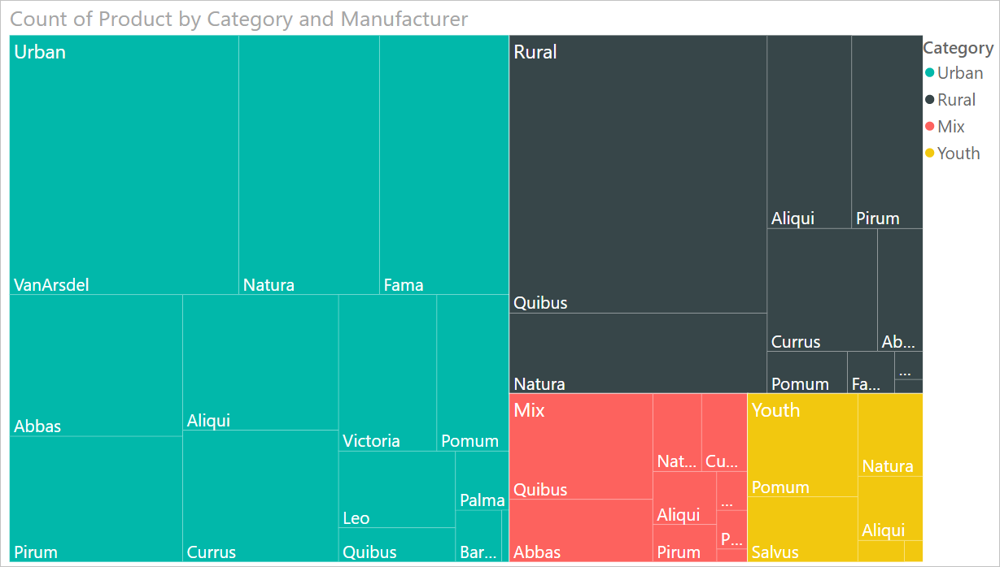
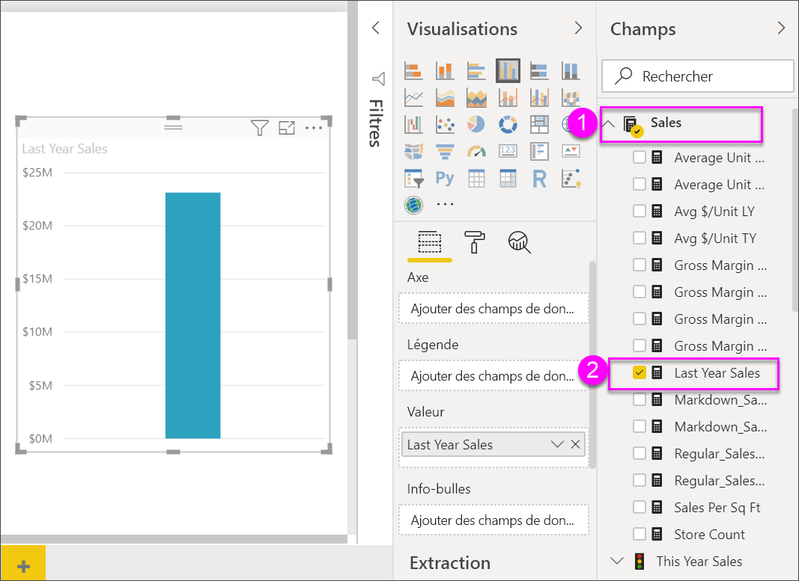
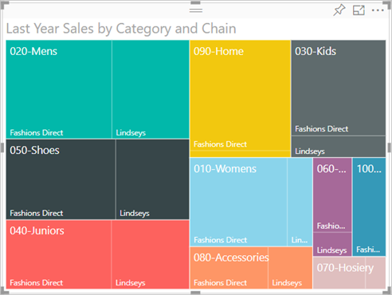

# Graphiques de compartimentage dans Power BI

[!INCLUDE[consumer-appliesto-nyyn](../includes/consumer-appliesto-nyyn.md)]

[!INCLUDE [power-bi-visuals-desktop-banner](../includes/power-bi-visuals-desktop-banner.md)]

Les treemaps utilisent des rectangles imbriqués pour présenter des données sous forme hiérarchique. Chaque niveau de la hiérarchie est représenté par un rectangle de couleur (une branche) qui contient d’autres rectangles plus petits (les feuilles). Power BI définit la taille de l’espace à l’intérieur de chaque rectangle selon sur la valeur mesurée. Les rectangles sont disposés par taille du haut à gauche (le plus grand) au bas à droite (le plus petit).

Imaginons que j’utilise ce graphique pour analyser mes ventes, les branches supérieures correspondent aux catégories de vêtements : **Urban**, **Rural**, **Youth** et **Mix**. Power BI divise les rectangles de votre catégorie en feuilles correspondant aux fabricants de vêtements dans cette catégorie. Ces feuilles auront une taille et une nuance qui dépendent du nombre d’articles vendus.

Dans la branche **Urban** ci-dessus, un grand nombre de vêtements **VanArsdel** a été vendu. Les ventes de vêtements **Natura** et **Fama** sont moindres. Seuls quelques articles **Leo** ont été vendus. Par conséquent, la branche **Urban** de votre treemap se présentera comme suit :

* le plus grand rectangle pour **VanArsdel** dans le coin supérieur gauche ;

* des rectangles légèrement plus petits pour **Natura** et **Fama** ;

* un grand nombre d’autres rectangles pour tous les autres vêtements vendus ;

* un tout petit rectangle pour **Leo**.

Vous pourriez ainsi comparer le nombre d’articles vendus dans les autres catégories de vêtements d’après la taille et le nuance de chaque nœud feuille : plus le rectangle est grand et sombre, plus les ventes sont élevées.

## Quand faut-il utiliser un treemap ?

Les treemaps sont conseillés :

* pour afficher de grandes quantités de données hiérarchiques ;

* quand un graphique à barres ne peut pas afficher correctement toutes les valeurs ;

* pour montrer la proportion de chaque partie par rapport à l’ensemble ;

* pour montrer le modèle de distribution de la mesure entre chaque niveau de catégories dans la hiérarchie ;

* pour représenter les attributs selon un codage par taille et couleur ;

* pour repérer les modèles, les valeurs inhabituelles, les principaux contributeurs et les exceptions.

## Prérequis

Ce tutoriel utilise le [fichier PBIX de l’exemple Analyse de la vente au détail](https://download.microsoft.com/download/9/6/D/96DDC2FF-2568-491D-AAFA-AFDD6F763AE3/Retail%20Analysis%20Sample%20PBIX.pbix).

1. Dans la section supérieure gauche de la barre de menus, sélectionnez **Fichier** > **Ouvrir**.
   
2. Rechercher votre copie du **fichier PBIX de l’exemple Analyse de la vente au détail**

1. Ouvrez le **fichier PBIX de l’exemple Analyse de la vente au détail** dans la vue Rapport .

1. Sélectionner  pour ajouter une nouvelle page.

> [!NOTE]
> Pour que vous puissiez partager votre rapport avec un collègue Power BI, il faut que vous disposiez tous deux de licences individuelles Power BI Pro ou que le rapport soit enregistré dans une capacité Premium.    

Une fois que vous obtenez le jeu de données **Retail Analysis Sample (Analyse de la vente au détail)** , vous pouvez commencer.

## Créer un treemap simple

Vous allez créer un rapport et ajouter un treemap simple.

1. Dans le volet **Champs**, sélectionnez la mesure **Ventes** > **Ventes de l’année dernière**.

   

1. Sélectionnez l’icône du treemap  pour convertir le graphique en treemap.

   

1. Sélectionnez **Item** (Élément) > **Category** (Catégorie) : ceci va également ajouter **Category** à **Group** (Groupe).

    Power BI crée un treemap dont les rectangles ont une taille proportionnelle au total des ventes et une couleur distincte pour chaque catégorie représentée. Pour résumer, vous avez créé une hiérarchie qui représente visuellement la quantité relative du total des ventes par catégorie. La catégorie **Men’s** enregistre les meilleures ventes, alors que la catégorie **Hosiery** enregistre les plus basses.

    

1. Sélectionnez **Store** (Magasin) > **Chain** (Chaîne) : ceci va également ajouter **Chain** à **Details** (Détails) pour compléter votre treemap. Vous pouvez à présent comparer les ventes de l’année dernière par catégorie et par chaîne.

   

   > [!NOTE]
   > Les détails et la saturation des couleurs ne peuvent pas être utilisés en même temps.

1. Pointez sur une zone **Chaîne** pour afficher l’info-bulle correspondant à cette portion de la **Catégorie**.

    Par exemple, si vous pointez sur **Fashions Direct** dans le rectangle **090-Home**, l’info-bulle pour la portion Fashions Direct de la catégorie Home s’affiche.

   

## Mise en surbrillance et filtrage croisé

La mise en surbrillance d’une **Category** (Catégorie) ou d’un **Detail** (Détail) dans un treemap entraîne la mise en surbrillance et le filtrage croisés des autres visualisations sur la page du rapport. Pour poursuivre, ajoutez des visuels à cette page de rapport ou copiez le treemap dans l’une des autres pages de ce rapport. L’image ci-dessous montre que le treemap a été copié dans la page **Vue d’ensemble**. 

1. Dans le treemap, sélectionnez une **catégorie** ou une **chaîne** au sein d’une **catégorie**. Cela mettra en surbrillance croisée les autres visualisations sur la page. Le fait de sélectionner par exemple la catégorie **050-Shoes** vous montre que le montant des ventes de chaussures de l’année dernière était de **16 352 432 $** avec **Fashions Direct** comptant pour **2 174 185 $** .

   

1. Dans le graphique en secteurs **Ventes de l’année dernière par chaîne**, sélectionnez le secteur **Fashions Direct** pour filtrer le graphique de compartimentage.
   

1. Pour gérer la mise en surbrillance croisée et le filtrage croisé des tableaux entre eux, consultez [Modifier l’interaction des visuels dans un rapport Power BI](../service-reports-visual-interactions.md).

## Étapes suivantes

* [Graphiques en cascade dans Power BI](power-bi-visualization-waterfall-charts.md)

* [Types de visualisation dans Power BI](power-bi-visualization-types-for-reports-and-q-and-a.md)
