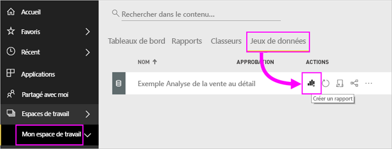
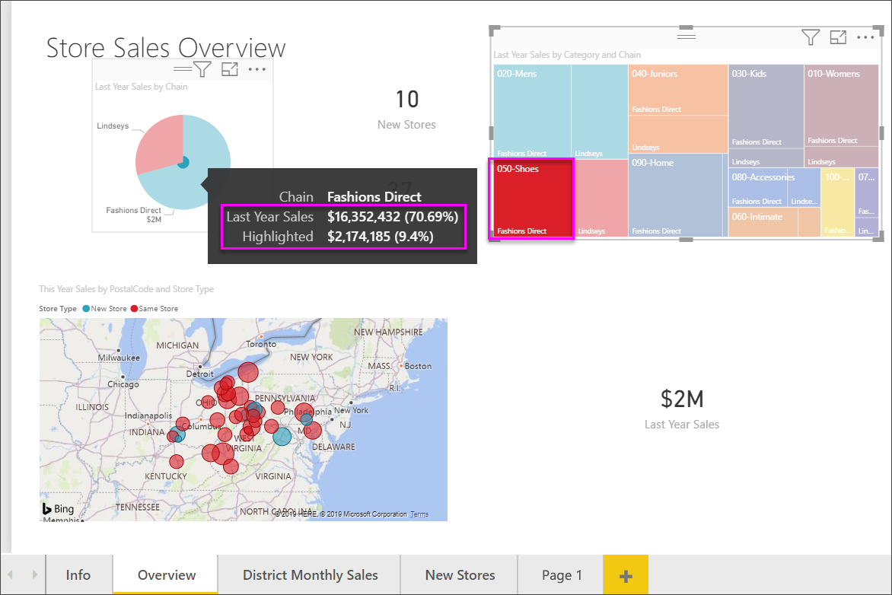

# Graphiques de compartimentage dans Power BI

Les treemaps utilisent des rectangles imbriqués pour présenter des données sous forme hiérarchique. Chaque niveau de la hiérarchie est représenté par un rectangle de couleur (une branche) qui contient d’autres rectangles plus petits (les feuilles). Power BI définit la taille de l’espace à l’intérieur de chaque rectangle selon sur la valeur mesurée. Les rectangles sont disposés par taille du haut à gauche (le plus grand) au bas à droite (le plus petit).

Imaginons que j’utilise ce graphique pour analyser mes ventes, les branches supérieures correspondent aux catégories de vêtements : **Urban**, **Rural**, **Youth** et **Mix**. Power BI divise les rectangles de votre catégorie en feuilles correspondant aux fabricants de vêtements dans cette catégorie. Ces feuilles auront une taille et une nuance qui dépendent du nombre d’articles vendus.

Dans la branche **Urban** ci-dessus, un grand nombre de vêtements **VanArsdel** a été vendu. Les ventes de vêtements **Natura** et **Fama** sont moindres. Seuls quelques articles **Leo** ont été vendus. Par conséquent, la branche **Urban** de votre treemap se présentera comme suit :

* le plus grand rectangle pour **VanArsdel** dans le coin supérieur gauche ;

* des rectangles légèrement plus petits pour **Natura** et **Fama** ;

* un grand nombre d’autres rectangles pour tous les autres vêtements vendus ;

* un tout petit rectangle pour **Leo**.

Vous pourriez ainsi comparer le nombre d’articles vendus dans les autres catégories de vêtements d’après la taille et le nuance de chaque nœud feuille : plus le rectangle est grand et sombre, plus les ventes sont élevées.

Vous souhaitez d’abord regarder une personne créer un treemap ? Accédez à la position 2:10 de cette vidéo pour voir comment Amanda crée un graphique de compartimentage.

<iframe width="560" height="315" src="https://www.youtube.com/embed/IkJda4O7oGs" frameborder="0" allowfullscreen></iframe>

## Quand faut-il utiliser un treemap ?

Les treemaps sont conseillés :

* pour afficher de grandes quantités de données hiérarchiques ;

* quand un graphique à barres ne peut pas afficher correctement toutes les valeurs ;

* pour montrer la proportion de chaque partie par rapport à l’ensemble ;

* pour montrer le modèle de distribution de la mesure entre chaque niveau de catégories dans la hiérarchie ;

* pour représenter les attributs selon un codage par taille et couleur ;

* pour repérer les modèles, les valeurs inhabituelles, les principaux contributeurs et les exceptions.

## Conditions préalables

* Service Power BI ou Power BI Desktop

* Exemple de rapport Analyse de la vente au détail

## Obtenir l’exemple de rapport Retail Analysis (Analyse de la vente au détail)

Ces instructions s’appliquent à l’exemple Analyse de la vente au détail. La création d’une visualisation nécessite des autorisations de modification du jeu de données et du rapport. Par chance, les exemples Power BI sont tous modifiables. Si quelqu’un partage un rapport avec vous, vous ne pourrez pas créer de visualisations dans les rapports. Pour suivre la procédure, obtenez l’[exemple de rapport Retail Analysis Sample (Analyse de la vente au détail)](../sample-datasets.md).

Une fois que vous obtenez le jeu de données **Retail Analysis Sample (Analyse de la vente au détail)** , vous pouvez commencer.

## Créer un treemap simple

Vous allez créer un rapport et ajouter un treemap simple.

1. À partir de **Mon espace de travail**, sélectionnez l’onglet **Jeux de données** > **Créer un rapport**.

    

1. Dans le volet **Champs**, sélectionnez la mesure **Ventes** > **Ventes de l’année dernière**.

   

1. Sélectionnez l’icône du treemap  pour convertir le graphique en treemap.

   

1. Faites glisser **Élément** > **Catégorie** vers **Groupe**.

    Power BI crée un treemap dont les rectangles ont une taille proportionnelle au total des ventes et une couleur distincte pour chaque catégorie représentée. Pour résumer, vous avez créé une hiérarchie qui représente visuellement la quantité relative du total des ventes par catégorie. La catégorie **Men’s** enregistre les meilleures ventes, alors que la catégorie **Hosiery** enregistre les plus basses.

    

1. Faites glisser **Magasin** > **Chaîne** vers **Détails** pour terminer votre treemap. Vous pouvez à présent comparer les ventes de l’année dernière par catégorie et par chaîne.

   

   > [!NOTE]
   > Les détails et la saturation des couleurs ne peuvent pas être utilisés en même temps.

1. Pointez sur une zone **Chaîne** pour afficher l’info-bulle correspondant à cette portion de la **Catégorie**.

    Par exemple, si vous pointez sur **Fashions Direct** dans le rectangle **090-Home**, l’info-bulle pour la portion Fashions Direct de la catégorie Home s’affiche.

   

1. Ajoutez le treemap sous forme de [vignette de tableau de bord (épinglez le visuel)](../service-dashboard-tiles.md).

1. Enregistrez [le rapport](../service-report-save.md).

## Mise en surbrillance et filtrage croisé

Pour plus d’informations sur le volet **Filtres**, consultez [Ajouter un filtre à un rapport](../power-bi-report-add-filter.md).

La mise en surbrillance d’une **catégorie** ou de **détails** dans un treemap entraîne la mise en surbrillance et le filtrage croisé des autres visualisations sur la page du rapport, et vice versa. Pour poursuivre, ajoutez des visuels à cette page de rapport ou copiez le treemap dans l’une des autres pages de ce rapport.

1. Dans le treemap, sélectionnez une **catégorie** ou une **chaîne** au sein d’une **catégorie**. Cela mettra en surbrillance croisée les autres visualisations sur la page. Sélectionnez la catégorie **050-Shoes**, par exemple, pour afficher le montant des ventes de chaussures l’année dernière (**3 640 471 $** ) et la part de ces ventes réalisée par **Fashions Direct** (**2 174 185 $** ).

   

1. Dans le graphique en secteurs **Ventes de l’année dernière par chaîne**, sélectionnez le secteur **Fashions Direct** pour filtrer le graphique de compartimentage.
   

1. Pour gérer la mise en surbrillance croisée et le filtrage croisé des tableaux entre eux, consultez [Modifier l’interaction des visuels dans un rapport Power BI](../service-reports-visual-interactions.md).

## Étapes suivantes

* [Graphiques en cascade dans Power BI](power-bi-visualization-waterfall-charts.md)

* [Types de visualisation dans Power BI](power-bi-visualization-types-for-reports-and-q-and-a.md)
