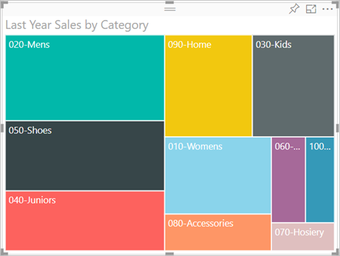

# Graphiques de compartimentage dans Power BI
Les treemaps utilisent des rectangles imbriqués pour présenter des données sous forme hiérarchique.  Chaque niveau de la hiérarchie est représenté par un rectangle de couleur (généralement appelé « branche ») qui contient d’autres rectangles (les « feuilles »).  L’espace à l’intérieur de chaque rectangle est alloué en fonction de la valeur mesurée. Les rectangles sont disposés par taille du haut à gauche (le plus grand) au bas à droite (le plus petit).

Imaginons que j’utilise ce graphique pour analyser mes ventes. Les grands rectangles (également appelés *branches*) correspondront aux catégories de vêtements : **Urban**, **Rural**, **Youth** et **Mix**.  Ces rectangles de catégorie seront divisés en rectangles plus petits, également appelés *feuilles*, correspondant aux fabricants de vêtements dans cette catégorie. Ces rectangles plus petits auront une taille et une nuance qui dépendent du nombre d’articles vendus.  

Dans la branche **Urban** ci-dessus, un grand nombre de vêtements `Maximus` a été vendu, moins de `Natura` et `Fama` et quelques `Leo`.  Par conséquent, la branche **Urban** de mon treemap se présentera comme suit :
* le plus grand rectangle pour `Maximus` dans le coin supérieur gauche
* des rectangles légèrement plus petits pour `Natura` et `Fama`
* un grand nombre d’autres rectangles pour tous les autres vêtements vendus, et 
* un tout petit rectangle pour `Leo`.  

Je pourrai ainsi comparer le nombre d’articles vendus dans les autres catégories de vêtements d’après la taille et le nuance de chaque nœud feuille : plus le rectangle est grand et sombre, plus les ventes sont élevées.

## Quand faut-il utiliser un treemap ?
Les treemaps sont conseillés :

* pour afficher de grandes quantités de données sous forme hiérarchique ;
* quand un graphique à barres ne peut pas afficher correctement toutes les valeurs ;
* pour montrer la proportion de chaque partie par rapport à l’ensemble ;
* pour montrer le modèle de distribution de la mesure entre chaque niveau de catégories dans la hiérarchie ;
* pour représenter les attributs selon un codage par taille et couleur ;
* pour repérer les modèles, les valeurs inhabituelles, les principaux contributeurs et les exceptions.

### Conditions préalables
 - Service Power BI ou Power BI Desktop
 - Exemple analyse de la vente au détail

## Créer un treemap simple
Vous souhaitez d’abord regarder une personne créer un treemap ?  Accédez à la position 2:10 de cette vidéo pour voir comment Amanda crée un graphique de compartimentage.

<iframe width="560" height="315" src="https://www.youtube.com/embed/IkJda4O7oGs" frameborder="0" allowfullscreen></iframe>

Ou bien, créez votre propre treemap. Ces instructions s’appliquent à l’exemple Analyse de la vente au détail. Pour la suite, connectez-vous au service Power BI et sélectionnez **Obtenir des données \> Exemples \> Exemple Analyse de la vente au détail \> Se connecter \> Accéder au tableau de bord**. Pour créer des visualisations dans un rapport, il est nécessaire de disposer d’autorisations de modification du jeu de données et du rapport. Par chance, les exemples Power BI sont modifiables. Mais vous ne pouvez pas ajouter des visualisations à un rapport que quelqu’un a partagé avec vous.  

1. Sélectionnez la vignette Nombre total de magasins pour ouvrir le rapport de l’exemple Analyse de la vente au détail.    
2. Ouvrez le [Mode Édition](../service-interact-with-a-report-in-editing-view.md), puis sélectionnez la mesure **Ventes** > **Ventes de l’année dernière**.   
      
3. Convertissez le graphique en treemap.  
      
4. Faites glisser **Élément** > **Catégorie** vers **Groupe**. Power BI crée un treemap dont les rectangles ont une taille proportionnelle au total des ventes et une couleur distincte pour chaque catégorie représentée.  Pour résumer, vous avez créé une hiérarchie qui représente visuellement la quantité relative du total des ventes par catégorie.  La catégorie **Men’s** enregistre les meilleures ventes, alors que la catégorie **Hosiery** enregistre les plus basses.   
      
5. Faites glisser **Magasin** > **Chaîne** vers **Détails** pour terminer votre treemap. Vous pouvez à présent comparer les ventes de l’année dernière par catégorie et par chaîne.   
   
   
   > [!NOTE]
   > Les détails et la saturation des couleurs ne peuvent pas être utilisés en même temps.
   > 
   > 
5. Pointez sur une zone **Chaîne** pour afficher l’info-bulle correspondant à cette portion de la **Catégorie**.  Par exemple, si vous pointez sur **Fashions Direct** dans le rectangle **090-Home**, l’info-bulle pour la portion Fashions Direct de la catégorie Home s’affiche.  
   
6. [Ajoutez le treemap sous forme de vignette de tableau de bord (épinglez l’élément visuel)](../service-dashboard-tiles.md). 
7. [Enregistrez le rapport](../service-report-save.md).

## Mise en surbrillance et filtrage croisé
Pour plus d’informations sur le volet Filtres, consultez [Ajouter un filtre à un rapport](../power-bi-report-add-filter.md).

La mise en surbrillance d’une catégorie ou de détails dans un treemap entraîne la mise en surbrillance et le filtrage croisés des autres visualisations sur la page du rapport, et vice versa. Pour poursuivre, ajoutez des visuels à cette page de rapport ou copiez le treemap dans l’un des autres pages non vides de ce rapport.

1. Dans le treemap, sélectionnez une catégorie ou une chaîne au sein d’une catégorie.  Cela met en surbrillance croisée les autres visualisations sur la page. Sélectionnez la catégorie **050-Shoes**, par exemple, pour afficher le montant des ventes de chaussures l’année dernière (3 640 471 $) et la part de ces ventes réalisée par Fashions Direct (2 174 185 $).  
   

2. Dans le graphique en secteurs **Ventes de l’année dernière par chaîne**, sélectionnez le secteur **Fashions Direct** pour filtrer le graphique de compartimentage.  
       

3. Pour gérer la mise en surbrillance croisée et le filtrage croisé des tableaux entre eux, consultez [Interactions de visualisation dans un rapport Power BI](../service-reports-visual-interactions.md).

## Étapes suivantes

[Graphiques en cascade dans Power BI](power-bi-visualization-waterfall-charts.md)

[Types de visualisation dans Power BI](power-bi-visualization-types-for-reports-and-q-and-a.md)