# Créer des cartes ArcGIS dans Power BI

[!INCLUDE[consumer-appliesto-yyyn](../includes/consumer-appliesto-yyyn.md)]    

> [!NOTE]
> Ces visuels peuvent être créés et affichés à la fois dans Power BI Desktop et dans le service Power BI. Les étapes et les illustrations de cet article proviennent de Power BI Desktop.

Cette vue d’ensemble est écrite du point de vue d’une personne qui crée une carte ArcGIS for Power BI. Quand le _concepteur_ partage une carte ArcGIS for Power BI avec un collègue, ce dernier peut l’afficher et interagir avec elle, mais non enregistrer des modifications. Pour plus d’informations sur l’affichage d’une carte ArcGIS, consultez [Exploration d’ArcGIS for Power BI](https://doc.arcgis.com/en/power-bi/use/explore-maps.htm).

L’association des cartes ArcGIS et de Power BI porte la cartographie au-delà de la simple présentation de points sur une carte, pour accéder à un nouveau niveau. Faites votre choix parmi des cartes de base, des types d’emplacement, des thèmes, des styles de symboles et des couches de référence pour créer des visualisations de cartes informatives exceptionnelles. L’association des couches de données faisant autorité sur une carte avec l’analyse spatiale permet une compréhension approfondie des données dans votre visualisation. S’il n’est pas possible de créer de cartes ArcGIS for Power BI sur un appareil mobile, vous pouvez en revanche les afficher et interagir avec elles.

> [!NOTE]
> ArcGIS for Power BI ne prend en charge Power BI Report Server que dans les environnements en ligne, et non dans les environnements hors connexion.

> [!TIP]
> SIG (ou GIS pour Geographic Information System en anglais) signifie système d’informations géographiques.

L’exemple ci-dessous utilise une zone de dessin gris foncé pour afficher les ventes régionales en tant que carte thermique par rapport à une couche démographique du revenu disponible médian 2016. Comme vous allez le découvrir, ArcGIS for Power BI offre des fonctionnalités de cartographie améliorées, des données démographiques et des visualisations de type carte encore plus attrayantes pour transmettre votre message.

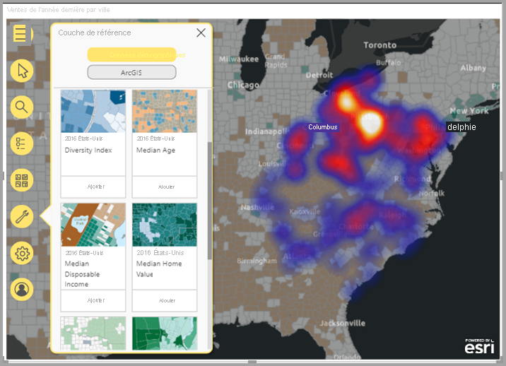

> [!TIP]
> Pour découvrir de nombreux exemples et lire des témoignages, consultez la [**page d’Esri sur ArcGIS for Power BI**](https://www.esri.com/powerbi). Affichez également l’**aide en ligne d’[ArcGIS Maps for Power BI](https://doc.arcgis.com/en/power-bi/get-started/about-maps-for-power-bi.htm)** d’Esri.

## Consentement de l’utilisateur

ArcGIS for Power BI est fourni par Esri ([https://www.esri.com](https://www.esri.com/)). Son utilisation est soumise aux [conditions](https://go.microsoft.com/fwlink/?LinkID=826322) et à la [politique de confidentialité](https://go.microsoft.com/fwlink/?LinkID=826323) d’Esri. Les utilisateurs de Power BI qui souhaitent se servir des visuels d’ArcGIS for Power BI doivent accepter la boîte de dialogue de consentement. Elle ne s’affiche qu’à la première utilisation d’ArcGIS for Power BI.

## Prérequis

Ce tutoriel utilise Power BI Desktop et le fichier PBIX de l’[exemple Analyse de la vente au détail](https://download.microsoft.com/download/9/6/D/96DDC2FF-2568-491D-AAFA-AFDD6F763AE3/Retail%20Analysis%20Sample%20PBIX.pbix). Il est également possible de créer des cartes ArcGIS for Power BI à l’aide du service Power BI.

1. Dans la section supérieure gauche de la barre de menus, sélectionnez **Fichier** > **Ouvrir le rapport**.
2. Recherchez le **fichier PBIX de l’exemple Analyse de la vente au détail** enregistré sur votre machine locale.
3. Ouvrez l’**Exemple Analyse de la vente au détail** dans la vue Rapport .
4. Sélectionner  pour ajouter une nouvelle page au rapport.

## Création d’une visualisation de type carte ArcGIS for Power BI

Pour ajouter une carte à un rapport, procédez comme suit :

1. Sélectionnez l’icône ArcGIS for Power BI dans le volet Visualisations.

    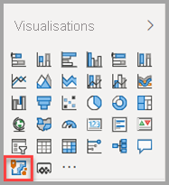

2. Power BI ajoute un modèle vide au canevas de rapport. Dans cette vue d’ensemble, nous allons utiliser la version **Standard** incluse dans Power BI. Si vous vous connectez à un compte ArcGIS valide avec une licence appropriée, vous aurez accès à d’autres fonctionnalités. Pour plus d’informations, consultez [l’aide en ligne d’ArcGIS for Power BI](https://doc.arcgis.com/en/power-bi/get-started/account-types.htm).

    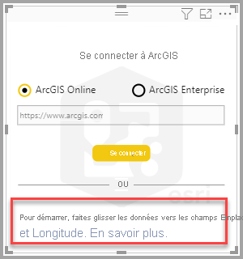

3. Dans le volet **Champs**, faites glisser un champ de données vers le champ **Emplacement**, ou faites glisser les coordonnées dans les compartiments **Latitude** et/ou **Longitude** appropriés. Dans cet exemple, utilisez **Store > City** (Magasin > Ville).

    > [!NOTE]
    > ArcGIS for Power BI détecte automatiquement si les champs sélectionnés offrent un meilleur affichage sous forme de formes ou de points sur une carte. Vous pouvez ajuster la valeur par défaut dans les paramètres (cf. [Mise en forme de la visualisation ArcGIS for Power BI](#format-the-arcgis-for-power-bi-visualization)).

    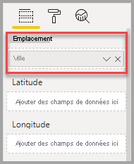

4. À partir du volet **Champs**, faites glisser une mesure vers le compartiment **Taille** pour ajuster le mode d’affichage des données. Dans cet exemple, utilisez **Sales > Last Year Sales** (Ventes > Ventes de l’année dernière).

    

Vous avez créé votre première carte ArcGIS for Power BI. À présent, nous allons affiner et mettre en forme notre carte en utilisant des cartes de base, des types d’emplacement, des thèmes et bien d’autres options.

## Mise en forme de la visualisation ArcGIS for Power BI

Pour accéder aux fonctionnalités de mise en forme **d’ArcGIS for Power BI**, procédez comme suit :

1. Dans le volet Visualisations, cliquez sur l’onglet **Format** pour afficher les options de mise en forme.

    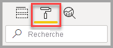

    Voici les options de mise en forme des cartes ArcGIS :

    * **Couches :** Modifiez le titre de la liste des couches (ToC), activez ou désactivez la liste des couches, ancrez la liste sur la carte, définissez la position de la liste ancrée. La liste de couches est activée par défaut et est disponible dans les outils de carte développés .
    * **Outils de carte :** activez ou désactivez les outils de navigation, verrouillez l’étendue de la carte dans sa position actuelle, définissez la position des cartes d’infographies sur la carte. Les boutons Zoom avant et Zoom arrière sont désactivés par défaut.
    * **Type d’emplacement :** Le fait de spécifier le pays ou la région où se trouvent vos données permet d’améliorer la précision des emplacements sur votre carte. Si vos données se trouvent dans un seul pays/une seule région, choisissez le pays ou la région dans la liste déroulante. Si vos données sont globales, choisissez Monde.
    * **Recherche :** Activez ou désactivez la fonction de recherche, puis modifiez la couleur par défaut de l’épingle. La recherche est activée par défaut et est disponible dans les outils de carte développés .

### Modification d’une carte ArcGIS for Power BI

Une fois que vous avez ajouté des données à la visualisation de la carte, les outils de mappage deviennent disponibles.

> [!NOTE]
> Ce tutoriel présente uniquement les fonctionnalités et les options disponibles dans la version **Standard** d’ArcGIS for Power BI. Si vous êtes connecté à un [compte ArcGIS](https://doc.arcgis.com/en/power-bi/get-started/account-types.htm) valide avec la licence appropriée, vous aurez accès à plus de fonctionnalités.

Pour développer les outils de carte :

1. Cliquez sur le bouton Outils de carte pour développer les outils.

    

Les outils de carte se développent pour afficher les fonctionnalités disponibles. Chaque fonctionnalité, lorsque vous la sélectionnez, ouvre un volet Office qui fournit des options détaillées.

> [!TIP]
> Esri fournit une [documentation complète](https://go.microsoft.com/fwlink/?LinkID=828772) sur ArcGIS for Power BI.

#### Modifier la carte de base

Une carte de base fournit un contexte d’arrière-plan ou visuel pour les données d’une carte. Par exemple, une carte de base qui présente des rues peut fournir un contexte pour vos données d’adresse. En utilisant le compte **Standard**, quatre cartes de base sont fournies : Dark Gray Canvas, Light Gray Canvas, OpenStreetMap et Streets.

Pour modifier la carte de base, procédez comme suit :

1. Cliquez sur le bouton **Carte de base**  pour afficher la Galerie.
2. Sélectionnez la carte de base **Canevas Gris foncé**.

    

    La carte est mise à jour à l’aide de la nouvelle carte de base.

Pour plus d’informations, consultez [Modification de la carte de base](https://doc.arcgis.com/en/power-bi/design/change-the-basemap.htm) dans l’aide en ligne d’ArcGIS for Power BI.

#### Afficher les couches de carte

Dans ArcGIS for Power BI, les données géographiques sont manipulées par le biais de couches. Les couches sont des collections logiques de données géographiques utilisées pour créer des cartes. Elles sont également la base de l’analyse géographique.

Pour afficher la liste des couches, cliquez sur le bouton **Couches**  dans les outils de carte.

La liste Couches affiche chaque couche qui compose la carte, et chaque couche possède son propre ensemble d’options pour vous aider à personnaliser et à utiliser la carte. Différentes options s’affichent dans le menu en fonction du type de couche sélectionné. Par exemple, vous pouvez modifier le symbolisme et le type d’emplacement pour une couche créée à l’aide de données Power BI, comme la couche **Ville** que vous avez créée pour cet exemple, mais ces options ne sont pas disponibles pour les couches de référence ou de temps de trajet.

Pour plus d’informations, consultez [Utilisation des couches](https://doc.arcgis.com/en/power-bi/design/work-with-layers.htm) dans l’aide en ligne d’ArcGIS for Power BI.

#### Spécifier le type d’emplacement

ArcGIS for Power BI utilise sa puissante technologie géographique pour positionner avec précision les données d’emplacement sur la carte. Il affiche automatiquement les éléments sous forme de points ou de limites par défaut, en fonction du type de données. Par exemple, une coordonnée de longitude-latitude est rendue sous la forme d’un point sur la carte, alors qu’un champ d’état est rendu sous la forme d’une limite, ou d’un polygone. Vous pouvez modifier la façon dont les emplacements sont représentés en spécifiant le type d’emplacement.

Utilisez la fonctionnalité Type d’emplacement pour améliorer la précision des emplacements sur votre carte. Vous pouvez le faire rapidement en choisissant un pays/une région dans le volet Format de la visualisation (développez la catégorie Type d’emplacement et choisissez le pays/la région en question), ou accédez à davantage d’options à l’aide de la fonctionnalité Type d’emplacement complète du volet Options de couche.

La fonctionnalité **Type d’emplacement** complète est accessible via le menu Options de couche et vous permet de choisir si vous souhaitez représenter vos données sous forme de points ou de limites (polygones), en plus de spécifier le pays ou la région où se trouvent les données. Les limites sont généralement définies en tant que zones géographiques standard, comme des pays, provinces, codes postaux, etc. Si vous choisissez des limites et un pays ou une région spécifique pour vos emplacements de données, vous pouvez choisir parmi une variété de limites standard, comme des comtés, des secteurs de recensement, des districts ou des municipalités. Différents types d’emplacement sont disponibles pour chaque pays/région.

Pour modifier le type d’emplacement de vos données, procédez comme suit :

1. Dans la liste Couches, sélectionnez la couche de données que vous souhaitez utiliser.
2. Cliquez sur le bouton **Options de couche** et choisissez **Type d’emplacement**.

    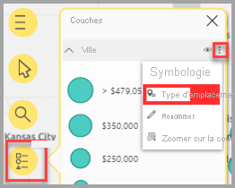

    Acceptez les valeurs par défaut pour afficher les emplacements en tant que points sur la carte et spécifiez **Un pays > États-Unis**.

    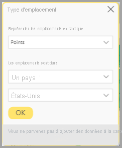

Pour plus d’informations, consultez [Spécification du type d’emplacement](https://doc.arcgis.com/en/power-bi/design/specify-location-type.htm) dans l’aide en ligne d’ArcGIS for Power BI.

#### Personnaliser la symbologie de la carte

ArcGIS for Power BI utilise les valeurs du volet Champs pour déterminer intelligemment comment afficher les emplacements sur la carte. La fonctionnalité **Symbologie** vous permet de modifier le style par défaut pour mieux raconter votre histoire. Vous pouvez choisir un autre thème de carte et personnaliser les symboles et les couleurs utilisés pour représenter les emplacements sur la carte. Différents thèmes de carte et options de style sont disponibles, en fonction des valeurs que vous avez ajoutées au volet Champs du visuel de la carte.

Pour modifier la symbologie d’une couche, procédez comme suit :

1. Dans la liste Couches, sélectionnez la couche de données que vous souhaitez utiliser.

2. Cliquez sur le bouton **Options de couche** et choisissez **Symbologie**.

Le volet Symbologie s’affiche avec la catégorie Thème de la carte développée.

##### Modifier le thème de la carte

Dans cet exemple, étant donné que nous avons ajouté des valeurs à la fois aux champs **Emplacement** et **Taille**, la carte utilise le thème **Taille** par défaut.

Pour modifier le thème de la carte, procédez comme suit :

1. Choisissez d’autres thèmes de la carte pour voir comment votre carte change.

    

2. Choisissez le thème **Taille**.

Pour plus d’informations, consultez [Modification du thème de la carte](https://doc.arcgis.com/en/power-bi/design/change-the-map-theme.htm) dans l’aide en ligne d’ArcGIS for Power BI.

##### Transparence de couche

Si votre carte contient plusieurs couches, il peut être utile d’afficher des couches avec un certain niveau de transparence afin que les éléments sur les autres couches soient toujours visibles.

Pour définir la valeur de transparence de la couche, procédez comme suit :

1. Dans le volet **Symbologie**, développez la catégorie **Transparence**.

2. Entrez un pourcentage dans la zone de texte ou déplacez le curseur vers la gauche (moins transparent) ou vers la droite (plus transparent).

##### Style de symbole

Les styles de symbole vous permettent de représenter les données sur la carte avec plus de précision. Les styles de symboles par défaut sont basés sur le type d’emplacement et le thème de carte sélectionnés, et les options de style disponibles sont différentes selon les types de champ qui contiennent des valeurs et la nature de ces valeurs.

Pour modifier le style de symbole, procédez comme suit :

1. Dans le volet **Symbologie**, développez la catégorie **Style de symbole**.

2. Modifiez les paramètres de symbole comme vous le souhaitez. Choisissez une forme, une couleur et une transparence de symbole, et une couleur, une épaisseur et une transparence de contour. Développez la catégorie Taille du symbole pour modifier ces options. Différentes options s’affichent en fonction de la nature de vos données et du thème de carte sélectionné.

    L’exemple ci-dessous montre un thème de carte défini sur **Size** et plusieurs ajustements du style de symbole apportés à la transparence, au style et à la taille.

    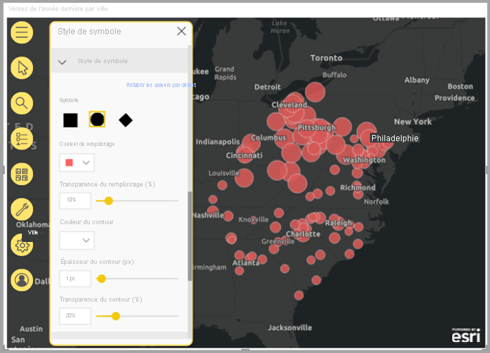

3. Lorsque vous avez terminé de définir les options de style, fermez le volet Symbologie.

### Analyser vos données

ArcGIS for Power BI fournit plusieurs outils qui vous permettent de découvrir des modèles dans vos données et de raconter une histoire convaincante avec une carte.

Les fonctionnalités d’analyse sont les suivantes :

- Sélection d’emplacements sur la carte
- Recherche d’une adresse, d’un lieu ou d’un point d’intérêt spécifique
- Ajout d’une couche de référence pour fournir davantage de contexte
- Recherche d’emplacements au sein d’un rayon ou d’une zone de temps de trajet spécifique
- Ajout de cartes qui affichent des détails démographiques sur la zone affichée sur la carte

#### Sélectionner des emplacements

ArcGIS for Power BI fournit différents outils permettant de sélectionner des emplacements sur la carte. Différents outils s’affichent, selon le type de couche actuellement sélectionné dans la liste Couches.

Pour afficher les outils de sélection, procédez comme suit :

1. Dans les outils de la carte, cliquez sur le bouton **Outils de sélection**  pour développer l’ensemble d’outils.

    Quatre outils de sélection sont disponibles ; différents outils peuvent apparaître dans le menu **Outils de sélection**, selon le type de couche actuellement actif. Étant donné que la carte dans cet exemple contient uniquement une couche de données, seuls les outils **Sélection simple** et **Sélection de zone** s’affichent.
    
    | **Outil** | **Description** |
    | --- | --- |
    |  | **Sélection simple** : il s’agit d’un outil à sélection unique qui peut être utilisé pour cliquer sur des emplacements individuels. Il s’agit de l’outil de sélection par défaut. Appuyez sur Ctrl et cliquez pour sélectionner plusieurs emplacements. Cliquer sur les emplacements de données sur la carte les sélectionne et déclenche des interactions avec d’autres visualisations. Le fait de cliquer sur une épingle ou sur une couche de référence affiche son info-bulle. |
    |   | **Sélection de zone** : faites glisser un sélecteur de rectangle pour sélectionner plusieurs emplacements ou sélectionner des emplacements individuels en cliquant dessus. Comme avec l’outil de sélection, le fait de cliquer sur une épingle ou un emplacement sur une couche de référence affiche son info-bulle. Lorsque l’outil de sélection de zone est actif, vous ne pouvez pas effectuer un panoramique de la carte. |
    |   | **Sélection de couche de référence** : si vous avez ajouté une [couche de référence](https://doc.arcgis.com/en/maps-for-powerbi/design/add-a-reference-layer.htm) à la carte, utilisez cet outil pour sélectionner des emplacements en cliquant sur des zones de la couche de référence. Les emplacements situés dans une zone délimitée d’une référence sont mis en surbrillance ; les emplacements situés dans d’autres zones de la carte ne sont pas disponibles. Cet outil s’affiche uniquement si la carte contient une ou plusieurs couches de référence et qu’une couche de référence est actuellement active. |
    |   | **Sélection de temps de trajet** : si vous avez ajouté une [zone de temps de trajet](https://doc.arcgis.com/en/maps-for-powerbi/design/find-nearby-locations.htm) à votre carte, utilisez l’outil de sélection de la zone de temps de trajet pour sélectionner des emplacements de données dans la zone définie. |
    
2. Sélectionnez un ou plusieurs emplacements sur la carte. Vous pouvez sélectionner un maximum de 250 points de données à la fois.

Pour plus d’informations, consultez [Sélection d’emplacements sur une carte](https://doc.arcgis.com/en/power-bi/design/select-features-on-the-map.htm) dans l’aide en ligne d’ArcGIS for Power BI.

#### Épingler un emplacement

Épinglez une adresse spécifique, un emplacement ou un point d’intérêt sur la carte. Pour cet exemple, vous allez rechercher l’aéroport international de Pittsburgh.

Pour épingler un emplacement, procédez comme suit :

1. Dans les outils de carte, cliquez sur le bouton **Rechercher**  pour ouvrir le volet de recherche.
2. Entrez les mots clés **Pittsburgh international** dans la zone de recherche.

    Les mots clés peuvent inclure une adresse, un lieu ou un point d’intérêt. Au fur et à mesure que vous écrivez, les recherches récentes similaires ou les suggestions basées sur des mots clés similaires s’affichent.

3. Dans la liste des résultats, choisissez **Aéroport international de Pittsburgh**, puis cliquez sur **Fermer**.

    Un symbole apparaît sur la carte qui effectue automatiquement un zoom sur l’emplacement. Les épingles restent en place sur la carte uniquement pendant la session active ; vous ne pouvez pas enregistrer un emplacement épinglé avec la carte. L’emplacement épinglé apparaît également sous la forme d’une couche dans la liste Couches. Vous pouvez renommer la couche, l’afficher ou la masquer, ou la supprimer de la carte, comme vous pouvez le faire avec d’autres couches.

4. Pour modifier la couleur de l’épingle, développez la catégorie **Recherche** dans le volet **format** du visuel de la carte et choisissez une nouvelle couleur.

> [!NOTE]
> La fonctionnalité **Recherche** remplace la fonctionnalité Épingles auparavant disponible dans ArcGIS for Power BI.

Pour plus d’informations, consultez [Épinglage d’un emplacement](https://doc.arcgis.com/en/power-bi/design/pin-locations.htm) dans l’aide en ligne d’ArcGIS for Power BI.

#### Ajouter une couche de référence

Les couches de référence fournissent le contexte des données Power BI que vous affichez déjà sur une carte. Les couches de référence peuvent inclure des données démographiques, comme le revenu du ménage, l’âge ou le niveau d’études. Elles peuvent également inclure des couches de fonctionnalités partagées publiquement disponibles sur ArcGIS Online, qui fournissent des informations supplémentaires sur les zones entourant les emplacements sur votre carte.

##### Ajouter une couche démographique

Le compte ArcGIS for Power BI standard comprend une sélection organisée de couches démographiques américaines qui aident à contextualiser les données de Power BI.

Pour ajouter une couche démographique, procédez comme suit :

1. Dans les outils de mappage, cliquez sur le bouton **Outils d’analyse**  pour développer l’ensemble d’outils.
2. Cliquez sur le bouton **Couche de référence** .

    Le volet **Couche de référence** s’affiche, affichant l’onglet **Démographie** et sa sélection de couches.

3. Faites défiler la galerie et cliquez sur **Ajouter** sur la miniature de la couche que vous souhaitez ajouter à votre carte.

    Pour cet exemple, recherchez la couche **2016 USA Average Household Income** , puis cliquez sur **Ajouter**.
    
    La carte se met à jour pour afficher la nouvelle couche.
    
    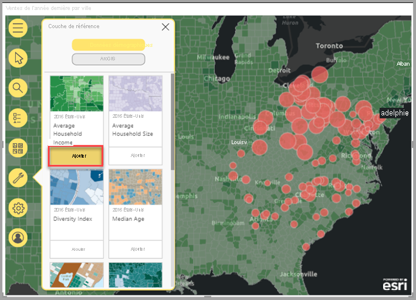
    
Les couches de référence démographiques sont interactives. Cliquez sur une zone pour afficher une info-bulle contenant plus d’informations. Vous pouvez également utiliser l’outil **Sélection de référence** pour [sélectionner des zones de la carte](https://doc.arcgis.com/en/power-bi/design/select-features-on-the-map.htm) qui se trouvent dans une zone de la couche de référence.

##### Ajouter une couche de référence à partir d’ArcGIS

ArcGIS for Power BI offre la possibilité de rechercher des couches de fonctionnalités partagées publiquement sur ArcGIS. Vous avez ainsi accès à des milliers de couches de référence qui fournissent des informations sur les zones entourant les emplacements de votre couche de données. Quand vous vous connectez à ArcGIS for Power BI à l’aide d’un compte ArcGIS valide, vous pouvez rechercher du contenu dans votre organisation, dans les groupes de votre organisation ou dans le contenu public. Dans cet exemple, étant donné que vous utilisez le compte standard, seul le contenu partagé publiquement apparaît dans les résultats de la recherche.

Pour ajouter une couche de référence ArcGIS, procédez comme suit :

1. Dans le volet de référence, cliquez sur l’onglet **ArcGIS**.

2. Dans le champ de recherche, entrez **USA Congressional districts** et appuyez sur **Entrée**.

    La Galerie se remplit avec plusieurs résultats possibles.

3. Recherchez la couche USA 116th Congressional Districts, puis cliquez sur Ajouter.

    La carte se met à jour pour afficher la nouvelle couche.
    
    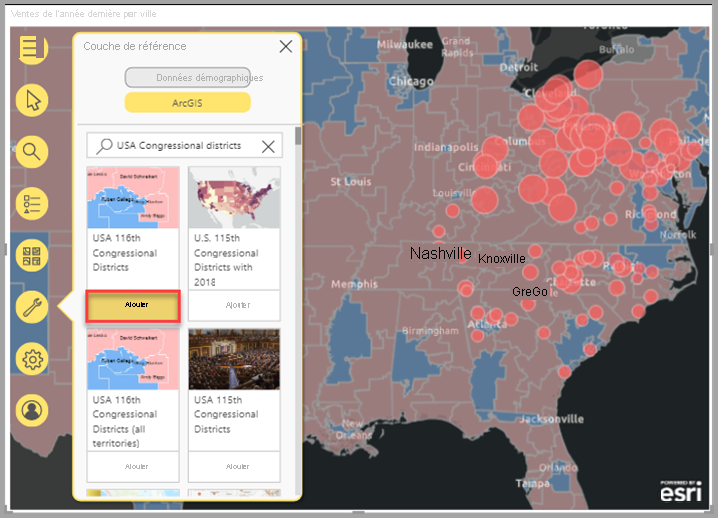
    
Les couches de référence ArcGIS sont interactives. Cliquez sur une zone pour afficher une info-bulle contenant plus d’informations. Vous pouvez également utiliser l’outil **Sélection de référence** pour [sélectionner des zones de la carte](https://doc.arcgis.com/en/power-bi/design/select-features-on-the-map.htm) qui se trouvent dans une zone de la couche de référence.

#### Rechercher les emplacements à proximité

Vous pouvez utiliser des emplacements sur votre carte (y compris un emplacement épinglé) comme point de départ pour rechercher et sélectionner des emplacements à proximité sur votre carte. Par exemple, si vous recherchez un point d’intérêt particulier, vous pouvez sélectionner des emplacements sur votre carte qui se trouvent à un temps de trajet ou à une distance spécifiés à partir de cet emplacement.

Dans cet exemple, vous allez utiliser l’aéroport international de Pittsburgh que vous avez épinglé précédemment comme point de départ pour rechercher des emplacements situés à moins de 100 kilomètres de l’aéroport. Utilisez des étapes similaires pour rechercher des emplacements accessibles dans un temps de trajet spécifié.

Pour rechercher des emplacements à une distance de trajet spécifique à partir du point d’origine, procédez comme suit :

1. Dans les outils de mappage, cliquez sur le bouton **Outils d’analyse**  pour développer l’ensemble d’outils.

2. Cliquez sur le bouton **Temps de trajet** .

    Le volet **Temps de trajet** s’affiche.

3. Cliquez sur l’outil de sélection unique et, sur la carte, sélectionnez l’emplacement **Aéroport international de Pittsburgh** que vous avez épinglé précédemment.
4. Dans le menu déroulant **Zone de recherche**, choisissez **Rayon** et spécifiez une distance de **100** miles.
5. Cliquez sur **OK**.

    La carte affiche un cercle entourant l’emplacement de l’aéroport épinglé. Le volet Temps de trajet se développe pour afficher les options de style pour la zone de distance de trajet.
    
    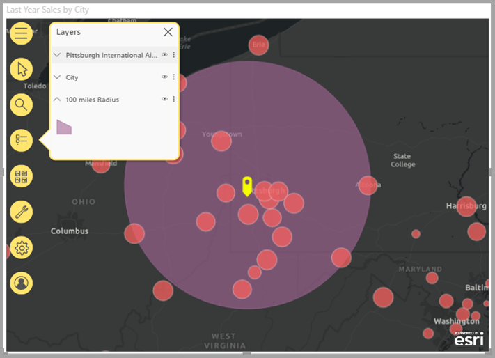
    
    La zone de distance de trajet apparaît également sous la forme d’une couche dans la liste Couches. Vous pouvez renommer la couche, l’afficher ou la masquer, ou la supprimer de la carte, comme vous pouvez le faire avec d’autres couches.

6. Une fois la couche de temps de trajet activée dans la liste Couches, utilisez l’outil de sélection de temps de trajet pour cliquer sur la zone de distance de trajet.

    Les emplacements qui se trouvent dans la zone de recherche sont sélectionnés ; les emplacements non sélectionnés sur la carte apparaissent plus petits ou deviennent plus transparents. D’autres visualisations sont mises à jour pour refléter les emplacements sélectionnés.

Pour plus d’informations, consultez [Recherche d’emplacements à proximité](https://doc.arcgis.com/en/power-bi/design/find-nearby-locations.htm) dans l’aide en ligne d’ArcGIS for Power BI.

#### Ajouter des cartes d’infographie

Comme les couches de référence, les cartes d’infographie fournissent des détails supplémentaires sur les zones de la carte. Les cartes d’infographie s’affichent au-dessus de la carte et affichent des informations démographiques spécifiques sur la zone qui entoure immédiatement un emplacement sélectionné ou sur la zone générale affichée dans l’étendue de carte actuelle. Pour plus d’informations, consultez [Ajout de cartes d’infographie](https://doc.arcgis.com/en/power-bi/design/add-infographics.htm) dans l’aide en ligne d’ArcGIS for Power BI.

### Obtenir de l’aide

Esri fournit une documentation en ligne complète sur ArcGIS for Power BI.

Pour accéder à l’aide en ligne d’ArcGIS for Power BI à partir de la visualisation, procédez comme suit :

1. Dans les outils de mappage, cliquez sur le bouton **Paramètres** .

2. Dans le volet **Paramètres**, cliquez sur le bouton **Aide**.
3. Cliquez sur **OK** dans la fenêtre de confirmation qui s’affiche.

    L’aide en ligne d’ArcGIS for Power BI s’ouvre dans une fenêtre du navigateur.
    
    - Trouvez des réponses aux [questions fréquentes](https://doc.arcgis.com/en/power-bi/get-started/pbi-faq.htm#anchor5) dans l’aide en ligne d’ArcGIS for Power BI.
    - Vous pouvez poser des questions, accéder aux dernières informations, signaler des problèmes et trouver des réponses sur le [fil de discussion de la communauté Power BI consacré à **ArcGIS for Power BI**](https://go.microsoft.com/fwlink/?LinkID=828771).
    - Si vous avez des suggestions d’amélioration, ajoutez-les à la [liste d’idées concernant Power BI](https://ideas.powerbi.com/).
    
### Gestion de l’utilisation d’ArcGIS for Power BI au sein de l’organisation

Power BI permet aux concepteurs, aux administrateurs Power BI et aux administrateurs d’utilisateurs de gérer l’utilisation d’ArcGIS for Power BI. Les sections ci-dessous décrivent les actions que chaque rôle peut effectuer.

#### Options du concepteur

Dans Power BI Desktop, les concepteurs peuvent désactiver ArcGIS for Power BI dans l’onglet Sécurité. Sélectionnez **Fichier**  >  **Options et paramètres**, puis sélectionnez **Options**  >  **Sécurité**. Une fois désactivé, ArcGIS ne se charge plus par défaut.

#### Options pour l’administrateur

Dans le service Power BI, les administrateurs peuvent désactiver ArcGIS for Power BI pour tous les utilisateurs. Sélectionnez **Paramètres** > **Portail d’administration** > **Paramètres du client**. Après la désactivation d’ArcGIS for Power BI, Power BI n’affiche plus l’icône correspondante dans le volet Visualisations.

#### Options pour l’administrateur d’utilisateurs

Power BI Desktop prend en charge le recours à une **stratégie de groupe** pour désactiver ArcGIS for Power BI sur tous les ordinateurs déployés d’une organisation.

| **Attribut** | **Valeur** |
| --- | --- |
| Clé | Software\Policies\Microsoft\Power BI Desktop |
| valueName | EnableArcGISMaps |

La valeur 1 (décimale) active ArcGIS for Power BI.

La valeur 0 (décimale) désactive ArcGIS for Power BI.

## Considérations et limitations

ArcGIS for Power BI est disponible dans les applications et services suivants :

| Service/Application | Disponibilité |
| --- | --- |
| Power BI Desktop | Oui |
| Service Power BI (powerbi.com) | Oui |
| Applications mobiles Power BI\* | Oui |
| Publier sur le web Power BI | Oui, pour les concepteurs connectés à un compte ArcGIS valide avec la licence du module complémentaire appropriée. Les consommateurs n’ont pas besoin de la licence du module complémentaire pour afficher le contenu publié. |
| Power BI Embedded | Oui, pour les concepteurs connectés à un compte ArcGIS valide avec la licence du module complémentaire appropriée. Les consommateurs n’ont pas besoin de la licence du module complémentaire pour afficher le contenu publié. |
| Incorporation au service Power BI (powerbi.com) | Non |
| Power BI Report Server | Oui, dans les environnements en ligne uniquement ; non pris en charge dans les environnements déconnectés. |

\* Dans les environnements mobiles, vous pouvez afficher les cartes créées à l’aide de la visualisation ArcGIS for Power BI incluse dans Power BI ([compte standard](https://doc.arcgis.com/en/maps-for-powerbi/get-started/account-types.htm)). Les cartes qui contiennent du contenu Premium d’ArcGIS ne sont pas prises en charge dans les environnements mobiles.

Dans les services et applications pour lesquels ArcGIS for Power BI n’est pas disponible, la visualisation se présente sous la forme d’un visuel vide avec le logo Power BI.

Le tableau suivant compare les fonctionnalités standard disponibles pour tous les utilisateurs Power BI à celles disponibles pour les utilisateurs ArcGIS connectés :

|  Standard (inclus avec Power BI) |   Avec votre compte ArcGIS |
| --- | --- | --- |
| Cartes de base |
| 4 cartes de base | Toutes les cartes de base Esri plus l’accès à celles de votre organisation, y compris les cartes de base personnalisées |
| Géocodage |
| 3 500 emplacements par carte | 10 000 emplacements par carte |
 | 10 000 emplacements par mois | Aucune limite mensuelle |
| Couches de référence |
| 10 couches de référence qui contiennent des données démographiques des États-Unis | Accès à toutes les couches et cartes web à partir de votre organisation ArcGIS |
 | Couches de fonctionnalités partagées publiquement dans ArcGIS | Couches de fonctionnalités partagées publiquement dans ArcGIS |
 | Accès aux cartes et couches d’ArcGIS Living Atlas of the World (services de fonctionnalités) |
| Infographie |
| Galerie organisée de variables démographiques des États-Unis (7 catégories) | Accès complet à l’explorateur de données ArcGIS GeoEnrichment, y compris les variables démographiques mondiales et des États-Unis |
|

## Étapes suivantes

- [Interaction avec une carte ArcGIS qui a été partagée avec vous](https://doc.arcgis.com/en/power-bi/use/explore-maps.htm)
- [Billets de blog annonçant les mises à jour d’ArcGIS for Power BI](https://www.esri.com/arcgis-blog/?s=#ArcGIS%20for%20Power%20BI)
- D’autres questions ? [Essayez d’interroger la communauté Power BI](https://community.powerbi.com/)