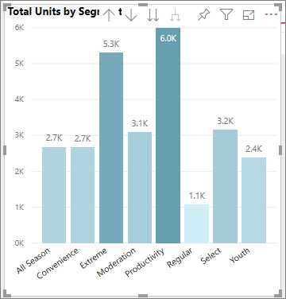
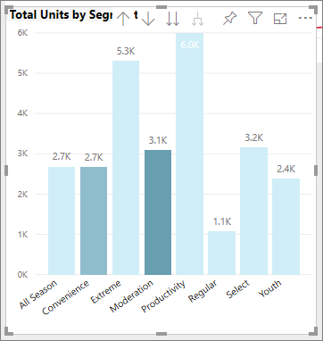

# Trucs et astuces pour la mise en forme des couleurs dans Power BI
Power BI vous propose de nombreuses façons de personnaliser vos tableaux de bord et vos rapports. Cet article fournit des astuces pour rendre vos visualisations Power BI plus attrayantes, plus intéressantes et mieux adaptées à vos besoins.

Ces astuces sont répertoriées ci-dessous. Vous en avez une autre à proposer ? Excellent ! Envoyez-la nous et nous verrons si nous pouvons l’ajouter à notre liste.

* Modifier la couleur d’un seul point de données
* Baser les couleurs du graphique sur une valeur numérique
* Baser la couleur des points de données sur une valeur de champ
* Personnaliser les couleurs de l’échelle de couleurs
* Utiliser des échelles de couleurs divergentes
* Comment annuler dans Power BI

Pour apporter des modifications, vous devez modifiez un rapport. Ouvrez le rapport, puis sélectionnez **Modifier le rapport** à partir de la zone de menu supérieur, comme illustré dans l’image suivante.

Quand les volets **Filtres** et **Visualisations** s’affichent à droite du canevas de rapport, vous pouvez commencer la personnalisation. Si le volet n’apparaît pas, sélectionnez la flèche, à partir de l’angle supérieur droit, pour l’ouvrir.

## Modifier la couleur d’un seul point de données
Parfois, il peut être nécessaire de mettre en évidence un point de données particulier. Il peut s’agir de chiffres de ventes pour le lancement d’un nouveau produit ou de l’amélioration de la qualité après le lancement d’un nouveau programme. Avec Power BI, vous pouvez mettre en évidence un point de données spécifique en modifiant sa couleur.

La visualisation suivante classe les unités vendues par segment de produit. 

Maintenant imaginez que vous souhaitez appeler le segment **Convenience** pour afficher les performances de ce tout nouveau segment, à l’aide de la couleur. Voici les étapes à suivre :

Développez la section **Couleurs des données** et activez le curseur pour **Tout afficher**. Cela affiche les couleurs de chaque élément de données de la visualisation. Quand vous pointez sur les points de données, le défilement est activé pour vous permettre de les modifier.

Définissez **Convenience** sur la couleur orange. 

Une fois sélectionné, le point de données **Convenience** se distingue facilement par sa couleur orange.

Même si vous modifiez les types de visualisations, puis revenez, Power BI se souvient de votre sélection et conserve la couleur orange pour **Convenience**.

Vous pouvez modifier la couleur d’un point de données pour un, plusieurs ou tous les éléments de données dans la visualisation. Vous pouvez choisir que votre élément visuel imite les couleurs de votre entreprise. 

Vous pouvez réaliser toutes sortes de choses avec les couleurs. Dans la section suivante, nous parlerons des dégradés.

## Baser les couleurs du graphique sur une valeur numérique
Il est souvent utile de définir les couleurs d’un graphique de façon dynamique, en fonction de la valeur numérique d’un champ. Cela vous permet, par exemple, d’afficher une valeur différente pour la taille d’une barre, ou d’afficher deux valeurs sur un même graphique. Vous pouvez également utiliser cette méthode pour mettre en évidence des points de données supérieurs (ou inférieurs) à une certaine valeur (par exemple, en mettant en surbrillance les régions à faible rentabilité).

Les sections suivantes présentent différentes manières de baser les couleurs sur une valeur numérique.

## Baser la couleur des points de données sur une valeur
Pour changer la couleur en fonction d’une valeur, ouvrez le volet de mise en forme et sélectionnez l’option **Mise en forme conditionnelle**.  

Dans le volet Couleur par défaut, utilisez les listes déroulantes pour identifier les champs à utiliser pour la mise en forme conditionnelle. Dans cet exemple, nous avons sélectionné le champ **Sales fact** > **Total Units**. Nous avons aussi choisi le bleu clair pour **Valeur la plus basse** et le bleu foncé pour **Valeur la plus élevée**. 

Vous pouvez également mettre en forme la couleur du visuel à l’aide d’un champ qui ne fait pas partie du visuel. Dans l’image suivante, **%Market Share SPLY YTD** est utilisé. 

Comme vous pouvez le voir, bien que nous ayons vendu plus d’unités des deux catégories **Productivity** et **Extreme** (leurs colonnes sont plus haut), la catégorie **Moderation** a une valeur **%Market Share SPLY YTD** plus élevée (sa couleur de colonne est plus foncée).

## Personnaliser les couleurs de l’échelle de couleurs
Vous pouvez également modifier la façon dont les valeurs sont mappées aux couleurs. Dans l’image suivante, les couleurs des valeurs **Minimum** et **Maximum** sont définies respectivement sur orange et vert.

Dans cette première image, notez comment les barres du graphique reflètent le dégradé. La valeur la plus élevée est verte, la plus basse est orange, et chacune des barres situées entre ces deux extrêmes possède une nuance du spectre allant du vert à l’orange.

Maintenant, nous allons voir ce qui se passe si nous indiquons des valeurs numériques dans les zones **Minimum** et **Maximum**. Affectons à **Minimum** la valeur 3 500 et à **Maximum** la valeur 6 000.

Quand nous définissons ces valeurs, le dégradé n’est plus appliqué aux valeurs du graphique qui sont inférieures à la valeur **Minimum** ou supérieures à la valeur **Maximum**. Toute barre ayant une valeur supérieure à la valeur **Maximum** est de couleur verte et toute barre dont la valeur est inférieure à la valeur **Minimum** est de couleur rouge.

## Utiliser des échelles de couleurs divergentes
Parfois, vos données peuvent avoir une échelle naturellement divergente. Par exemple, une plage de températures dispose d’un centre naturel qui correspond au point de congélation et un score de rentabilité possède un milieu naturel (zéro).

Pour utiliser des échelles de couleurs divergentes, sélectionnez l’option **Divergent**. Quand **Divergent** est activé, un autre sélecteur de couleurs (appelé **Centre**) s’affiche, comme indiqué dans l’image suivante.

Quand le curseur **Divergent** est activé, vous pouvez définir séparément les couleurs des valeurs **Minimum**, **Maximum** et **Centre**. Dans l’image suivante, **Centre** a la valeur 0,2 pour **% Market Share SPLY YTD**. Les barres dont la valeur est supérieure à 1 seront donc d’une nuance de vert et les barres dont la valeur est inférieure à 1 seront d’une nuance de rouge.

## Comment annuler dans Power BI
Comme de nombreux autres services et logiciels Microsoft, Power BI permet d’annuler facilement la dernière commande. Par exemple, supposons que vous ayez modifié la couleur d’un point de données ou d’une série de points de données, et que vous n’aimiez pas la couleur une fois que vous la voyez dans la visualisation. Vous voulez rétablir la couleur précédente, mais vous ne vous souvenez pas exactement de quelle couleur il s’agissait.

Pour **Annuler** votre dernière action ou les quelques actions précédentes, procédez comme suit :

- Tapez CTRL + Z

## Commentaires
Vous avez une astuce que vous aimeriez partager ? Envoyez-la nous et nous verrons si nous pouvons l’inclure dans notre rubrique.

>[!NOTE]
>Les personnalisations des couleurs, des axes et autres qui sont disponibles quand l’icône **Format** est sélectionnée sont également disponibles dans Power BI Desktop.

## Étapes suivantes
[Prise en main de la mise en forme des couleurs et des propriétés d’axe](service-getting-started-with-color-formatting-and-axis-properties.md)

